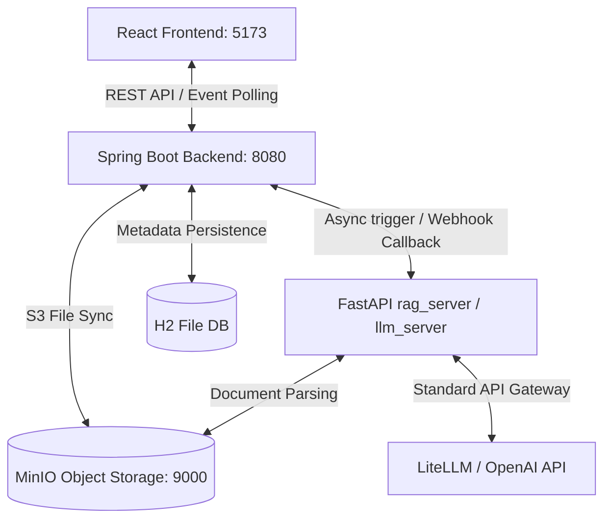

# 📌 연암 테스터 (Yeonam Tester)
> **AI 기반 TDD 검증 및 테스트 케이스 자동화 플랫폼 (MVP)**

연암 테스터는 소프트웨어 요구사항 명세서, 기획 설계 문서를 업로드하면 AI(LLM)가 명세 문맥을 분석하여 QA/TDD용 테스트 시나리오 및 구체적인 테스트 케이스를 자동 분리/생성하고, 이를 검증 보고서로 변환하여 다운로드할 수 있게 돕는 교육용 및 실무용 QA 보조 플랫폼입니다.

---

## 📂 하위 모듈별 상세 가이드

각 서브 모듈의 설계 구조, 상세 API 목록, 모듈별 구동 가이드는 아래 개별 문서를 참고하시면 편리합니다:
- **[☕ 백엔드 모듈 상세 가이드 (Spring Boot)](file:///c:/capd/yeonam_tester/backend/README.md)**
- **[🎨 프론트엔드 모듈 상세 가이드 (React)](file:///c:/capd/yeonam_tester/frontend/README.md)**
- **[🐍 AI 분석 서버 상세 가이드 (FastAPI llm_server)](file:///c:/capd/yeonam_tester/llm_server/README.md)**
- **[🐍 RAG 분석 서버 상세 가이드 (FastAPI rag_server)](file:///c:/capd/yeonam_tester/rag_server/README.md)**

---

## 🛠️ 시스템 아키텍처 및 기술 스택

연암 테스터는 결합도가 낮은 **비동기 웹훅 기반의 3중 구조 아키텍처**로 구성되어 있습니다.



### 1. 프론트엔드 (React)
- **기술 스택:** React 18, TypeScript, Vite, Vanilla CSS
- **주요 기능:** 글래스모피즘 기반 다크 테마 대시보드, 셋업, 설정 및 분석 스텝퍼, 결과 시각화, 마크다운 렌더러 미리보기 및 반출 UI.

### 2. 백엔드 (Spring Boot)
- **기술 스택:** Java 17+, Spring Boot 3.3.0, Spring Data JPA, Hibernate, AWS Java SDK S3
- **주요 기능:** REST API 엔드포인트 제어, H2 데이터베이스 트랜잭션, AWS S3 API를 이용한 로컬 MinIO 문서 업로드/다운로드, 비동기 AI 분석 파이프라인 트리거 및 비결합형 웹훅 처리.

### 3. AI 및 RAG 분석 서버 (FastAPI)
- **기술 스택:** Python 3.10+, FastAPI, Uvicorn, LiteLLM, pypdf, python-docx, FAISS
- **주요 기능:** 비동기 `asyncio.Queue` 기반 분석 대기열(202 Accepted 반환), S3 연계 텍스트 파싱 및 분할, 로컬 FAISS 인덱싱 및 시맨틱/키워드 하이브리드 검색, OpenAI/Anthropic 표준 호출 게이트웨이, JSON 보정 및 웹훅 전송.

### 4. 저장소 계층
- **H2 Database (RDB):** 로컬 파일 모드(`jdbc:h2:file:./data/yeonam_db`). 프로젝트 메타데이터, 파일 이력, 분석 작업 진행률 및 테스트 케이스 결과 저장.
- **MinIO (S3 호환 스토리지):** 도커 컨테이너로 구동. 원본 파일용 버킷 `yeonam-documents` 및 반출용 보고서 버킷 `yeonam-reports` 자동 체크 및 적재.

---

## 🚀 로컬 구동 및 설치 가이드

프로젝트를 실행하려면 다음 소프트웨어가 로컬에 설치되어 있어야 합니다.
* Docker Desktop
* Java JDK 17 또는 JDK 25
* Node.js 18+ (npm 포함)
* Python 3.10+

### Step 1. 로컬 S3 (MinIO) 실행
프로젝트 루트 경로에서 Docker Compose를 사용해 MinIO 스토리지를 백그라운드로 실행합니다.
```bash
docker-compose up -d
```
* **API Endpoint:** `http://localhost:9000` (백엔드 및 AI 서버 연동)
* **Console UI:** `http://localhost:9001` (접속 계정: `minioadmin` / `minioadmin`)

---

### Step 2. AI / RAG 분석 서버 실행 (FastAPI)
`rag_server`를 예시로 가동합니다.
1. `rag_server/` 폴더로 이동하여 Python 가상환경을 생성하고 구동합니다.
   ```bash
   cd rag_server
   python -m venv venv
   
   # Windows PowerShell의 경우
   .\venv\Scripts\Activate.ps1
   # macOS/Linux의 경우
   source venv/bin/activate
   ```
2. 필요 라이브러리를 설치합니다.
   ```bash
   pip install -r requirements.txt
   ```
3. 로컬 테스트 및 API 비용 절약을 위해 기본적으로 **Mock 모드**로 작동합니다. 실제 OpenAI API를 연동하려면 `.env` 파일을 다음과 같이 구성하세요.
   ```env
   MOCK_RAG=false
   MOCK_LLM=false
   LLM_MODEL=gpt-4o-mini
   OPENAI_API_KEY=your_actual_openai_api_key
   ```
4. Uvicorn 개발 서버를 시작합니다.
   ```bash
   uvicorn main:app --host 0.0.0.0 --port 8000 --reload
   ```

---

### Step 3. 백엔드 서버 (Spring Boot) 실행
1. `backend/` 폴더로 이동합니다.
   ```bash
   cd backend
   ```
2. 동봉된 메이븐 래퍼를 사용하여 서버를 빌드하고 구동합니다. 최초 구동 시 MinIO에 `yeonam-documents`, `yeonam-reports` 버킷이 없으면 자동으로 확인 후 생성합니다.
   ```bash
   # Windows PowerShell/cmd 공통
   .maven\apache-maven-3.9.6\bin\mvn.cmd spring-boot:run
   ```
   * **API Base URL:** `http://localhost:8080`
   * **H2 Console:** `http://localhost:8080/h2-console` (JDBC URL: `jdbc:h2:file:./data/yeonam_db` / ID: `sa`, PW: 없음)

---

### Step 4. 프론트엔드 (React) 실행
1. `frontend/` 폴더로 이동하여 의존성 라이브러리를 설치합니다.
   ```bash
   cd frontend
   npm install
   ```
2. Vite 개발 서버를 기동합니다.
   ```bash
   npm run dev
   ```
3. 브라우저를 열고 `http://localhost:5173`으로 접속합니다.

---

## 🔄 RAG_Server와 LLM_Server의 교체 방법

연암 테스터는 상황에 따라 단순 AI 추론만을 지원하는 **LLM_Server** 또는 기획 문서 기반 시맨틱 검색 검색증강생성(RAG)이 특화된 **RAG_Server**를 유연하게 교체하여 사용할 수 있도록 느슨하게 결합된 아키텍처를 지니고 있습니다.

### 방법 1. 동일한 포트(8000)를 통한 스왑 교체 (가장 추천)
기본적으로 `llm_server`와 `rag_server`는 모두 **8000번 포트**를 사용하도록 설계되어 있습니다.
1. 현재 구동 중인 AI 서버의 터미널에서 구동을 중지(`Ctrl + C`)합니다.
2. 교체하고자 하는 다른 AI 서버 폴더로 이동하여 해당 서버를 8000번 포트로 가동합니다:
   ```bash
   # 예: llm_server에서 rag_server로 교체하는 경우
   cd rag_server
   .\venv\Scripts\activate
   uvicorn main:app --host 0.0.0.0 --port 8000 --reload
   ```
3. 백엔드(Spring Boot)는 계속 동일하게 `http://localhost:8000`을 바라보기 때문에, 백엔드 서버를 재기동할 필요 없이 즉시 교체된 AI 엔진을 사용합니다.

### 방법 2. 다른 포트로 각각 실행 후 백엔드 설정 변경 교체
두 서버를 동시에 각각 다른 포트에 띄워두고 백엔드의 연동 대상을 환경 설정으로 손쉽게 스왑할 수 있습니다.
1. `LLM_Server`와 `RAG_Server`를 서로 다른 포트로 동시에 구동합니다:
   - **LLM_Server**: 8000번 포트로 구동 (`uvicorn main:app --port 8000`)
   - **RAG_Server**: 8001번 포트로 구동 (`uvicorn main:app --port 8001`)
2. Spring Boot 백엔드가 바라보는 AI 서버 엔드포인트(`AI_SERVER_URL`)를 환경 변수나 설정 파일을 통해 교체한 뒤 백엔드를 실행합니다:
   - **방법 A: 환경변수로 제어하기**
     - **Windows PowerShell**:
       ```powershell
       $env:AI_SERVER_URL="http://localhost:8001"
       .maven\apache-maven-3.9.6\bin\mvn.cmd spring-boot:run
       ```
     - **Windows CMD**:
       ```cmd
       set AI_SERVER_URL=http://localhost:8001
       .maven\apache-maven-3.9.6\bin\mvn.cmd spring-boot:run
       ```
     - **Linux / macOS**:
       ```bash
       export AI_SERVER_URL=http://localhost:8001
       mvn spring-boot:run
       ```
   - **방법 B: 설정 파일(.env 또는 application.yml)로 제어하기**
     - `backend/` 하위의 `.env` 파일 내에 `AI_SERVER_URL=http://localhost:8001`을 기입한 후 구동합니다.
     - 혹은 `backend/src/main/resources/application.yml`의 `ai.server.url` 프로퍼티를 해당 주소로 수정합니다.

### ⚠️ AI 서버 교체 시 주의사항 (웹훅 콜백 설정)
- AI 분석 서버들이 작업 완료 후 백엔드로 결과를 회신할 때, 각 AI 서버의 환경 변수인 `BACKEND_URL`을 참조합니다.
- 교체하여 사용하는 모든 AI 서버(`llm_server` 및 `rag_server`)의 `.env` 내에 `BACKEND_URL`이 실제 Spring Boot 백엔드 서버 주소(기본값: `http://localhost:8080`)와 완벽히 일치하게 선언되어 있는지 반드시 확인해 주세요.

---

## 🛠️ 최근 추가 개선 및 확장 스펙 (Phase 5)

연암 테스터 서비스의 고도화, 안정성 확보, 보안 및 무중단 데이터 복원 기능 강화를 위해 최근 추가 완료된 핵심 개선 내역입니다:

### 1. MinIO(S3) 물리 파일 기반 RDB 자동 동기화 및 메타데이터 복원
* **개념:** 로컬 테스트나 서버 리셋으로 백엔드 H2 DB 데이터가 휘발되더라도, S3(MinIO) 스토리지에 기적재된 물리 파일 데이터를 파싱하여 대시보드 상태를 즉각 동기식 복구합니다.
* **프로젝트 상세 복원:** 파일 저장(`PutObject`) 시 프로젝트의 모든 메타데이터(이름, 설명, GitHub URL, 브랜치 등)를 S3 객체의 User Metadata로 안전하게 인코딩하여 영속화합니다. DB 유실 후 대시보드에 접근(`GET /api/projects`)하면 `S3SyncService` 스캐너가 메타데이터를 디코딩하여 임시 명칭이 아닌 **본래의 실제 프로젝트 정보 그대로 완벽 복구**해 냅니다.

### 2. 프론트엔드 중심 API Key 제어 및 비동기 인증 오류 피드백 일원화
* **개념:** 서버 비용 절감 및 개별 보안을 위해 브라우저의 로컬 스토리지에 입력된 LLM API Key를 동적으로 AI 서버(FastAPI) 추론 엔진까지 안전하게 바인딩하여 전송합니다.
* **에러 피드백 일원화:** API Key가 만료되었거나 비정상일 경우 RAG 서버에서 `AuthenticationError` 계열의 예외를 명시적으로 캐치하여 실패 사유를 백엔드 콜백으로 전파합니다. 프론트엔드는 폴링을 즉시 중단하고 화면 로딩 모달 하단에 붉은색 경고 박스 피드백과 함께 이전 설정으로 복귀하는 인터랙션 흐름을 지원합니다.

### 3. 결과 뷰포트 반응형 가로 2열 그리드 다단화 배치의 안정화
* **개념:** 기존 세로 일렬 형태의 긴 테스트 케이스 카드 나열 레이아웃을 반응형 2열 다단 그리드 구조(`grid grid-cols-1 md:grid-cols-2 gap-6`)로 개편하여 화면 공간 활용을 극대화했습니다. 해상도가 좁아질 경우 레이아웃 무너짐 없이 모바일 화면에 최적화된 1열로 자동 전환됩니다.

### 4. 우측 사이드바 패널 실데이터 누락 분석 텍스트 매핑
* **개념:** 결과 페이지 우측 영역에 하드코딩 더미 목록으로 채워져 있던 '기획 명세서 누락 분석' 영역에 RAG/LLM 분석 엔진이 탐지한 실제 설계 미흡 리스트 데이터를 매핑하여 실시간 동적 렌더링되도록 수정했습니다.

---

## 🧪 추가 기능 통합 테스트 가이드 (JUnit 5)

백엔드 폴더(`backend/`) 내에서 아래 Maven CLI 테스트 명령을 수행하여, 추가 구현된 신규 스펙들이 오차 없이 작동하는지 빌드 단에서 확인할 수 있습니다.

```bash
# 백엔드 모듈 경로로 이동
cd backend

# 1. MinIO S3 파일 메타데이터 기반 DB 자동 복구 및 동기화 파이프라인 검증
.maven\apache-maven-3.9.6\bin\mvn.cmd test -Dtest=S3SyncTests

# 2. H2 DB 스키마 missing_items_text 칼럼 생성 및 콜백 수집 로직 검증
.maven\apache-maven-3.9.6\bin\mvn.cmd test -Dtest=AnalysisJobEntityTests
```
