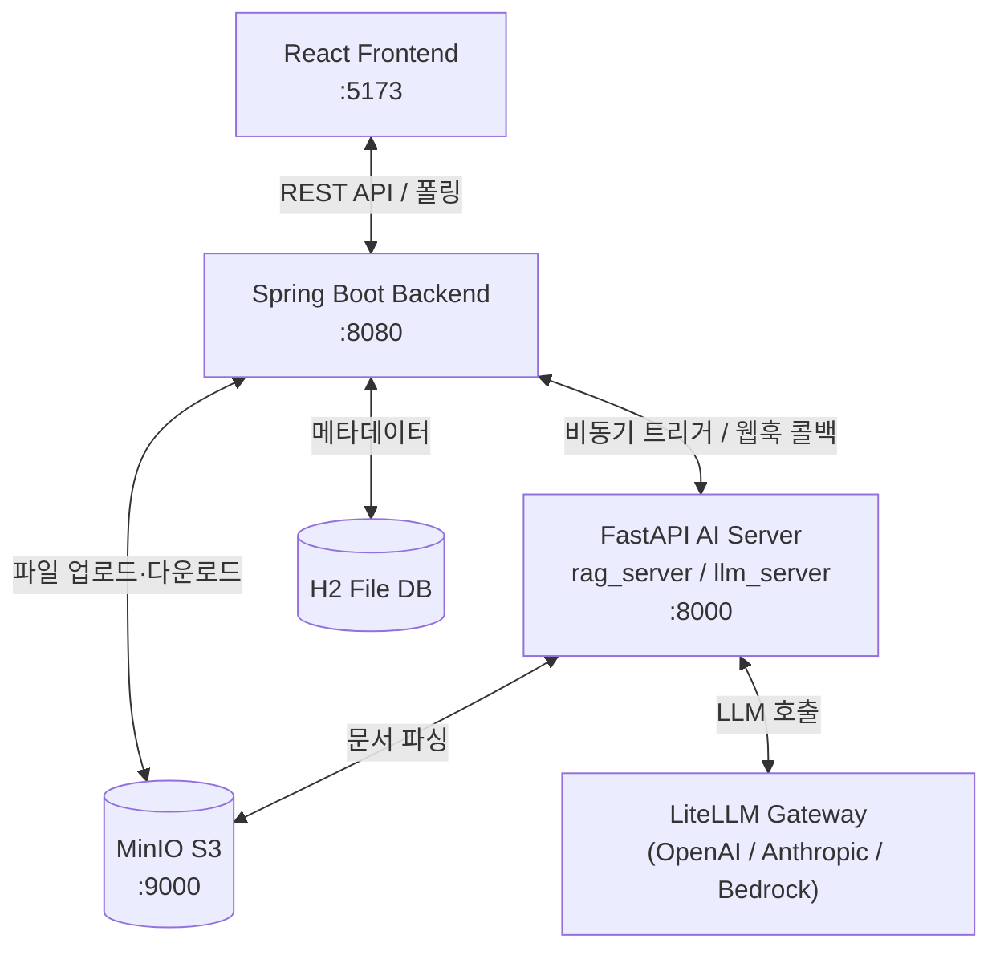

# 연암 테스터 (Yeonam Tester)

> AI 기반 QA/TDD 테스트 케이스 자동 생성 플랫폼

요구사항 명세서·기획 문서를 업로드하면 AI(LLM + RAG)가 문맥을 분석하여 테스트 시나리오와 구체적인 테스트 케이스를 자동으로 생성하고, Markdown/PDF 검증 보고서로 내보낼 수 있는 QA 보조 플랫폼입니다.

---

## 목차

- [시스템 아키텍처](#시스템-아키텍처)
- [기술 스택](#기술-스택)
- [프로젝트 구조](#프로젝트-구조)
- [사전 준비](#사전-준비)
- [로컬 실행 가이드](#로컬-실행-가이드)
- [환경 변수 설정](#환경-변수-설정)
- [AI 서버 교체 방법](#ai-서버-교체-방법)
- [RAG 지식 베이스](#rag-지식-베이스)
- [주요 API 엔드포인트](#주요-api-엔드포인트)
- [테스트 실행](#테스트-실행)
- [하위 모듈 상세 가이드](#하위-모듈-상세-가이드)

---

## 시스템 아키텍처

비동기 웹훅 기반의 **4-Tier 분산 아키텍처**로 구성됩니다. Spring Boot는 LLM을 직접 호출하지 않고 AI 서버에 작업을 위임한 뒤 웹훅 콜백으로 결과를 수신합니다.



### 분석 파이프라인 흐름

```
사용자 업로드 → Spring Boot (S3 저장 + H2 기록)
    → AI 서버 비동기 트리거 (POST /analyze)
        → 문서 파싱 → 청킹 → FAISS 인덱싱 → RAG 검색
        → LLM 프롬프트 조립 → 테스트 케이스 JSON 생성
    → 웹훅 콜백 (POST /api/internal/analysis/{id}/callback)
→ Spring Boot H2 저장 → React 렌더링 → 보고서 반출
```

---

## 기술 스택

| 레이어 | 기술 |
|---|---|
| **프론트엔드** | React 18, TypeScript, Vite 5, Tailwind CSS 3, Axios, react-router-dom 6, react-markdown |
| **백엔드** | Java 17, Spring Boot 3.3, Spring Data JPA, H2 Database, AWS SDK v2 (S3 + Bedrock), Apache Tika 2.9 |
| **AI 서버 (RAG)** | Python 3.10+, FastAPI, Uvicorn, LiteLLM, FAISS, sentence-transformers, PyMuPDF, python-docx, boto3 |
| **AI 서버 (LLM)** | Python 3.10+, FastAPI, Uvicorn, LiteLLM, pypdf, python-docx, boto3 |
| **스토리지** | MinIO (S3 호환), H2 File DB |
| **인프라** | Docker Compose |

---

## 프로젝트 구조

```
web-service/
├── frontend/          # React + Vite 프론트엔드
│   └── src/
│       ├── pages/     # Dashboard, ProjectSetup, DocumentUpload, AnalysisResult, ReportPreview
│       └── services/  # API 클라이언트 (api.ts)
├── backend/           # Spring Boot 백엔드
│   └── src/main/java/com/yeonam/tester/
│       ├── controller/  # Project, File, Analysis, Callback, Report, TestCase
│       ├── service/     # 비즈니스 로직
│       ├── domain/      # JPA 엔티티
│       ├── dto/         # 요청/응답 DTO
│       ├── llm/         # Bedrock / Mock LLM 클라이언트
│       └── config/      # S3, LLM 설정
├── rag_server/        # RAG 기반 고도화 AI 분석 서버 (FastAPI)
│   ├── knowledge_base/  # 7종 QA 도메인 지식 카드 (JSON)
│   └── main.py
├── llm_server/        # 경량 LLM 전용 AI 분석 서버 (FastAPI)
├── docker-compose.yml # MinIO 컨테이너 정의
├── deploy_guide.md    # EC2 단일 서버 배포 가이드
└── troubleshooting.md # 장애 대응 런북
```

---

## 사전 준비

| 소프트웨어 | 권장 버전 |
|---|---|
| Docker Desktop | 최신 |
| Java JDK | 17 이상 |
| Node.js | 18 이상 (npm 포함) |
| Python | 3.10 이상 |

---

## 로컬 실행 가이드

4개 컴포넌트를 아래 순서로 실행합니다.

### Step 1. MinIO (로컬 S3) 실행

프로젝트 루트에서 실행합니다.

```bash
docker-compose up -d
```

| 항목 | 주소 |
|---|---|
| S3 API | `http://localhost:9000` |
| 콘솔 UI | `http://localhost:9001` (계정: `minioadmin` / `minioadmin`) |

---

### Step 2. AI 분석 서버 실행 (FastAPI)

`rag_server` (권장) 또는 `llm_server` 중 하나를 선택해 실행합니다.

```bash
# rag_server 예시 (llm_server는 경로만 변경)
cd rag_server

python -m venv venv

# macOS / Linux
source venv/bin/activate
# Windows PowerShell
.\venv\Scripts\Activate.ps1

pip install -r requirements.txt

# .env 파일 생성 (기본값: Mock 모드)
cp .env.example .env

uvicorn main:app --host 0.0.0.0 --port 8000 --reload
```

> 기본 실행 시 **Mock 모드**(`MOCK_RAG=true`, `MOCK_LLM=true`)로 동작하므로 별도 API 키 없이도 흐름을 확인할 수 있습니다.

---

### Step 3. 백엔드 서버 실행 (Spring Boot)

```bash
cd backend

# macOS / Linux
./mvnw spring-boot:run

# Windows
.maven\apache-maven-3.9.6\bin\mvn.cmd spring-boot:run
```

최초 실행 시 MinIO에 `yeonam-documents`, `yeonam-reports` 버킷이 자동 생성됩니다.

| 항목 | 주소 |
|---|---|
| API Base URL | `http://localhost:8080` |
| H2 콘솔 | `http://localhost:8080/h2-console` |

H2 콘솔 접속 정보: JDBC URL `jdbc:h2:file:./data/yeonam_db`, 계정 `sa`, 비밀번호 없음

---

### Step 4. 프론트엔드 실행 (React)

```bash
cd frontend
npm install
npm run dev
```

브라우저에서 `http://localhost:5173` 으로 접속합니다.

---

## 환경 변수 설정

### `backend/.env`

```env
# AI 분석 서버 URL (rag_server: 8000, llm_server: 8000)
AI_SERVER_URL=http://localhost:8000
```

### `rag_server/.env`

```env
MOCK_LLM=true                        # false로 변경 시 실제 LLM 호출
MOCK_RAG=true                        # false로 변경 시 실제 S3 파싱 + FAISS 인덱싱
BACKEND_URL=http://localhost:8080    # 웹훅 콜백 수신 주소
LLM_MODEL=gpt-4o-mini
EMBEDDING_PROVIDER=local
EMBEDDING_MODEL=all-MiniLM-L6-v2
# OPENAI_API_KEY=sk-...              # MOCK_LLM=false 시 필수
```

### `llm_server/.env`

```env
MOCK_LLM=true
BACKEND_URL=http://localhost:8080
LLM_MODEL=gpt-4o-mini
AWS_ACCESS_KEY_ID=minioadmin
AWS_SECRET_ACCESS_KEY=minioadmin
S3_ENDPOINT_URL=http://localhost:9000
S3_BUCKET=yeonam-documents
# OPENAI_API_KEY=sk-...
```

> 프론트엔드 UI에서 LLM API Key를 직접 입력할 수도 있습니다. 입력된 키는 브라우저 로컬 스토리지에 저장되며, 분석 요청 시 AI 서버로 동적으로 전달됩니다.

---

## AI 서버 교체 방법

`rag_server`와 `llm_server`는 동일한 API 규격(웹훅 콜백 포함)을 공유하므로 백엔드 코드 수정 없이 교체할 수 있습니다.

### 방법 1. 동일 포트(8000) 교체 (권장)

현재 실행 중인 서버를 `Ctrl+C`로 종료 후 다른 서버를 동일 포트로 실행합니다.

```bash
# rag_server → llm_server 교체 예시
cd llm_server
source venv/bin/activate   # Windows: .\venv\Scripts\Activate.ps1
uvicorn main:app --host 0.0.0.0 --port 8000 --reload
```

백엔드 재시작이 필요하지 않습니다.

### 방법 2. 포트 분리 후 환경 변수 스왑

두 서버를 각각 다른 포트로 동시에 실행한 뒤 백엔드 환경 변수를 변경합니다.

```bash
# macOS / Linux
export AI_SERVER_URL=http://localhost:8001
./mvnw spring-boot:run

# Windows PowerShell
$env:AI_SERVER_URL="http://localhost:8001"
.maven\apache-maven-3.9.6\bin\mvn.cmd spring-boot:run
```

> 교체하는 모든 AI 서버의 `.env`에 `BACKEND_URL`이 실제 Spring Boot 주소(`http://localhost:8080`)와 일치하는지 반드시 확인하세요.

---

## RAG 지식 베이스

`rag_server/knowledge_base/`에 7종의 QA 도메인 지식 카드가 사전 탑재되어 있습니다.

| 파일 | 내용 |
|---|---|
| `istqb_knowledge_cards.json` | ISTQB 소프트웨어 테스팅 표준 |
| `owasp_security_knowledge_cards.json` | OWASP 보안 취약점 및 테스트 기법 |
| `nist_samate_knowledge_cards.json` | NIST SAMATE 정적 분석 지식 |
| `atlassian_knowledge_cards_refined.json` | Atlassian QA 실무 가이드 |
| `ms_playbook_knowledge_cards.json` | Microsoft QA Playbook |
| `cypress_best_practices_knowledge_cards.json` | Cypress E2E 테스트 모범 사례 |
| `playwright_knowledge_cards.json` | Playwright 자동화 테스트 가이드 |

---

## 주요 API 엔드포인트

### 프로젝트

| 메서드 | 경로 | 설명 |
|---|---|---|
| `GET` | `/api/projects` | 전체 프로젝트 목록 조회 |
| `POST` | `/api/projects` | 프로젝트 생성 |
| `DELETE` | `/api/projects/{projectId}` | 프로젝트 삭제 |

### 파일

| 메서드 | 경로 | 설명 |
|---|---|---|
| `POST` | `/api/projects/{projectId}/files` | 문서 업로드 |
| `GET` | `/api/projects/{projectId}/files` | 업로드 파일 목록 |
| `DELETE` | `/api/files/{fileId}` | 파일 삭제 |

### 분석

| 메서드 | 경로 | 설명 |
|---|---|---|
| `POST` | `/api/projects/{projectId}/analysis` | 분석 시작 (201 Created) |
| `GET` | `/api/analysis/{analysisId}` | 분석 작업 정보 조회 |
| `GET` | `/api/analysis/{analysisId}/status` | 분석 진행 상태 조회 |
| `GET` | `/api/analysis/{analysisId}/result` | 분석 결과(테스트 케이스) 조회 |
| `DELETE` | `/api/analysis/{analysisId}` | 분석 작업 삭제 |

### 콜백 (AI 서버 내부용)

| 메서드 | 경로 | 설명 |
|---|---|---|
| `POST` | `/api/internal/analysis/{analysisId}/callback` | AI 서버 웹훅 콜백 수신 |

### 보고서

| 메서드 | 경로 | 설명 |
|---|---|---|
| `GET` | `/api/projects/{projectId}/reports` | 보고서 목록 |
| `POST` | `/api/reports` | 보고서 생성 |
| `GET` | `/api/reports/{reportId}/download` | 보고서 다운로드 |

---

## 테스트 실행

`backend/` 경로에서 Maven으로 단위 테스트를 실행합니다.

```bash
cd backend

# macOS / Linux — 전체 테스트
./mvnw test

# 특정 테스트 클래스 실행
./mvnw test -Dtest=S3SyncTests            # S3 메타데이터 기반 DB 자동 복구 검증
./mvnw test -Dtest=AnalysisJobEntityTests  # AnalysisJob 엔티티 및 콜백 로직 검증
./mvnw test -Dtest=Phase6Tests            # Phase 6 통합 기능 검증
./mvnw test -Dtest=Phase8Tests            # Phase 8 확장 기능 검증
```

---

## 하위 모듈 상세 가이드

각 모듈의 상세 API, 설정 옵션, 구동 방법은 개별 README를 참조하세요.

- [백엔드 상세 가이드 (Spring Boot)](./backend/README.md)
- [프론트엔드 상세 가이드 (React)](./frontend/README.md)
- [RAG 분석 서버 상세 가이드 (FastAPI)](./rag_server/README.md)
- [LLM 분석 서버 상세 가이드 (FastAPI)](./llm_server/README.md)
- [EC2 배포 가이드](./deploy_guide.md)
- [장애 대응 런북](./troubleshooting.md)
