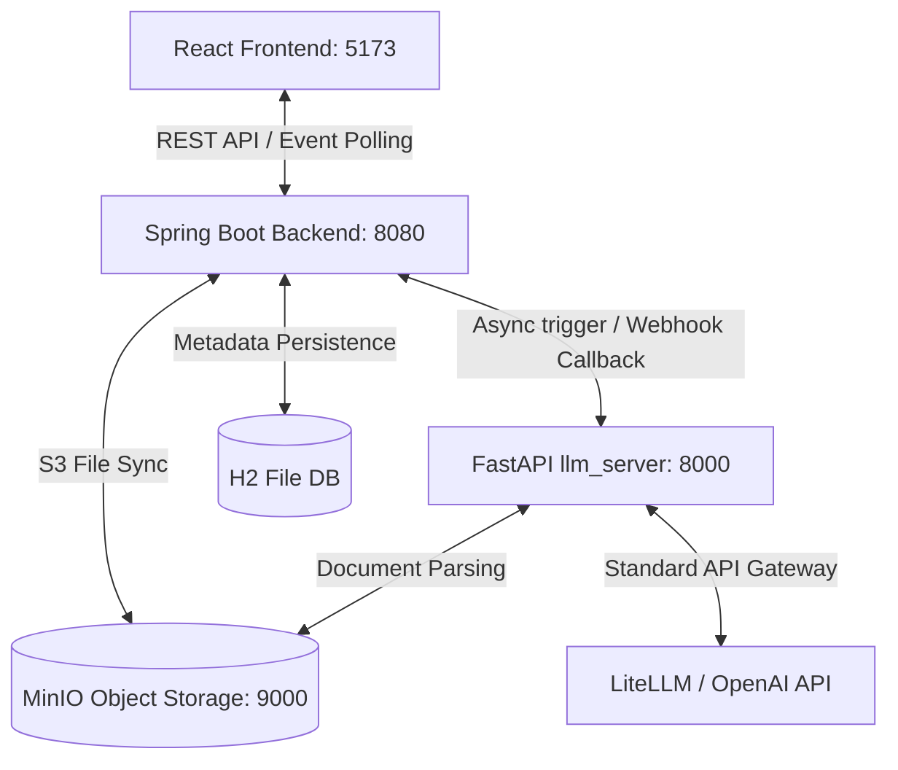

# 📌 연암 테스터 (Yeonam Tester)
> **AI 기반 TDD 검증 및 테스트 케이스 자동화 플랫폼 (MVP)**

연암 테스터는 소프트웨어 요구사항 명세서, 기획 설계 문서를 업로드하면 AI(LLM)가 명세 문맥을 분석하여 QA/TDD용 테스트 시나리오 및 구체적인 테스트 케이스를 자동 분리/생성하고, 이를 검증 보고서로 변환하여 다운로드할 수 있게 돕는 교육용 및 실무용 QA 보조 플랫폼입니다.

---

## 🛠️ 시스템 아키텍처 및 기술 스택

연암 테스터는 결합도가 낮은 **비동기 웹훅 기반의 3중 구조 아키텍처**로 구성되어 있습니다.



### 1. 프론트엔드 (React)
- **기술 스택:** React 18, TypeScript, Vite, Vanilla CSS
- **주요 기능:** 글래스모피즘 기반 다크 테마 대시보드, 셋업, 설정 및 분석 스텝퍼, 결과 시각화, 마크다운 렌더러 미리보기 및 반출 UI.

### 2. 백엔드 (Spring Boot)
- **기술 스택:** Java 17+, Spring Boot 3.3.0, Spring Data JPA, Hibernate, AWS Java SDK S3
- **주요 기능:** REST API 엔드포인트 제어, H2 데이터베이스 트랜잭션, AWS S3 API를 이용한 로컬 MinIO 문서 업로드/다운로드, 비동기 AI 분석 파이프라인 트리거 및 비결합형 웹훅 처리.

### 3. AI 분석 서버 (FastAPI)
- **기술 스택:** Python 3.10+, FastAPI, Uvicorn, LiteLLM, pypdf, python-docx
- **주요 기능:** 비동기 `asyncio.Queue` 기반 분석 대기열(202 Accepted 반환), S3 연계 텍스트 파싱 및 추출, OpenAI/Anthropic 표준 호출 게이트웨이, JSON 보정 및 웹훅 전송.

### 4. 저장소 계층
- **H2 Database (RDB):** 로컬 파일 모드(`jdbc:h2:file:./data/yeonam_db`). 프로젝트 메타데이터, 파일 이력, 분석 작업 진행률 및 테스트 케이스 결과 저장.
- **MinIO (S3 호환 스토리지):** 도커 컨테이너로 구동. 원본 파일용 버킷 `yeonam-documents` 및 반출용 보고서 버킷 `yeonam-reports` 자동 체크 및 적재.

---

## 🚀 로컬 구동 및 설치 가이드

프로젝트를 실행하려면 다음 소프트웨어가 로컬에 설치되어 있어야 합니다.
* Docker Desktop
* Java JDK 17 또는 JDK 25
* Node.js 18+ (npm 포함)
* Python 3.10+

### Step 1. 로컬 S3 (MinIO) 실행
프로젝트 루트 경로에서 Docker Compose를 사용해 MinIO 스토리지를 백그라운드로 실행합니다.
```bash
docker-compose up -d
```
* **API Endpoint:** `http://localhost:9000` (백엔드 및 AI 서버 연동)
* **Console UI:** `http://localhost:9001` (접속 계정: `minioadmin` / `minioadmin`)

---

### Step 2. AI 분석 서버 (FastAPI) 실행
1. `llm_server/` 폴더로 이동하여 Python 가상환경을 생성하고 구동합니다.
   ```bash
   cd llm_server
   python -m venv venv
   
   # Windows PowerShell의 경우
   .\venv\Scripts\Activate.ps1
   # macOS/Linux의 경우
   source venv/bin/activate
   ```
2. 필요 라이브러리를 설치합니다.
   ```bash
   pip install -r requirements.txt
   ```
3. 로컬 테스트 및 API 비용 절약을 위해 기본적으로 **Mock LLM 모드**로 작동합니다. 실제 OpenAI API를 연동하려면 `.env` 파일을 다음과 같이 구성하세요.
   ```env
   MOCK_LLM=false
   LLM_MODEL=gpt-4o-mini
   OPENAI_API_KEY=your_actual_openai_api_key
   ```
4. Uvicorn 개발 서버를 시작합니다 (8000번 포트).
   ```bash
   uvicorn main:app --host 0.0.0.0 --port 8000 --reload
   ```

---

### Step 3. 백엔드 서버 (Spring Boot) 실행
1. `backend/` 폴더로 이동합니다.
   ```bash
   cd backend
   ```
2. 동봉된 메이븐 래퍼를 사용하여 서버를 빌드하고 구동합니다. 최초 구동 시 MinIO에 `yeonam-documents`, `yeonam-reports` 버킷이 없으면 자동으로 확인 후 생성합니다.
   ```bash
   # Windows PowerShell/cmd 공통
   .maven\apache-maven-3.9.6\bin\mvn.cmd spring-boot:run
   ```
   * **API Base URL:** `http://localhost:8080`
   * **H2 Console:** `http://localhost:8080/h2-console` (JDBC URL: `jdbc:h2:file:./data/yeonam_db` / ID: `sa`, PW: 없음)

---

### Step 4. 프론트엔드 (React) 실행
1. `frontend/` 폴더로 이동하여 의존성 라이브러리를 설치합니다.
   ```bash
   cd frontend
   optional npm install
   ```
2. Vite 개발 서버를 기동합니다.
   ```bash
   npm run dev
   ```
3. 브라우저를 열고 `http://localhost:5173`으로 접속합니다.

---

## ✨ 연암 테스터 핵심 기능 스펙

1. **프로젝트 연동 및 README 수집:** 
   GitHub Public 리포지토리 URL을 통해 연결 유무를 실시간 검증하고, 연동 완료 시 기본 브랜치의 `README.md`를 자동 수집하여 전처리 문서 대상으로 즉각 등록합니다.
2. **문서 업로드 및 이중 유효성 검증:** 
   PDF, TXT, MD, DOCX 확장자 검사 및 20MB 이하의 용량 제한 필터를 프론트엔드와 백엔드에서 이중으로 엄격하게 검증하여 비적합 파일 업로드를 사전에 완벽 차단합니다.
3. **맞춤형 QA 추천 관점 및 커스프트 프롬프트:** 
   업로드된 문서 명칭에 알맞은 맞춤형 키워드 칩(#입력값_검증, #API_보안 등)을 추천하고, 사용자의 상세 통제 지시 프롬프트를 취합해 분석 파라미터로 적재합니다.
4. **비동기 상태 모니터링 폴링:** 
   분석 실행 시 UI에서 2초 주기로 백엔드를 폴링하여 진행률과 메시지가 동적 스텝퍼(문서 파싱 -> 지식베이스 검색 -> 테스트 케이스 생성 -> 무결성 검증)에 맵핑되도록 실시간 피드백을 제공합니다.
5. **테스트 시나리오 카드화 및 시각적 강조:** 
   AI 결과로 분리된 요약 카드, 테스트 카드 목록, 우선순위 배지, 위험 해시태그를 출력합니다. 300자 초과 텍스트 영역은 말줄임 후 클릭 시 확장되는 아코디언 컴포넌트로 정돈되어 제공됩니다.
6. **검증 보고서 렌더링 및 무중단 자동 복구 (Fallback):** 
   Markdown/PDF 형태로 최종 결과 보고서를 조립하고, 하단에 시스템 Disclaimer(한계 고지)를 병합해 반출합니다. 만약 S3 스토리지의 실물 보고서가 임의로 손상/유실되더라도 500 에러를 반환하지 않고 RDB 메타데이터 기반으로 온더플라이로 재생성하여 무중단 다운로드되도록 보장합니다.
7. **3중 연쇄 완전 파기:** 
   문서 및 프로젝트 삭제 시 관계형 DB(RDB)에 매핑된 데이터뿐만 아니라 S3 스토리지에 존재하는 원본 및 보고서 실물 파일까지 동기식으로 일괄 연쇄 삭제하여 저장 공간 누수를 완벽 차단합니다.
8. **샌드박스 오프라인 데모 스위치 지원:**
   화면 상의 `샌드박스 데모 모드 (오프라인)` 스위치를 켜면 AI 서버 기동 없이도 8초 후 자동 가상 결과를 도출해주며, 이를 끄면 실물 AI 서버와 완전히 실시간 통신하게 됩니다.
