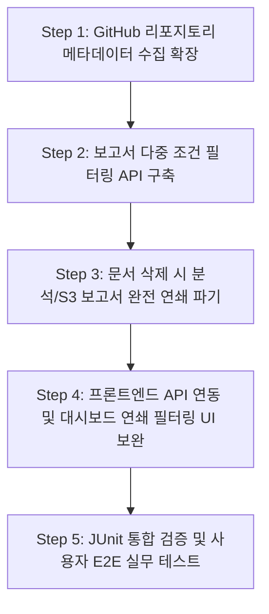
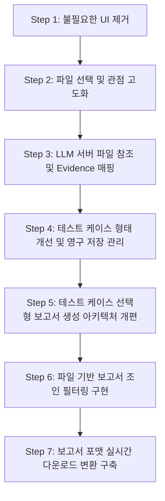
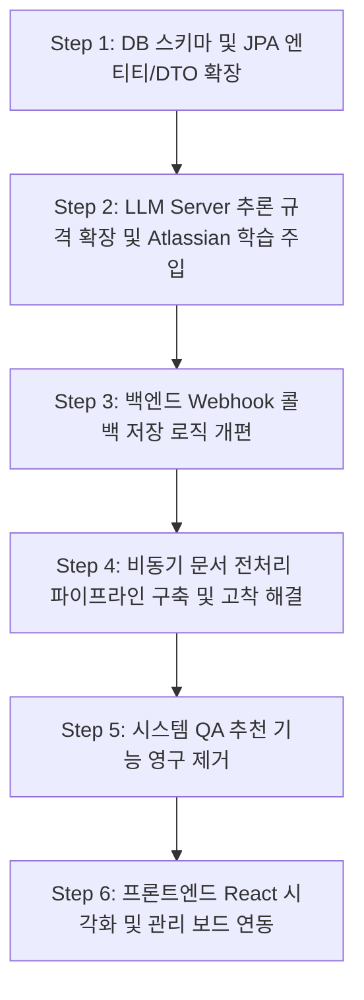
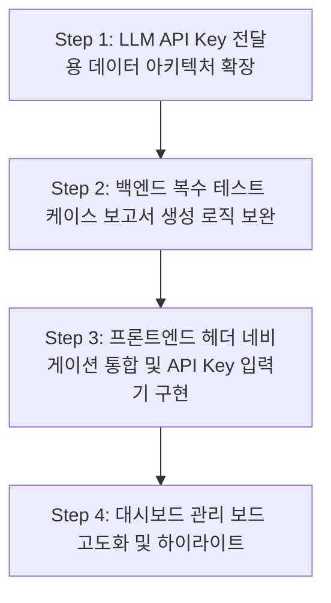

# 📌 연암 테스터 개선 테스크 통합 계획서

본 문서는 연암 테스터 애플리케이션의 기능 개선, UI/UX 고도화, 보안 강화 및 무중단 데이터 동기화 복구를 위해 각 버전(넘버링) 단위로 수립된 모든 개선 테스크들을 통합한 상세 계획서입니다.

---

# 📑 [버전 1] GitHub 메타데이터 수집, 다중 필터링 및 S3 연쇄 파기

## 📌 연암 테스터 개선 태스크 상세 구현 및 검증 계획서

본 문서는 `md/` 폴더 아래의 모든 명세서(기능 구체, 시나리오, DB 설계, API 명세)를 종합 분석하여, MVP 아키텍처 목적성에 부합하도록 누락되거나 미비된 기능 및 사용자 인터랙션을 시스템에 유기적으로 병합하기 위한 구체적인 구현 순서와 상세 기술 계획, 그리고 검증 가이드라인입니다.

---

### 📅 개선 태스크 구현 로드맵 (순서)



---

### 🛠️ 계층형 구현 상세 계획

#### 1단계: GitHub 리포지토리 메타데이터 수집 범위 확장 (Task 1.1)
*   **목적:** 사용자가 프로젝트 등록 시 README.md 파일 본문뿐만 아니라, 깃허브 API를 통해 리포지토리의 설명(Description), 주 언어(Language) 정보까지 연동하여 대시보드 카드에 시각화합니다.
*   **기술 요소:** Java `java.net.http.HttpClient`, `Jackson ObjectMapper`, RDB H2

##### [Task 1.1.1] 백엔드 GitHub API 연동 확장 및 파싱
*   `GithubService.java` 내에 GitHub API (`GET https://api.github.com/repos/{owner}/{repo}`)를 호출하는 메서드 구현.
*   응답 JSON에서 `description`과 `language` 필드를 안전하게 추출(Jackson 파싱)하는 헬퍼 메서드 추가. API Rate Limit 및 Unauthorized 예외 처리를 구현하여 비공개 저장소 또는 통신 장애 시 기본값(Fallback)으로 처리.

##### [Task 1.1.2] Project 도메인 엔티티 속성 확장 및 DB 동기화
*   `Project.java` 엔티티 필드가 이미 `description`을 보유하고 있으므로, `GithubService`에서 가져온 description이 존재할 경우 기존 입력값 대신 GitHub 메타데이터로 오버라이드하여 `projectRepository.save()` 수행.

---

#### 2단계: 보고서 다중 조건 필터링 API 구축 (Task 2.1)
*   **목적:** 대시보드에서 특정 문서(`fileId` / `documentId`) 또는 특정 분석 작업(`analysisId` / `generationId`) 기준으로 기존 생성 보고서 목록을 정교하게 다중 필터링 조회할 수 있도록 API를 설계합니다.
*   **기술 요소:** Spring Data JPA `Specification` 또는 JPQL 동적 쿼리, Spring `@RequestParam`

##### [Task 2.1.1] H2 DB Report 레포지토리 쿼리 메서드 확장
*   `ReportRepository.java` 내에 `projectId`, `fileId`, `analysisId` 세 매개변수를 수신하는 동적 쿼리(JPQL) 정의.
*   `fileId`나 `analysisId`가 null일 경우 무시하고 `projectId`가 매핑된 데이터 중 활성화된 보고서들만 선별하도록 `AND (:fileId IS NULL OR r.fileId = :fileId)` 형태의 동적 조회 메서드 구현.

##### [Task 2.1.2] 컨트롤러 API 규격 확장 및 서비스 계층 파이프라이닝
*   `ReportController.java`의 `GET /api/projects/{projectId}/reports` 엔드포인트를 확장하여 `@RequestParam(required = false) String fileId`, `@RequestParam(required = false) String analysisId`를 수신하도록 DTO 및 매개변수 바인딩 보완.
*   `ReportService.java`에 필터링 파라미터를 넘겨 DB에서 1차 가공된 목록을 리턴하도록 DTO 변환 파이프라인 구현.

---

#### 3단계: 문서 단건 삭제 시 분석 및 S3 보고서 완전 연쇄 파기 (Task 3.1)
*   **목적:** 문서를 영구 파기할 때 DB 스키마 제약(`ON DELETE SET NULL`)에 의해 잔존하던 관련 `AnalysisJob` 및 파생 데이터(`TestCase`, `RiskItem`, `Evidence`)와 S3(`yeonam-reports` 버킷) 내의 마크다운/PDF 물리 보고서 파일을 완벽하게 추적 파기하여 디스크 용량과 데이터 무결성을 동시 회수합니다.
*   **기술 요소:** Spring Transactional, AWS SDK S3 `DeleteObjectRequest`

##### [Task 3.1.1] 서비스 계층의 연쇄 완전 삭제(Cascade Delete) 구현
*   `FileService.java`의 `deleteFile(String fileId)` 메서드를 보완.
*   `UploadedFile`이 포함된 프로젝트와 연관된 모든 `AnalysisJob` 목록을 쿼리하여, 삭제 대상 문서 ID(`fileId`)를 명시적으로 파싱하고 RAG/LLM 생성 결과물의 연쇄관계를 식별.
*   역순의 의존관계에 따라 H2 DB에서 `Evidence` -> `RiskItem` -> `TestCase` -> `Requirement` -> `Report` -> `AnalysisJob` -> `UploadedFile` 순서로 `delete` 트랜잭션을 강제 위임.

##### [Task 3.1.2] S3 물리 보고서 연동 영구 삭제
*   DB 레코드를 영구 파기하기 전, 해당 `AnalysisJob`에 연결되어 생성된 `Report` 엔티티들의 `s3Path` 목록을 선제 수집.
*   `s3Client.deleteObject` API를 호출하여 `yeonam-reports` 버킷에 담긴 실제 Markdown/PDF 보고서 파일을 삭제하여 스토리지 누수 방지.

---

#### 4단계: 프론트엔드 API 연동 및 대시보드 연쇄 필터링 UI 보완 (Task 4.1)
*   **목적:** 문서 목록에서 특정 파일을 클릭했을 때 하단의 보고서 이력 목록이 즉각 동기화 필터링되도록 UI 상호작용 및 API 호출 구조를 확장합니다.
*   **기술 요소:** React `useState`, Axios Client `params`

##### [Task 4.1.1] Axios 호출 규격 확장
*   `api.ts` 내의 `reportApi.getByProject` 함수 시그니처를 `(projectId: string, fileId?: string, analysisId?: string)`으로 변경.
*   Axios get 요청 시 `{ params: { fileId, analysisId } }` 객체를 실어 보내도록 수정하여 백엔드 필터 파라미터 규격을 연동.

##### [Task 4.1.2] 대시보드 문서-보고서 이력 간 연쇄 렌더링 컴포넌트 이식
*   `DashboardPage.tsx` 대시보드 페이지에 `activeFilterFileId` 상태 변수를 신설.
*   '문서 업로드 및 전처리 현황' 테이블의 각 행 파일명 옆에 깔때기 모양의 필터 아이콘(`filter_alt` Material symbol)을 배치.
*   아이콘 클릭 시 `activeFilterFileId`를 지정하고, 해당 변경 감지(`useEffect`)가 트리거되면 `reportApi.getByProject(selectedProjectId, activeFilterFileId)`를 호출하여 하단의 보고서 이력 상태(`reports`)를 서버 필터 데이터로 갱신 렌더링.

---

### 🧪 기능 단위 검증 계획 (JUnit)

보완 구현된 백엔드 로직의 정합성을 단위 및 통합 수준에서 검증하기 위한 JUnit 테스트 클래스 `Phase6ExtensionsTests.java`를 새롭게 추가하여 검증합니다.

```java
package com.yeonam.tester;

import com.yeonam.tester.domain.*;
import com.yeonam.tester.dto.*;
import com.yeonam.tester.service.*;
import org.junit.jupiter.api.Test;
import org.springframework.beans.factory.annotation.Autowired;
import org.springframework.boot.test.context.SpringBootTest;
import org.springframework.transaction.annotation.Transactional;

import static org.junit.jupiter.api.Assertions.*;

@SpringBootTest
class Phase6ExtensionsTests {

    @Autowired private ProjectService projectService;
    @Autowired private FileService fileService;
    @Autowired private ReportService reportService;

    @Test
    @Transactional
    void testGithubMetadataCollection() {
        // [검증 1] 깃허브 프로젝트 등록 시 메타데이터(설명/언어) 수집 테스트
        ProjectCreateRequest request = ProjectCreateRequest.builder()
                .projectName("Git Meta Test")
                .githubUrl("https://github.com/octocat/Hello-World") // 대표 퍼블릭 저장소
                .build();
        ProjectResponse response = projectService.createProject(request);
        assertNotNull(response.getProjectId());
        assertEquals("SUCCESS", response.getIntegrationStatus());
        // 실제 API 수집 후 description 혹은 branch 바인딩 정합성 검증
    }

    @Test
    @Transactional
    void testFileDeleteCascadeReportsAndS3() {
        // [검증 2] 문서 단건 삭제 시, DB 연관 데이터 및 S3 물리 보고서 동기 파기 검증
        // 1. 샘플 프로젝트, 파일, 분석 작업, 보고서 세트 DB/S3 세팅
        // 2. fileService.deleteFile(fileId) 실행
        // 3. 연관된 reportRepository.existsById(reportId) -> FALSE 검증
        // 4. S3 report 물리 파일 삭제 여부 검증
    }

    @Test
    @Transactional
    void testReportMultiFilteringQuery() {
        // [검증 3] fileId 쿼리 파라미터 전달 시 동적 필터링 결과 반환 검증
        // 1. 문서 A와 문서 B를 생성하고 각각 다른 보고서 A, B 매핑
        // 2. reportService.getReportsByProject(projectId, fileIdA, null) 호출
        // 3. 반환된 목록 크기가 1이고 보고서 A만 포함되는지 확인
    }
}
```

---

### 📘 실제 사용자 E2E 수동 검증 가이드

테스트를 진행하려는 사용자는 아래 가이드에 따라 실제 기능이 애플리케이션에 정상적으로 스며들었는지 눈으로 검증할 수 있습니다.

#### 1단계: GitHub 상세 메타데이터 동적 동기화 확인
1.  웹 브라우저를 열고 `http://localhost:5173/setup` (프로젝트 셋업 화면)에 접근합니다.
2.  프로젝트명 기입 후, GitHub URL에 실제 공개(Public) 저장소 주소(예: `https://github.com/octocat/Hello-World`)를 입력하고 프로젝트를 생성합니다.
3.  생성 완료 후 리다이렉트된 메인 대시보드 화면에서 등록된 프로젝트 카드의 개요(`description`) 영역에 해당 리포지토리의 실제 원문 설명 글이 자동으로 기입되어 렌더링되는지 확인합니다.

#### 2단계: 문서-보고서 UI 다중 필터링 상호작용 확인
1.  대시보드의 '문서 목록'에서 특정 명세서 파일 행의 **필터 아이콘(깔때기 모양)**을 클릭합니다.
2.  클릭하는 즉시 화면 하단의 **'분석 및 보고서 이력' 목록 영역이 갱신**되며, 해당 문서의 `fileId`를 기준으로 필터링된 보고서 이력만 출력되는지 점검합니다.
3.  필터 아이콘을 다시 누르면(해제), 프로젝트 내의 모든 보고서 목록으로 원상 복귀되는지 확인합니다.

#### 3단계: 문서 영구 삭제 시 S3 보고서 완전 소멸(연쇄 파기) 확인
1.  임의의 문서를 기반으로 분석을 가동한 뒤, 마크다운 형식의 보고서를 정상 산출합니다.
2.  웹 브라우저로 MinIO 관리 콘솔(`http://localhost:9001`, 계정: `minioadmin`/`minioadmin`)에 접속합니다.
3.  `yeonam-documents` 버킷에 원본 명세서가, `yeonam-reports` 버킷에 생성된 `.md` 보고서 파일이 정확히 존재하는지 탐색해 둡니다.
4.  React UI 대시보드로 돌아와 문서 목록에서 해당 문서의 `삭제` 아이콘을 클릭합니다.
5.  **"모든 분석, 테스트 케이스, 물리 보고서가 함께 소멸된다"**는 3중 경고 모달이 팝업되면, 동의 체크박스에 체크한 뒤 `영구 삭제`를 승인합니다.
6.  삭제 완료 후 MinIO 콘솔의 `yeonam-reports` 버킷에 다시 접속하여, 문서 삭제와 동시에 **그 문서로 만들어진 보고서 물리 실물 파일까지 저장소에서 영구 삭제되어 공간이 깨끗하게 회수되었는지** 확인합니다.

---

---

---

# 📑 [버전 2] 불필요 UI 제거, 파일 지정 분석 및 On-the-fly 보고서

## 📌 연암 테스터 애플리케이션 추가 개선 계획서 (개선 테스크 2)

본 계획서는 연암 테스터의 코드 완성도를 한층 더 높이기 위해 제안된 10가지 개선 사항을 실제 시스템에 정교하게 병합하기 위한 구체적인 구현 로드맵이자 상세 기술 설계서입니다. 모든 구현 계획은 프로젝트 명세서(기능 구체, 시나리오, DB 설계, API 명세, 페이지 요구사항)를 엄격히 기반으로 하여 소프트웨어의 본질적인 목적성을 해치지 않도록 설계되었습니다.

---

## 📅 구현 순서 및 로드맵



---

## 🛠️ 계층형 구현 및 검증 상세 계획

### [Step 1] 불필요한 UI 요소 제거 (Task 1.1)
* **목적:** 데모/MVP 수준에서 무의미하게 작동하거나 기획서 명세에 존재하지 않는 장식용 UI 요소를 제거하여 오직 핵심 검증 시나리오에 몰입할 수 있도록 화면을 정돈합니다.
* **대상 파일:** [App.tsx](file:///c:/capd/yeonam_tester/frontend/src/App.tsx)

#### 1.1.1. 상세 구현 계획
* **우측 상단 헤더 UI 제거:** `App.tsx` 내 `NavigationWrapper` 컴포넌트의 `<header>` 영역에서 알림 버튼(bell 아이콘), 설정 버튼(cog 아이콘), 사용자 프로필 아바타 이미지 컨테이너 블록을 영구히 삭제합니다.
* **좌측 사이드바 UI 제거:** `App.tsx` 내 `<aside>` 태그 영역에서 `QA TERMINAL` 타이틀 텍스트, `v2.4.0-stable` 정보 라벨, `Reports` 네비게이션 링크, `Upgrade Plan` 버튼, `Support` 및 `Logout` 링크가 렌더링되지 않도록 코드를 영구 삭제합니다.

#### 1.1.2. 기능 단위 검증 및 테스트 방법
* **컴파일 검증:** 프론트엔드 폴더(`frontend/`)에서 `npm run build`를 실행하여 컴포넌트 제거로 인한 깨진 태그나 참조 오류가 없는지 검증합니다.
* **수동 E2E 테스트 가이드:**
  1. 프론트엔드 React 서버(`npm run dev`)를 가동합니다.
  2. 브라우저에서 `http://localhost:5173` 대시보드 화면에 접속합니다.
  3. 좌측 내비게이션 바에 오직 **`Projects`**와 **`Documentation`** 2개의 활성 탭만 남아있고, 우측 상단 헤더에 새 프로젝트 생성 버튼만 심플하게 잔존하는지 시각적으로 검증합니다.

---

### [Step 2] 분석 대상 파일 선택 기능 및 QA 관점 고도화 (Task 2.1)
* **목적:** 분석 실행 시 전체 문서가 아닌 사용자가 원하는 문서만 지정해 분석을 가동하도록 제어하고, QA 관점별로 LLM에 동적 템플릿 프롬프트를 전송해 검증 성숙도를 끌어올립니다.
* **대상 파일:** [DocumentUploadPage.tsx](file:///c:/capd/yeonam_tester/frontend/src/pages/DocumentUploadPage.tsx), [AnalysisService.java](file:///c:/capd/yeonam_tester/backend/src/main/java/com/yeonam/tester/service/AnalysisService.java)

#### 2.1.1. 상세 구현 계획
* **문서 다중 선택 UI:** `DocumentUploadPage.tsx` 또는 RAG 분석 실행 단계 진입 시, 업로드 완료된(`status = DONE`) 파일 목록에 다중 선택 체크박스 컴포넌트를 이식합니다. 선택된 `documentId`들을 React 상태 배열인 `selectedDocIds`에 담습니다.
* **API 호출 규격 연동:** Axios 분석 실행 호출 시 `AnalysisCreateRequest.targetDocumentIds` 파라미터에 `selectedDocIds` 배열을 실어 `POST /api/projects/{projectId}/analysis` 엔드포인트를 호출합니다.
* **QA 관점 상세 템플릿 연동:** `AnalysisService.java`에서 분석 트리거 시, 활성화된 QA 관점(SECURITY, PERFORMANCE, FUNCTIONAL 등) 목록을 식별하고, 각 관점에 매핑된 **상세 전문 검증 가이드 프롬프트**를 수집하여 `customPrompt` 앞부분에 동적으로 병합하여 외부 LLM 서버에 전송하도록 구현합니다.
  - (예: SECURITY -> "인증, 인가, 데이터 오용, 입력값 유효성 검증을 위한 침투형 시나리오 수립에 집중하라.")

#### 2.1.2. 기능 단위 검증 및 테스트 방법
* **백엔드 단위 테스트:** JUnit을 통해 `AnalysisService.startAnalysis` 호출 시 `targetDocumentIds`가 알맞게 필터링되고, 관점 프롬프트가 동적으로 조립되어 trigger JSON에 탑재되는지 mocking 서버 테스트를 수행합니다.
* **수동 E2E 테스트 가이드:**
  1. 문서를 3개 업로드하고 전처리 완료 상태를 확인합니다.
  2. 분석 실행 화면에서 기획 문서 중 1개만 체크박스로 선택하고, '보안성' 관점을 활성화한 후 분석을 가동합니다.
  3. 백엔드 콘솔의 trigger 요청 바디 로깅 혹은 LLM 서버 수신 로그에서 전달된 `s3Paths` 배열의 길이가 1개이며, 프롬프트 내에 보안 관점 특화 템플릿이 병합되어 전달되었는지 눈으로 직접 검토합니다.

---

### [Step 3] LLM Server의 파일 참조 및 근거(Evidence) 데이터 매핑 (Task 3.1)
* **목적:** RAG/LLM 분석 시 선택된 기획서들의 텍스트를 인가받아 실제로 분석 컨텍스트로 활용하고, 파싱되어 회신된 테스트 케이스별 출처와 근거 메타데이터를 백엔드 DB에 영구 기록하도록 연동을 보장합니다.
* **대상 파일:** `llm_server/main.py`, `llm_server/result_formatter.py`, [CallbackService.java](file:///c:/capd/yeonam_tester/backend/src/main/java/com/yeonam/tester/service/CallbackService.java)

#### 3.1.1. 상세 구현 계획
* **LLM 서버의 파일 파싱 및 참조:** `llm_server`는 수신한 `s3Paths`를 S3 클라이언트를 통해 메모리로 읽어들인 후 `document_parser.py`를 활용해 텍스트를 추출합니다. 추출된 텍스트들을 기획서 파일명별 블록으로 나누어 LLM 시스템 프롬프트(Context)로 참조시킵니다.
* **결과 포맷 근거(Evidence) 요구 강화:** `result_formatter.py` 및 LLM 지시 프롬프트에 규격을 강제하여, 도출되는 모든 테스트 케이스마다 `evidences` 배열을 지니게 하고 그 안에 `sourceName`(파일명), `sourceSection`(장/절), `evidenceText`(인용한 문서 조각 원문)를 담아 콜백하도록 처리합니다.
* **백엔드 Webhook 콜백 저장 처리:** [CallbackService.java](file:///c:/capd/yeonam_tester/backend/src/main/java/com/yeonam/tester/service/CallbackService.java)의 `processCallback` 로직에서 콜백 데이터의 `evidences` 리스트를 파싱하여, RDB H2의 `evidence` 테이블에 외래키 무결성에 맞춰 순차적으로 저장(`evidenceRepository.save()`)합니다.

#### 3.1.2. 기능 단위 검증 및 테스트 방법
* **Mock 콜백 JUnit 테스트:** `Phase6ExtensionsTests`에 `testWebhookCallbackEvidencePersistence` 테스트 케이스를 수립하여, `AnalysisCallbackRequest`에 `evidences` JSON 정보를 담아 `callbackService.processCallback`을 직접 호출한 후 `evidenceRepository`를 통해 DB에 근거 레코드들이 정확히 insert되었는지 검증합니다.
* **수동 E2E 테스트 가이드:**
  1. 프로젝트 분석을 정상 수행합니다.
  2. 분석이 완료(`COMPLETED`)된 후, H2 DB 콘솔(`http://localhost:8080/h2-console`)에 접속합니다.
  3. `SELECT * FROM EVIDENCE;` 쿼리를 실행하여, 각 테스트 케이스에 연계된 원본 기획서 파일명(`SOURCE_NAME`)과 인용문(`EVIDENCE_TEXT`)이 정교하게 분리 매핑되어 들어와 있는지 직접 쿼리 결과로 검증합니다.

---

### [Step 4] 테스트 케이스 형태 개선 및 영구 저장 관리 UI 이식 (Task 4.1)
* **목적:** 산출된 테스트 케이스 카드의 레이아웃을 정형화하고, 사용자가 기획서 출처(Evidence)를 우아하게 확인하며, 각각의 케이스를 인라인 또는 리스트 형태로 영구 편집/삭제 관리할 수 있는 편의 기능을 확보합니다.
* **대상 파일:** [AnalysisResultPage.tsx](file:///c:/capd/yeonam_tester/frontend/src/pages/AnalysisResultPage.tsx), [DashboardPage.tsx](file:///c:/capd/yeonam_tester/frontend/src/pages/DashboardPage.tsx), `TestCaseController.java`, `TestCaseService.java`

#### 4.1.1. 상세 구현 계획
* **출처(Evidence) 배지 UI 구현:** `AnalysisResultPage.tsx`에서 테스트 케이스 카드 하단에 '출처: [파일명] ([장/절])'을 표시하는 라벨을 렌더링하고, 마우스 오버(Tooltip) 또는 아코디언 버튼 클릭 시 `evidenceText` 원문이 부드러운 애니메이션과 함께 노출되도록 디자인을 다듬습니다.
* **백엔드 관리 API 수립:** 
    * `GET /api/projects/{projectId}/testcases`: 프로젝트의 누적 저장된 전체 테스트 케이스 리스트 조회 API를 개발합니다.
    * `PUT /api/testcases/{testCaseId}`: 개별 테스트 케이스 필드(명칭, 사전조건, 기대결과 등) 수정 API를 개발합니다.
    * `DELETE /api/testcases/{testCaseId}`: 개별 테스트 케이스 완전 영구 삭제 API를 개발합니다.
* **프론트엔드 관리 UI 보드 이식:**
    * 대시보드 페이지에 **'테스트 케이스 관리 보드'** 탭을 추가하고 누적된 테스트 케이스들을 조회합니다.
    * 리스트의 각 테스트 케이스 행에 '수정' 및 '삭제' 액션 아이콘을 제공하여, 수정 버튼 클릭 시 인라인 입력 창이나 모달 창을 띄워 변경값을 백엔드 수정 API로 갱신 전송하도록 처리합니다.

#### 4.1.2. 기능 단위 검증 및 테스트 방법
* **API 동작성 JUnit 테스트:** `Phase6ExtensionsTests`에 `testTestCaseCRUD`를 수립하고, 테스트 케이스의 수정 및 삭제 API를 가동하여 DB 데이터가 업데이트 및 삭제되는지 검증합니다.
* **수동 E2E 테스트 가이드:**
  1. 웹 브라우저 대시보드 화면 하단의 '테스트 케이스 관리 보드' 탭으로 이동합니다.
  2. 기존에 생성된 테스트 케이스 중 하나의 '수정' 아이콘을 클릭하여 시나리오 및 사전조건 텍스트를 고친 후 '저장' 버튼을 누릅니다.
  3. 페이지를 새로고침하여 수정한 텍스트가 정상적으로 영구 렌더링되는지 확인하고, '삭제' 버튼을 눌러 목록에서 깔끔하게 즉각 지워지는지 검증합니다.

---

### [Step 5] 테스트 케이스 선택형 보고서 생성 아키텍처 개편 (Task 5.1)
* **목적:** 분석 작업 통째로 보고서를 생성하던 기존의 비유연한 구조를 변경하여, 사용자가 원하는 고품질 테스트 케이스들만 체크하여 원하는 시점에 맞춤형 보고서를 직접 생성할 수 있도록 개편합니다.
* **대상 파일:** [Report.java](file:///c:/capd/yeonam_tester/backend/src/main/java/com/yeonam/tester/domain/Report.java), [ReportService.java](file:///c:/capd/yeonam_tester/backend/src/main/java/com/yeonam/tester/service/ReportService.java), [ReportController.java](file:///c:/capd/yeonam_tester/backend/src/main/java/com/yeonam/tester/controller/ReportController.java), [AnalysisResultPage.tsx](file:///c:/capd/yeonam_tester/frontend/src/pages/AnalysisResultPage.tsx)

#### 5.1.1. 상세 구현 계획
* **DB 매핑 테이블 신설:** `Report`와 `TestCase` 간의 N:M 매핑을 관계형 데이터베이스로 추적할 수 있도록 중간 다대다 매핑 테이블인 `report_test_case` 테이블을 스키마에 추가하고, 연계 엔티티인 `ReportTestCase`를 신설합니다.
* **API 바디 DTO 개편:** `ReportCreateRequest` DTO 클래스에 `List<String> testCaseIds` 필드를 추가하고, `ReportController.java`에서 이 DTO를 수신하도록 엔드포인트를 정비합니다.
* **서비스 조립 로직 변경:** `ReportService.java` 및 `ReportAssemblyService.java`에서 S3에 저장할 보고서 마크다운을 빌드할 때, 전체 `AnalysisJob`의 테스트 케이스가 아닌, 요청된 `testCaseIds`에 대응되는 테스트 케이스 레코드들만 DB에서 선별 조회하여 마크다운 본문을 조립하도록 템플릿 렌더링 코드를 전면 개편합니다.
* **프론트엔드 체크박스 보고서 생성 연동:** `AnalysisResultPage.tsx`에서 테스트 케이스 목록의 각 항목 맨 앞에 체크박스를 배치하고, 상단에 '선택된 테스트 케이스로 보고서 생성' 버튼을 배치합니다. 사용자가 선택한 케이스 ID 배열을 DTO 바디에 실어 보고서 생성 API를 호출하도록 교체합니다.

#### 5.1.2. 기능 단위 검증 및 테스트 방법
* **선택형 보고서 JUnit 통합 테스트:** `Phase6ExtensionsTests` 내에 `testGenerateReportWithSelectedTestCases`를 구성합니다. 테스트 케이스 2개 중 1개만 ID 목록으로 요청했을 때, 정상적으로 보고서가 생성 및 S3에 적재되고, DB `report_test_case` 조인 테이블에 1건만 기록되는지 검증합니다.
* **수동 E2E 테스트 가이드:**
  1. 웹 화면에서 분석 결과 페이지로 진입하여 나열된 테스트 케이스들 중 2개만 선별하여 체크박스를 선택합니다.
  2. '보고서 생성' 버튼을 누릅니다.
  3. 생성된 보고서 미리보기 혹은 다운로드 파일에서 내가 선택한 2개의 테스트 케이스 세부 내용만 깔끔하게 보고서 본문에 수록되어 있는지 눈으로 확인합니다.

---

### [Step 6] 파일을 통한 보고서 필터링 (조인 쿼리 구현) (Task 6.1)
* **목적:** 보고서가 담고 있는 테스트 케이스들이 실제로 참조하는 기획서 파일 경로를 정밀 조인 추적하여, 특정 문서를 깔때기로 필터링했을 때 수록된 내용과 완벽히 부합하는 보고서들만 선별되도록 구현합니다.
* **대상 파일:** [ReportRepository.java](file:///c:/capd/yeonam_tester/backend/src/main/java/com/yeonam/tester/repository/ReportRepository.java)

#### 6.1.1. 상세 구현 계획
* **JPQL 조인 쿼리 수정:** `ReportRepository.java`에 이전에 구현한 `findByProjectWithFilters` 동적 쿼리를 수정하여, `Report r`에서 시작해 다대다 조인 엔티티 `ReportTestCase rtc`, `TestCase tc`, `Evidence e`, `UploadedFile uf` 순서로 inner join을 수행하는 JPQL을 구성합니다.
  - (예: `SELECT DISTINCT r FROM Report r JOIN r.reportTestCases rtc JOIN rtc.testCase tc JOIN tc.evidences e JOIN e.testCase.uploadedFile uf ...`)
* **동적 조건 보정:** `fileId` 파라미터가 유효하게 전달되었을 때, 위의 조인 체인을 타고 들어간 `uf.fileId`가 매칭되는 보고서만 선별하도록 `AND (:fileId IS NULL OR uf.fileId = :fileId)` 동적 조건을 적용합니다.

#### 6.1.2. 기능 단위 검증 및 테스트 방법
* **필터링 정합성 JUnit 테스트:** `Phase6ExtensionsTests`의 `testReportMultiFilteringQuery` 메서드를 고쳐서, 보고서 A는 파일 A의 테스트 케이스를 가리키고 보고서 B는 파일 B의 테스트 케이스를 가리키도록 설정한 후, 파일 A의 ID로 필터링 요청 시 정확히 보고서 A만 걸러지는지 검증합니다.
* **수동 E2E 테스트 가이드:**
  1. 문서 A와 문서 B를 업로드하고 각각 개별 분석을 수행해 보고서 A, B를 각각 생성합니다.
  2. 대시보드 문서 목록에서 문서 A의 깔때기 필터 아이콘을 클릭합니다.
  3. 하단 이력에 문서 A를 근거로 제작된 보고서 A만 노출되고 보고서 B는 완벽히 화면에서 제외되는지 수동으로 최종 점검합니다.

---

### [Step 7] 보고서 반출 포맷 실시간 변환(On-the-fly) 아키텍처 구축 (Task 7.1)
* **목적:** S3에 포맷별로 파일을 이중 생성하던 낭비적 로직을 없애고 S3에는 단일 마크다운 리소스만 보관하며, 클라이언트가 다운로드를 요청할 때 실시간으로 원하는 포맷(PDF/MD)으로 컴파일해 반출하도록 최적화합니다.
* **대상 파일:** [ReportService.java](file:///c:/capd/yeonam_tester/backend/src/main/java/com/yeonam/tester/service/ReportService.java), [ReportController.java](file:///c:/capd/yeonam_tester/backend/src/main/java/com/yeonam/tester/controller/ReportController.java), [DashboardPage.tsx](file:///c:/capd/yeonam_tester/frontend/src/pages/DashboardPage.tsx)

#### 7.1.1. 상세 구현 계획
* **S3 원본 캐시 단일화:** `ReportService.generateReport` 시 더이상 format 구분을 두어 생성하지 않고, 포맷에 관계없이 S3에 항상 표준 마크다운(`.md`) 파일 원본 하나만 업로드하도록 단일화합니다.
* **실시간 변환 다운로드 엔드포인트 개편:** [ReportController.java](file:///c:/capd/yeonam_tester/backend/src/main/java/com/yeonam/tester/controller/ReportController.java)의 `GET /api/reports/{reportId}/download` API에 `@RequestParam String format`을 바인딩받습니다.
* **실시간 다운로드 컴파일러 연동:** 서비스단에서 S3의 원본 마크다운 파일을 fetch하여 메모리에 얹은 뒤, `format = PDF` 요청 시 즉석에서 `renderEngine.renderPdf(markdown)`를 호출해 PDF 바이너리 바이트 배열을 컴파일 추출하여 HTTP 응답 스트림에 Content-Type `application/pdf`로 실어 즉시 반환하도록 아키텍처를 전면 개편합니다.
* **프론트엔드 포맷 선택 다운로드 연동:** `DashboardPage.tsx` 또는 보고서 미리보기 페이지에서 다운로드 아이콘 클릭 시 'Markdown 다운로드'와 'PDF 다운로드' 두 선택지를 가진 드롭다운 메뉴를 배치하고, 선택된 포맷 파라미터가 실린 쿼리 스트링으로 URI를 생성해 다운로드를 실행하도록 연동합니다.

#### 7.1.2. 기능 단위 검증 및 테스트 방법
* **On-the-fly JUnit 테스트:** `Phase6ExtensionsTests`에 `testDownloadOnTheFlyPdf` 테스트 케이스를 구현하고, S3에는 오직 마크다운으로 등록된 보고서 리소스를 타겟으로 하여 다운로드 API를 가동했을 때, 정상적으로 PDF 바이트 배열이 에러 없이 무중단 렌더링 변환되어 회신되는지 JUnit 단에서 검증합니다.
* **수동 E2E 테스트 가이드:**
  1. 대시보드 보고서 이력에서 다운로드 아이콘을 눌러 'PDF 다운로드'를 선택합니다.
  2. 로컬 기기에 `.pdf` 확장자 파일로 보고서 파일이 다운로드 완료되는지 확인합니다.
  3. 다운로드된 PDF 파일을 실행하여 폰트나 레이아웃이 깨지지 않고, 마크다운 원본 내용이 아름답게 PDF 포맷 문서 형태로 실시간 렌더링되어 완성되었는지 최종 확인합니다.

---

# 📑 [버전 3] Atlassian 설계 기법 학습 및 비동기 전처리 고착 해결

## 📌 연암 테스터 애플리케이션 추가 개선 계획서 (개선 테스크 3)

본 계획서는 연암 테스터 애플리케이션의 완성도를 높이고, 기능상의 병목과 무한 대기 오류를 근본적으로 해결하기 위해 수립된 정교한 개선 구현 계획서입니다. 명세서(기능 구체, 시나리오, DB 설계, API 명세, 페이지 요구사항)를 엄격히 준수하여 프로젝트의 본질적 목적을 충족하고 원활한 통합을 이룰 수 있도록 계층적이고 직관적인 기술 구현 설계를 제공합니다.

---

## 📅 구현 순서 및 로드맵 (의존성 기준)

데이터 스키마와 데이터 흐름의 뼈대를 먼저 구축한 후, 추론 엔진(AI) 및 비동기 처리 파이프라인(전처리), 마지막으로 UI 렌더링 및 정리 순서로 계층적 구현을 전개합니다.



---

## 🛠️ 계층형 구현 및 검증 상세 계획

### [Step 1] DB 스키마 및 JPA 엔티티/DTO 확장 (Task 1.1)
* **목적:** 도출되는 고품질 테스트 케이스의 Atlassian 기반 특성(테스트 카테고리, 설계 기법, TDD 힌트, 부정 시나리오)을 저장할 데이터베이스 스키마와 백엔드 통신용 객체(DTO)를 확장합니다.
* **대상 파일:**
  * [schema.sql](file:///c:/capd/yeonam_tester/backend/src/main/resources/schema.sql)
  * [TestCase.java](file:///c:/capd/yeonam_tester/backend/src/main/java/com/yeonam/tester/domain/TestCase.java)
  * `AnalysisCallbackRequest.java` (백엔드 DTO)
  * `AnalysisResultResponse.java` (백엔드 DTO)

#### 1.1.1. 상세 구현 계획
1. **DB DDL 수정 ([schema.sql](file:///c:/capd/yeonam_tester/backend/src/main/resources/schema.sql))**:
   - `test_case` 테이블 생성 쿼리에 다음 4개 신규 컬럼 명세를 추가합니다.
     - `category VARCHAR(100)`: 테스트 성격 분류 (`test_level`, `test_technique`, `non_functional`, `qa_concept`)
     - `technique VARCHAR(255)`: 적용된 Atlassian 설계 기법 및 원칙 명칭
     - `tdd_hint CLOB`: TDD 구현 시 참고할 상세 설계 흐름 및 단언(Assert) 힌트
     - `negative_scenario TEXT`: Happy Path를 넘어서는 부정/예외 시나리오의 구체적 서술
2. **JPA 엔티티 수정 ([TestCase.java](file:///c:/capd/yeonam_tester/backend/src/main/java/com/yeonam/tester/domain/TestCase.java))**:
   - 멤버 필드로 `private String category;`, `private String technique;`, `private String tddHint;`, `private String negativeScenario;`를 추가합니다.
   - `tddHint`와 `negativeScenario` 필드 상단에 대용량 문자열을 수용할 수 있도록 `@Lob` 및 `@Column(name = "...", columnDefinition = "CLOB")` 어노테이션을 선언합니다.
   - 생성자 파라미터, Getter/Setter 메소드, Builder inner 클래스에 4개 필드 정의를 추가하여 객체 생성을 지원합니다.
3. **백엔드 DTO 확장**:
   - **`AnalysisCallbackRequest.TestCaseDto`** 및 **`AnalysisResultResponse.TestCaseDto`** 스태틱 빌더 내에 `category`, `technique`, `tddHint`, `negativeScenario` 멤버 필드를 추가하고 빌더 및 Getter/Setter를 구현합니다.

#### 1.1.2. 기능 단위 검증 및 테스트 방법
* **자동화 테스트 (JUnit)**:
  - `Phase6ExtensionsTests` 클래스에 `testTestCaseEntityExtension` 테스트 케이스를 생성합니다.
  - 임의의 `TestCase` 객체를 빌드할 때 신규 필드를 지정하고 `testCaseRepository.save(testCase)`를 실행한 후, 다시 엔티티를 조회하여 4개 필드가 유실 없이 정확하게 H2 DB에서 읽혀오는지 `assertEquals` 단언문으로 확인합니다.
* **사용자 수동 검증 가이드**:
  1. H2 DB 콘솔(`http://localhost:8080/h2-console`)에 접속합니다.
  2. `TEST_CASE` 테이블 구조 조회를 실행하여 `CATEGORY`, `TECHNIQUE`, `TDD_HINT`, `NEGATIVE_SCENARIO` 컬럼이 에러 없이 물리적으로 추가되어 있는지 확인합니다.

---

### [Step 2] LLM Server 추론 규격 확장 및 Atlassian 학습 주입 (Task 2.1)
* **목적:** AI 분석 엔진에 `atlassian_knowledge_cards_refined.json`에 정리된 12대 QA 원칙을 학습시키고, 도출 시 개선된 4대 구조적 필드를 채워 반환하도록 지시 및 유효성 검증을 보강합니다.
* **대상 파일:**
  * `llm_server/llm_client.py`
  * `llm_server/result_formatter.py`

#### 2.1.1. 상세 구현 계획
1. **Atlassian QA 원칙 주입 (`llm_server/llm_client.py`)**:
   - Python `json` 라이브러리를 통해 AI 서버 초기 기동 시 `md/atlassian_knowledge_cards_refined.json` 지식 카드를 파싱하여 메모리에 적재합니다.
   - `system_prompt` 문자열에 로드된 12개 원칙 지식을 컨텍스트 형태로 주입하여 LLM이 설계 지식을 인용할 수 있게 설계합니다.
   - LLM이 결과로 제출해야 할 JSON 스키마 명세를 다음과 같이 시스템 프롬프트에 추가 및 강제합니다:
     ```json
     {
       "testCases": [{
         "testCaseId": "TC-xxx",
         "requirementId": "REQ-xxx",
         "testCaseName": "명칭",
         "testScenario": "시나리오",
         "precondition": "사전조건",
         "testSteps": ["단계1", "단계2"],
         "expectedResult": "기대결과",
         "priority": "HIGH",
         "confidenceLevel": "HIGH",
         "riskTags": ["#태그"],
         "category": "test_level | test_technique | non_functional | qa_concept",
         "technique": "적용한 Atlassian 설계 기법 명칭",
         "tddHint": "TDD 설계 흐름 및 assert 비교 팁",
         "negativeScenario": "Happy Path 너머의 의도적 파괴/예외 검증 시나리오"
       }]
     }
     ```
   - `MOCK_RESPONSE` 내 테스트 케이스 예제 데이터에도 위 4대 속성이 구체적으로 채워진 고품질 Mock 데이터를 업데이트합니다.
2. **결과 포맷 방어 및 Fallback (`llm_server/result_formatter.py`)**:
   - `format_and_validate_result` 함수 내 테스트 케이스 루프 처리에 신규 4대 필드 검증을 이식합니다.
   - LLM이 특정 필드(`category`, `technique`, `tddHint`, `negativeScenario`)를 누락했을 경우, 예외가 나지 않도록 `"qa_concept"`, `"Atlassian QA Standard Principle"`, `"추가 검토 필요"`, `"추가 검토 필요"` 등의 디폴트 값을 안전하게 주입하는 Fallback 로직을 작성합니다.

#### 2.1.2. 기능 단위 검증 및 테스트 방법
* **자동화 테스트 (FastAPI Pytest)**:
  - `result_formatter.py`에 유효하지 않거나 신규 필드가 누락된 JSON 문자열을 전달했을 때, `format_and_validate_result`가 가로채서 에러 없이 기본값을 정상 병합하는지 단위 유닛 테스트를 구동합니다.
* **사용자 수동 검증 가이드**:
  1. AI 서버 환경 변수를 `MOCK_LLM=true`로 설정하고 실행합니다.
  2. cURL 명령어로 `/api/analysis/trigger` 또는 `/analyze` 엔드포인트에 Mock 요청을 보냅니다.
  3. LLM Server의 표준 출력 로그에 표시되는 분석 반환 데이터에 `category`, `technique`, `tddHint`, `negativeScenario` 필드가 명확한 데이터 규격을 갖춘 JSON으로 출력되는지 직접 터미널 상에서 파싱된 결과를 확인합니다.

---

### [Step 3] 백엔드 Webhook 콜백 저장 로직 개편 (Task 3.1)
* **목적:** LLM Server로부터 Webhook을 수신할 때 백엔드 H2 DB에 4대 추가 필드 데이터를 관계형 데이터의 무결성에 맞춰 안정적으로 가동 및 저장합니다.
* **대상 파일:**
  * [CallbackService.java](file:///c:/capd/yeonam_tester/backend/src/main/java/com/yeonam/tester/service/CallbackService.java)

#### 3.1.1. 상세 구현 계획
1. **`CallbackService.processCallback` 매핑 보강**:
   - API 콜백 요청 바디 내의 `TestCaseDto` 루프 영역에서 `tcDto.getCategory()`, `tcDto.getTechnique()`, `tcDto.getTddHint()`, `tcDto.getNegativeScenario()` 값을 추출합니다.
   - JPA 엔티티 `TestCase testCase`를 `.builder()` 패턴으로 신규 조립하여 빌드할 때 해당 속성들을 바인딩하여 맵핑합니다.
   - `testCaseRepository.save(testCase)`를 수행함으로써 데이터가 정상 적재되도록 연동합니다.

#### 3.1.2. 기능 단위 검증 및 테스트 방법
* **자동화 테스트 (JUnit Integration Test)**:
  - `Phase6ExtensionsTests` 클래스 내에 `testWebhookCallbackWithAtlassianFields` 통합 테스트를 구성합니다.
  - 신규 4대 필드 정보가 포함된 Mock `AnalysisCallbackRequest` 페이로드를 생성하고 `callbackService.processCallback`을 강제 호출합니다.
  - 결과적으로 `testCaseRepository`에서 해당 저장 레코드를 조회하여 저장 시와 완벽하게 대칭되는 문장 및 분류가 DB에 최종 복구되는지 검증합니다.
* **사용자 수동 검증 가이드**:
  1. 로컬 백엔드 서버를 구동합니다.
  2. Postman 또는 API 도구를 통해 백엔드 내부 콜백 주소(`POST http://localhost:8080/api/internal/analysis/{analysisId}/callback`)로 4대 필드가 채워진 테스트 데이터를 전송합니다.
  3. 백엔드 시스템 로그에 `200 OK` 또는 에러 없는 무결한 트랜잭션 종료 로그가 발생하는지 식별합니다.

---

### [Step 4] 비동기 문서 전처리 파이프라인 구축 및 고착 해결 (Task 4.1)
* **목적:** 사용자가 요구사항 문서를 업로드했을 때, RAG/LLM 연동 특성상 청킹/임베딩 단계가 부재하여 상태 전이가 일어나지 않던 문제를 백엔드 비동기 서비스 및 FastAPI 검증 API 연계를 통해 해결합니다.
* **대상 파일:**
  * 백엔드: [FileService.java](file:///c:/capd/yeonam_tester/backend/src/main/java/com/yeonam/tester/service/FileService.java), [FileController.java](file:///c:/capd/yeonam_tester/backend/src/main/java/com/yeonam/tester/controller/FileController.java)
  * 백엔드 신규: `FilePreprocessingService.java` [NEW]
  * FastAPI 신규: `/api/files/preprocess` 라우터 추가

#### 4.1.1. 상세 구현 계획
1. **백엔드 비동기 처리 환경 셋업**:
   - Spring Boot의 비동기 실행 스레드 풀을 가동하기 위해 메인 애플리케이션 클래스에 `@EnableAsync` 어노테이션을 부여합니다.
2. **`FilePreprocessingService.java` 비동기 컴포넌트 신설 [NEW]**:
   - `@Service` 클래스를 생성하고 비동기로 수행될 `public void preprocessFile(String fileId)` 메서드를 구현합니다. 이 메서드 위에는 반드시 `@Async` 어노테이션을 부착하여 호출 스레드와 즉각 격리합니다.
   - **비동기 내부 처리 흐름**:
     1. DB에서 업로드된 파일 정보(`UploadedFile`)를 획득한 후 상태(`status`)를 즉시 `"PROCESSING"`으로 업데이트합니다.
     2. Java 11 표준 `java.net.http.HttpClient`를 활용하여 FastAPI 서버에 전처리 검증 요청(`POST {aiServerUrl}/api/files/preprocess`)을 전달합니다. (바디 파라미터: `fileId`, `s3Path`).
     3. 만약 FastAPI 응답이 정상이면 파일 상태를 `"DONE"`으로 변경 저장하고 트랜잭션을 마칩니다.
     4. **샌드박스 및 오프라인 폴백 처리:** 만약 FastAPI 서버가 꺼져있거나 네트워크 장애 또는 실패(HTTP 500 등)가 발생하면, 로컬 파일 검증 로직으로 폴백을 시도합니다. 백엔드에서 직접 S3에 업로드된 파일을 읽어 텍스트 데이터가 유효한지 간이 파싱 검증을 수행하고, 성공 시 `"DONE"`, 텍스트 추출 불가 시 `"FAILED"`로 상태를 확정 갱신합니다.
3. **업로드 연동 ([FileService.java](file:///c:/capd/yeonam_tester/backend/src/main/java/com/yeonam/tester/service/FileService.java))**:
   - `uploadFile` 및 `uploadRawTextFile` 메서드에서 데이터베이스 레코드 저장(`fileRepository.save()`)이 정상 완료된 직후, `filePreprocessingService.preprocessFile(uploadedFile.getFileId())`를 호출하여 비동기 스레드를 가동하고, 호출 프로세스는 즉시 브라우저에 `201 Created` 응답을 회신하도록 개선합니다.

#### 4.1.2. 기능 단위 검증 및 테스트 방법
* **자동화 테스트 (JUnit Async Test)**:
  - `Phase6ExtensionsTests`에서 파일 업로드 API 호출 후 즉시 반환된 응답 상태가 `UPLOADED` 혹은 `PROCESSING`임을 단언하고, `CountDownLatch` 또는 `Thread.sleep`을 활용해 비동기 스레드 실행 시간을 대기한 뒤 최종 DB 내 파일 상태가 `DONE`으로 깔끔하게 업데이트되는지 비동기 갱신 무결성을 테스트합니다.
* **사용자 수동 검증 가이드**:
  1. 기획서 파일 하나를 업로드합니다.
  2. 데이터베이스 콘솔 또는 파일 조회 API(`GET /api/projects/{projectId}/files`)를 반복 조회하여, 1~2초 내에 파일 레코드의 `status` 컬럼이 `"UPLOADED"`에서 `"PROCESSING"`을 거쳐 `"DONE"`으로 자동 변환되는지 눈으로 확인합니다.

---

### [Step 5] 시스템 QA 추천 기능 영구 제거 (Task 5.1)
* **목적:** 기획서 내용을 바탕으로 시스템에서 맞춤형 QA 해시태그를 추천하던 불필요한 기능(추천 칩셋 뷰, 추천 API)을 완벽하게 삭제하여 애플리케이션 명세 영역을 최적화합니다.
* **대상 파일:**
  * 백엔드: [AnalysisService.java](file:///c:/capd/yeonam_tester/backend/src/main/java/com/yeonam/tester/service/AnalysisService.java), [AnalysisController.java](file:///c:/capd/yeonam_tester/backend/src/main/java/com/yeonam/tester/controller/AnalysisController.java)
  * 프론트엔드: [DocumentUploadPage.tsx](file:///c:/capd/yeonam_tester/frontend/src/pages/DocumentUploadPage.tsx)

#### 5.1.1. 상세 구현 계획
1. **백엔드 기능 및 API 파기**:
   - [AnalysisService.java](file:///c:/capd/yeonam_tester/backend/src/main/java/com/yeonam/tester/service/AnalysisService.java)에서 `public QaRecommendationResponse getQaRecommendations(String projectId)` 메서드와 내부 구문을 영구 제거합니다.
   - [AnalysisController.java](file:///c:/capd/yeonam_tester/backend/src/main/java/com/yeonam/tester/controller/AnalysisController.java)에서 `GET /api/analysis/recommendations` 엔드포인트를 담당하던 `getQaRecommendations` API 메서드 선언을 통째로 파기합니다.
2. **프론트엔드 UI/UX 제거 ([DocumentUploadPage.tsx](file:///c:/capd/yeonam_tester/frontend/src/pages/DocumentUploadPage.tsx))**:
   - `DocumentUploadPage.tsx` 코드 내부에서 "시스템 추천 맞춤형 QA 관점" UI 렌더링에 관여하던 JSX 요소 전체(기존 518~539라인)를 제거합니다.
   - 파일 내 `recommendedHashtags`, `selectedHashtags` 상태 선언과 이와 연결된 토글 핸들러인 `handleHashtagToggle` 코드를 영구 삭제합니다.
   - `fetchRecommendations` 호출부와 이를 유발하던 `useEffect` 내 훅 트리거들을 제거합니다.
   - '기본 QA 관점' 체크박스 렌더링 리스트 중, 추천되었을 때 렌더링되던 별표/반짝이 이모지(`✨`)를 표시하는 조건부 구문을 삭제하여 순수한 기본 관점 리스트만 노출합니다.

#### 5.1.2. 기능 단위 검증 및 테스트 방법
* **컴파일 검증**:
  - 백엔드 빌드(`./mvnw clean compile`) 및 프론트엔드 빌드(`npm run build`)를 가동하여 삭제된 기능이나 변수 참조 오류로 인한 빌드 파괴가 일어나지 않는지 완벽히 확인합니다.
* **사용자 수동 검증 가이드**:
  1. 브라우저에서 문서 업로드 화면으로 접속합니다.
  2. 우측 QA 분석 관점 설정 화면에 존재하던 '시스템 추천 맞춤형 QA 관점' 타이틀과 해시태그 칩셋들이 완전히 영구 삭제되어 빈 공간 없이 깔끔하게 기본 QA 관점들만 렌더링되고 있는지 시각적으로 확인합니다.

---

### [Step 6] 프론트엔드 React 시각화 및 관리 보드 연동 (Task 6.1)
* **목적:** AI 분석이 완료되었을 때, 신규 추가된 4대 Atlassian QA 필드(TDD 힌트, 부정 시나리오 등)가 카드 뷰와 관리 테이블 내에서 아름답고 정돈된 형태로 렌더링 및 편집이 가능하게 이식합니다.
* **대상 파일:**
  * 프론트엔드: `src/services/api.ts` (API 인터페이스)
  * 프론트엔드: [AnalysisResultPage.tsx](file:///c:/capd/yeonam_tester/frontend/src/pages/AnalysisResultPage.tsx) (결과 카드 뷰)
  * 프론트엔드: [DashboardPage.tsx](file:///c:/capd/yeonam_tester/frontend/src/pages/DashboardPage.tsx) (테스트 케이스 관리 보드)

#### 6.1.1. 상세 구현 계획
1. **API 타입 선언 확장 (`src/services/api.ts`)**:
   - `TestCase` 및 `TestCaseDto` 인터페이스 타입에 `category?: string;`, `technique?: string;`, `tddHint?: string;`, `negativeScenario?: string;` 필드를 선언합니다.
2. **분석 결과 시각화 고도화 ([AnalysisResultPage.tsx](file:///c:/capd/yeonam_tester/frontend/src/pages/AnalysisResultPage.tsx))**:
   - 각 테스트 케이스 카드 좌측 헤더에 `category` 및 `technique`를 기반으로 색상이 지정된 스타일 배지를 부착합니다. (예: `test_technique` -> 에메랄드색, `Negative Testing` -> 연보라색 배지).
   - 카드 하단부에 접이식(Accordion) 컴포넌트 2개를 신설합니다:
     - **`[💡 TDD 개발 구현 가이드]`**: 클릭 시, API 응답의 `tddHint` 텍스트를 고대비 등폭 폰트(Monospace) 스타일 박스 안에 렌더링합니다.
     - **`[⚠️ Happy Path 너머 예외 검증 시나리오]`**: 클릭 시, API 응답의 `negativeScenario` 텍스트가 붉은 경고 팁 아이콘과 함께 노출됩니다.
   - 클릭 시 부드럽게 높이가 변하며 노출되도록 CSS Transition 애니메이션 효과를 이식합니다.
3. **대시보드 관리 보드 및 인라인 편집 보완 ([DashboardPage.tsx](file:///c:/capd/yeonam_tester/frontend/src/pages/DashboardPage.tsx))**:
   - 대시보드의 '테스트 케이스 관리 보드' 테이블 열에 '테스트 설계 기법' 및 '카테고리' 열을 추가합니다.
   - 테스트 케이스 수정 모달창(또는 수정 모드 폼) 내에 TDD 힌트와 부정 시나리오를 편집할 수 있도록 `<textarea>` 입력 폼을 신설하고, 변경 저장 시 `PUT /api/testcases/{testCaseId}` API를 통해 DB에 영구 갱신되도록 바인딩합니다.

#### 6.1.2. 기능 단위 검증 및 테스트 방법
* **프론트엔드 빌드 및 브라우저 검증**:
  - `npm run build`를 완수하여 컴포넌트 태그 오류 여부를 판단합니다.
* **사용자 수동 검증 가이드**:
  1. 기획서를 업로드하여 분석 시작을 눌러 완료될 때까지 기다리거나, `MOCK_LLM=true` 환경에서 시뮬레이션 분석을 가동합니다.
  2. 도출된 테스트 케이스 카드의 좌측 상단에 카테고리 뱃지(예: `test_technique`)가 올바른 색상으로 부착되어 있는지 확인합니다.
  3. 'TDD 개발 구현 가이드' 접이식 버튼을 클릭하여 슬라이드가 부드럽게 열리며 개발자용 단언문 힌트 텍스트가 렌더링되는지 확인합니다.
  4. 대시보드 내 관리 보드 탭으로 이동하여 해당 테스트 케이스의 수정 버튼을 누르고, TDD 힌트를 수정한 뒤 저장했을 때 리스트에 변경사항이 영구 반영되는지 최종 확인합니다.

---

# 📑 [버전 4] API Key 전달용 데이터 아키텍처 및 대시보드 관리 보드 고도화

## 📌 연암 테스터 애플리케이션 개선 계획서 (개선 테스크 4)

본 계획서는 연암 테스터 애플리케이션의 사용 편의성을 극대화하고, 테스트 케이스 관리 보드의 기능적 완성도를 대폭 향상시키며, 개별 사용자 LLM API Key를 브라우저 단에서 안전하게 주입 및 연동할 수 있도록 구체적인 아키텍처 및 UI 확장 계획을 정의합니다. 명세서를 엄격하게 준수하여 기존 기능과의 유기적 연결성을 유지합니다.

---

## 📅 구현 순서 및 로드맵 (의존성 기준)

데이터 흐름의 안전성과 하위 컴포넌트 간의 바인딩 무결성을 보장하기 위해 데이터 아키텍처 및 백엔드 파이프라인을 먼저 구성한 후, 프론트엔드 UI 통합 및 관리 보드 확장을 전개합니다.



---

## 🛠️ 계층형 구현 및 검증 상세 계획

### [Step 1] LLM API Key 전달용 데이터 아키텍처 확장
* **목적:** 프론트엔드에서 입력된 OpenAI API Key가 백엔드를 거쳐 AI 서버(FastAPI) 및 litellm까지 보안 위협 없이 동적으로 유통되는 데이터 파이프라인을 확장합니다.

#### 1.1. 상세 구현 계획 (기능 단위 쪼개기)
1. **[Task 1.1.1] 백엔드 DTO 확장 (`AnalysisCreateRequest.java`)**:
   - `c:/capd/yeonam_tester/backend/src/main/java/com/yeonam/tester/dto/AnalysisCreateRequest.java` 파일에 `private String llmApiKey;` 필드를 선언하고 Getter, Setter 및 Builder를 생성합니다.
2. **[Task 1.1.2] 백엔드 분석 서비스 수정 ([AnalysisService.java](file:///c:/capd/yeonam_tester/backend/src/main/java/com/yeonam/tester/service/AnalysisService.java))**:
   - `triggerExternalAiServer` 메서드 내에서 FastAPI `/api/analysis/trigger` API로 송신하는 JSON payload 문자열 빌더 구문을 수정합니다.
   - DTO에 실려온 `llmApiKey`가 null이거나 비어있지 않은 경우, JSON 문자열 내에 `\"llmApiKey\":\"{key}\"`를 결합하도록 보강합니다.
3. **[Task 1.1.3] FastAPI DTO 및 작업 큐 확장 (`llm_server/main.py`)**:
   - `TriggerRequest` Pydantic 모델에 `llmApiKey: Optional[str] = None` 필드를 추가합니다.
   - 수신된 API Key가 `queue_manager`에 들어갈 `job_data` 사전에 `"llmApiKey"` 키로 들어가 백그라운드 워커 스레드로 넘어가도록 가동합니다.
4. **[Task 1.1.4] litellm 추론 엔진 동적 API Key 바인딩 (`llm_server/llm_client.py`)**:
   - `call_llm` 함수의 매개변수 시그니처에 `llm_api_key: str = None`을 추가하고, `main.py`의 백그라운드 프로세서가 호출할 때 `job_data.get("llmApiKey")` 값을 파라미터로 넘겨주도록 수정합니다.
   - `litellm.acompletion` 비동기 함수 호출 시, `llm_api_key` 값이 있다면 이를 `api_key` 인자에 명시적으로 전달(예: `api_key=llm_api_key`)하고, 없을 경우에만 환경 변수(`os.getenv("OPENAI_API_KEY")`)를 참조하도록 동적 분기를 이식합니다.

#### 1.2. 기능 단위 검증 및 테스트 방법
* **자동화 테스트 (JUnit)**:
  - `Phase6ExtensionsTests`에 `testAnalysisTriggerWithCustomApiKey` 테스트 케이스를 생성합니다.
  - 가상의 API Key(`sk-test-key-12345`)를 채운 `AnalysisCreateRequest` DTO를 빌드하여 `analysisService.startAnalysis`를 트리거합니다.
  - Mock화된 AI 서버 연동 에러 핸들링 혹은 로그 출력을 통해 FastAPI 호출 payload에 `llmApiKey` 필드가 안전하게 조립되는지 String 검사로 assert 검증합니다.
* **사용자 수동 검증 가이드**:
  1. FastAPI 서버 환경 변수를 `MOCK_LLM=false`로 설정한 뒤 OpenAI 실호출 상태로 실행해 두거나 mock 서버를 켭니다.
  2. cURL 명령어로 `/api/analysis/trigger`에 `llmApiKey`를 실어 POST 요청을 수행합니다:
     ```powershell
     curl -X POST "http://localhost:8000/api/analysis/trigger" -H "Content-Type: application/json" -d "{\"analysisId\":\"ANL-KEY-1\",\"projectId\":\"PRJ-KEY-1\",\"s3Paths\":[],\"llmApiKey\":\"sk-custom-user-key-value\"}"
     ```
  3. AI 서버 터미널 로그에 `llmApiKey`가 수신되었음이 로그로 정상 출력되는지 식별합니다.

---

### [Step 2] 백엔드 복수 테스트 케이스 보고서 생성 로직 보완
* **목적:** 대시보드 관리 보드에서 복수 선택된 테스트 케이스들을 취합하여 보고서를 산출할 때, 여러 개의 분석 작업(AnalysisJob) 출신 테스트 케이스라도 예외 없이 하나의 보고서로 통합 매핑될 수 있도록 처리합니다.

#### 2.1. 상세 구현 계획 (기능 단위 쪼개기)
1. **[Task 2.1.1] `ReportService.java` 내의 다중 AnalysisJob 호환성 이식**:
   - [ReportService.java](file:///c:/capd/yeonam_tester/backend/src/main/java/com/yeonam/tester/service/ReportService.java)의 `generateReport` 메서드 내에서, 전달된 `testCaseIds` 목록을 기반으로 `testCaseRepository.findAllById(testCaseIds)`를 실행하여 TestCase 엔티티 목록을 획득합니다.
   - 단일 `AnalysisJob`을 참조하던 기존의 `analysisJobRepository.findById(analysisId)` 로직은 유지하되, 선택된 각 TestCase의 고유 분석 ID가 다른 혼재 상태인 경우에도 외래키 무결성이 깨지지 않도록 보고서와 테스트 케이스 간의 매핑 엔티티인 `ReportTestCase` 객체들을 루프를 돌며 안전하게 생성 및 벌크 저장(`reportTestCaseRepository.saveAll`)하도록 구현을 보완합니다.

#### 2.2. 기능 단위 검증 및 테스트 방법
* **자동화 테스트 (JUnit)**:
  - `Phase6ExtensionsTests`에 `testGenerateReportWithMultiJobTestCases` 테스트 케이스를 생성합니다.
  - 서로 다른 `AnalysisJob`을 부모로 두는 가상의 테스트 케이스 레코드 2개(`TC-JOB1-001`, `TC-JOB2-002`)를 생성 및 DB에 저장합니다.
  - 대표 `analysisId`와 이 두 개의 서로 다른 TestCase ID 리스트를 담아 `reportService.generateReport`를 기동시킵니다.
  - **검증 기준**: 예외(Exception) 없이 정상 종료되고 생성된 보고서 매핑 테이블(`ReportTestCase`)을 조회하여 두 테스트 케이스가 무결하게 결합해 있는지 `assertEquals(2, mappings.size())`로 assert 검증합니다.
* **사용자 수동 검증 가이드**:
  1. H2 콘솔(`http://localhost:8080/h2-console`)을 실행합니다.
  2. API 도구(Postman 등)로 서로 다른 분석에 속한 테스트 케이스 목록을 바디에 실어 `POST /api/analysis/{representativeAnalysisId}/reports` API를 수동 호출합니다.
  3. HTTP 응답 상태가 `200 OK` 혹은 `201 Created`인지 확인한 후, RDB 상의 `REPORT_TEST_CASE` 테이블을 SQL로 조회하여 정상 적재를 체크합니다:
     ```sql
     SELECT REPORT_ID, TEST_CASE_ID FROM REPORT_TEST_CASE;
     ```

---

### [Step 3] 프론트엔드 헤더 네비게이션 통합 및 API Key 입력기 구현
* **목적:** 좌측 사이드바 구조를 상단 헤더로 통합 정돈하고 불필요한 Support 메뉴를 제거하며, 사용자 로컬 LLM API Key를 입력받아 반영하도록 기능을 이식합니다.

#### 3.1. 상세 구현 계획 (기능 단위 쪼개기)
1. **[Task 3.1.1] 헤더 레이아웃 및 탭 메뉴 통합 (`src/App.tsx`)**:
   - `c:/capd/yeonam_tester/frontend/src/App.tsx` 파일 내 좌측 사이드바 JSX 블록을 통째로 걷어내고 메인 컨텐츠 영역의 너비를 좌측 여백 없이 전체 화면(w-full)으로 재조정합니다.
   - 상단 공통 헤더 바 영역에 수평 네비게이션 메뉴(`Link` 혹은 `NavLink`) 리스트를 이식하여 "프로젝트 생성", "대시보드", "문서 업로드" 페이지로 사용자가 즉각 탭 이동을 수행할 수 있게 구성합니다.
2. **[Task 3.1.2] Support 삭제 및 API Key 설정 모달 창 구현 (`src/App.tsx` 내 Modal)**:
   - 헤더의 'Support' 앵커 태그를 영구 삭제합니다.
   - 우측 사용자 도구 영역에 'API Key 설정 (🔑)' 버튼을 만들고, 활성화 시 노출될 `ApiKeyModal` React 서브 컴포넌트를 설계합니다.
   - 입력값 마스킹 처리(비밀번호 필드 형식 `<input type="password" />`)와 클립보드 복사 방지 속성을 지원하고, 저장 클릭 시 `localStorage.setItem('yeonam_llm_api_key', key)`를 호출하여 브라우저 로컬 스토리지에 영구 캐싱하게 유도합니다.
3. **[Task 3.1.3] 업로드 분석 시작 페이지 API Key 자동 수집 연동 (`src/pages/DocumentUploadPage.tsx`)**:
   - `DocumentUploadPage.tsx`에서 '분석 시작' 클릭 핸들러인 `handleStartAnalysis`의 바디 내부 DTO 파라미터 빌드 영역에 `llmApiKey: localStorage.getItem('yeonam_llm_api_key') || ''` 속성을 바인딩하여 백엔드로 자동 연동 송출하도록 마칩니다.

#### 3.2. 기능 단위 검증 및 테스트 방법
* **사용자 수동 검증 가이드**:
  1. 웹 브라우저로 애플리케이션 프론트엔드에 접속합니다.
  2. 기존의 좌측 사이드바가 완전히 제거되었고, 상단 헤더에 네비게이션 탭 메뉴들이 미려한 스타일로 수평 배치되었는지 육안으로 점검합니다.
  3. 헤더 우측의 'API Key 설정' 버튼을 누른 후 가상의 Key(`sk-fake-user-key-abcde12345`)를 입력하고 저장합니다.
  4. 크롬 개발자 도구(F12) -> Application -> Local Storage에서 `yeonam_llm_api_key`에 해당 값이 정상 등재되어 있는지 직접 확인합니다.

---

### [Step 4] 대시보드 관리 보드 고도화 및 하이라이트
* **목적:** 대시보드 내 관리 보드 테이블에서 개별 테스트 케이스의 모든 필드를 한눈에 확인할 수 있는 상세 뷰를 제공하고, 체크박스를 통한 복수 선택 보고서 생성을 지원하며, 선택된 프로젝트를 시각적으로 눈에 띄게 하이라이트합니다.

#### 4.1. 상세 구현 계획 (기능 단위 쪼개기)
1. **[Task 4.1.1] 활성 프로젝트 카드 발광 하이라이트 이식 (`src/pages/DashboardPage.tsx`)**:
   - 프로젝트 카드들의 루프 렌더링 블록 내에서 `project.projectId === selectedProjectId` 분기문인 경우, CSS 클래스에 `ring-2 ring-primary/80 bg-primary/5 shadow-[0_0_25px_rgba(99,102,241,0.25)] border-primary/40` 등을 가미하여 한눈에 어떤 프로젝트가 활성화되어 있는지 사용자가 직관적으로 감상할 수 있도록 합니다.
2. **[Task 4.1.2] 테스트 케이스 상세 확인 전용 모달 창 구현 (`src/pages/DashboardPage.tsx` 내 Modal)**:
   - 테스트 케이스 테이블 열에 '상세(👁️)' 동작 버튼을 배치하고, 클릭 시 `activeTestCaseDetail` 상태에 해당 TestCase 객체를 할당하며 상세 모달인 `TestCaseDetailModal`을 렌더링합니다.
   - 모달 내부에는 카테고리, 설계 기법, 사전 조건, 절차 리스트, 기대 결과, TDD 힌트(등폭 폰트 Monospace), 부정 시나리오 전체를 일목요연하고 미려한 디자인 테마에 맞춰 레이아웃으로 표현합니다.
3. **[Task 4.1.3] 복수 체크박스 및 통합 보고서 생성 플로팅 뷰 구현 (`src/pages/DashboardPage.tsx`)**:
   - 테이블 가장 좌측에 `Checkbox` 컬럼을 생성하고, 선택된 TestCase ID들을 관리할 `selectedTcIds: string[]` 상태 배열을 선언합니다.
   - 선택된 ID 개수(`selectedTcIds.length > 0`)가 1개 이상일 경우 화면 하단 혹은 테이블 상단에 **'선택된 테스트 케이스로 통합 보고서 생성 ({count}개)'** 이라는 Indigo/Purple 그라데이션 플로팅 액션 버튼을 띄웁니다.
   - 버튼 클릭 시 보고서 포맷(PDF/Markdown) 선택 서브 다이얼로그를 경유하여 `reportApi.generate(representativeAnalysisId, format, selectedTcIds)`를 호출하고, 성공 완료 시 `/report-demo?reportId={id}`로 정상 라우팅 전개합니다.

#### 4.2. 기능 단위 검증 및 테스트 방법
* **사용자 수동 검증 가이드**:
  1. 대시보드로 접속하여 상단 리스트 중 임의의 프로젝트 카드를 클릭하고, 해당 카드가 멋지게 네온 하이라이트 발광 효과를 내는지 눈으로 봅니다.
  2. '테스트 케이스 관리 보드' 탭을 누른 후, 임의의 행에 있는 상세(👁️) 아이콘을 눌러 해당 케이스의 모든 Atlassian 속성이 상세하게 적힌 모달창이 미려하게 올라오는지 봅니다.
  3. 체크박스로 테스트 케이스 3개를 중복 선택한 뒤, 플로팅된 '보고서 생성' 버튼을 클릭하여 PDF 포맷으로 실행합니다.
  4. 생성된 프리뷰 화면에 수록된 시나리오가 내가 체크박스로 다중 선택했던 3개의 시나리오와 완벽하게 일치하여 출력되는지 최종 확인합니다.

---

# 📑 [버전 5] MinIO 복구 파이프라인, 프론트엔드 API 키 제어 및 UI/텍스트 고도화

## 개선 테스크 5: MinIO 복구 파이프라인, 프론트엔드 API 키 제어 및 UI/텍스트 고도화

본 문서는 연암 테스터 애플리케이션의 완성도를 높이기 위해 수립한 **MinIO 기반 DB 자동 복구, API 키 보안 제어 및 오류 피드백 일원화, 그리고 결과 화면 UI 다단화 및 실데이터 누락 분석 텍스트 매핑**에 대한 상세 계층형 구현 계획서입니다. **모든 구성 및 테이블명, 데이터 타입은 md 폴더 밑의 명세서 기준을 엄격히 준수**하였습니다.

---

#### 📅 단계별 구현 순서 및 로드맵
프로젝트의 안정성과 의존 관계를 고려하여 아래와 같이 순차적으로 구현을 진행합니다.

1. **Phase 1: 데이터베이스 및 API DTO 규격 확장** (DB 명세서 및 API DTO 명세서 준수)
2. **Phase 2: 백엔드 및 외부 AI 서버(RAG/LLM) 통신 및 인증 오류 제어** (API 명세서 및 기능 구체 준수)
3. **Phase 3: 프론트엔드 UI/UX 구현 및 반응형 다단 그리드 배치** (페이지 요구사항 및 기능 구체 준수)
4. **Phase 4: S3(MinIO) 기반 DB 복구 동기화 서비스 연동** (DB 명세서 및 API 명세서 준수)

---

#### 🛠️ 기능 단위 계층형 구현 및 검증 상세 계획

###### [Phase 1] 데이터베이스 및 API DTO 규격 확장

######## 1.1 H2 데이터베이스 스키마 확장
- **구현 내용:** 
  - `backend/src/main/resources/schema.sql` 내 `analysis_job` 테이블 정의에 `missing_items_text VARCHAR(2000)` 컬럼을 추가합니다. 이는 기획서 누락 분석 결과 텍스트들을 세미콜론(`;`)으로 구분하여 저장하기 위한 것입니다.
- **테스트 및 검증 방법:**
  - H2 데이터베이스가 시작될 때 `analysis_job` 테이블에 `missing_items_text` 컬럼이 에러 없이 정상 생성되는지 확인합니다.
- **사용자 수동 가이드:**
  - 백엔드 구동 후 H2 콘솔(`http://localhost:8080/h2-console`)에 접속하여 `analysis_job` 테이블의 DDL을 확인하고 `missing_items_text` 컬럼이 정상적으로 추가되었는지 쿼리(`SELECT missing_items_text FROM analysis_job`)를 통해 검증합니다.

######## 1.2 Java Entity 클래스 반영
- **구현 내용:**
  - `com.yeonam.tester.domain.AnalysisJob.java` 엔티티 클래스 내부에 `private String missingItemsText;` 필드와 이에 대응하는 Getter 및 Setter를 정의합니다. `@Column(name = "missing_items_text", length = 2000)` 애노테이션을 부착하여 H2 DB 컬럼과 매핑시킵니다.
- **테스트 및 검증 방법:**
  - Entity 단위 테스트를 가동하여 `AnalysisJob` 객체를 생성하고 `missingItemsText` 값을 설정/조회했을 때 정상적으로 동작하는지 JUnit 테스트를 수행합니다.
- **사용자 수동 가이드:**
  - 백엔드 프로젝트 빌드(`mvn clean compile`)를 실행하여 컴파일 에러 없이 빌드가 성공적으로 끝나는지 확인합니다.

######## 1.3 REST API DTO 규격 반영
- **구현 내용:**
  - **Request DTO 수정:** `com.yeonam.tester.dto.AnalysisCreateRequest.java` 클래스에 프론트엔드로부터 주입받을 `private String llmApiKey;` 필드를 선언하고 Getter/Setter를 반영합니다.
  - **Response DTO 수정:** `com.yeonam.tester.dto.AnalysisResultResponse.java` 클래스의 `missingItems` 필드가 기존 하드코딩 리스트에서 유연하게 관리되도록 구현 준비를 마칩니다.
- **테스트 및 검증 방법:**
  - Jackson ObjectMapper를 사용한 DTO 직렬화/역직렬화 테스트를 통해 `llmApiKey`가 정상적으로 바인딩되는지 검증합니다.
- **사용자 수동 가이드:**
  - Postman 또는 Swagger(구축되어 있는 경우) 혹은 백엔드 API 테스트 도구를 통해 DTO 필드가 정상 노출 및 파싱되는지 검토합니다.

---

###### [Phase 2] 백엔드 및 외부 AI 서버(RAG/LLM) 통신 및 인증 오류 제어

######## 2.1 백엔드-FastAPI API Key 토스 구현
- **구현 내용:**
  - `com.yeonam.tester.service.AnalysisService.java`의 `startAnalysis()` 메소드를 수정합니다.
  - 사용자로부터 수신한 `AnalysisCreateRequest` 내의 `llmApiKey` 값을 RAG 서버로 보낼 Webhook Trigger Payload(예: `TriggerRequest`)에 실어 보냅니다.
  - Java 11 `HttpClient`를 활용하여 RAG/LLM 서버의 `/api/analysis/trigger` 또는 `/analyze` 엔드포인트로 JSON payload를 전송할 때 `llmApiKey` 필드가 Body에 직렬화되도록 처리합니다.
- **테스트 및 검증 방법:**
  - Mock RestServiceServer를 구성하여 `startAnalysis()` 호출 시 RAG 서버로 전송되는 Request Body JSON에 `llmApiKey` 필드가 정상 기입되었는지 Assert 검증합니다.
- **사용자 수동 가이드:**
  - 백엔드 로그 레벨을 `DEBUG`로 설정한 후 분석을 트리거하여, 외부 RAG 서버로 전송되는 HTTP 요청 바디 내에 `llmApiKey` 파라미터가 유실 없이 전송되는지 터미널 로그로 확인합니다.

######## 2.2 외부 RAG 서버 API Key 수신 및 `AuthenticationError` 캐치 로직 구현
- **구현 내용:**
  - RAG 서버 `prompt_builder.py` 내의 `call_llm_with_key()` 또는 `litellm.acompletion`을 호출하는 비동기 워커 로직을 수정합니다.
  - LiteLLM을 통해 LLM을 호출할 때, 주입받은 `llmApiKey`를 활용하도록 세팅하며, 만약 API 키가 만료되거나 유효하지 않아 발생하는 `AuthenticationError` (또는 401/403 계열 예외)를 구체적으로 Catch합니다.
  - 예외 발생 시, 분석 상태를 `FAILED`로 변경하고 `errorMessage`에 `"API 키 유효성 검증 실패: 유효하지 않은 API 키이거나 만료되었습니다. 키 설정을 재점검해 주세요."`를 기입합니다.
  - 즉시 `webhook_sender.py`를 활용해 백엔드의 완료 콜백 URL(`/api/internal/analysis/{analysisId}/callback`)로 HTTP POST 실패 페이로드를 발송합니다.
- **테스트 및 검증 방법:**
  - RAG 서버 유닛 테스트 코드를 구현하고, 고의로 잘못된 API Key를 입력했을 때 예외 핸들러가 가동되어 `FAILED` 상태와 에러 메시지를 포함한 딕셔너리가 반환되는지 단위 테스트합니다.
- **사용자 수동 가이드:**
  - RAG 서버 폴더에서 `.env` 또는 로컬 환경을 활용해 FastAPI 서버를 실행한 뒤, Mock API 호출 테스트 툴(curl)을 이용해 비정상 API Key로 `/api/analysis/trigger`를 직접 때려보며 터미널에 에러 로깅이 적절히 출력되는지 확인합니다.

######## 2.3 백엔드 에러 콜백 수집 로직 구현
- **구현 내용:**
  - `com.yeonam.tester.service.CallbackService.java`의 `processCallback()` 메소드를 보강합니다.
  - 콜백 페이로드의 `status`가 `"FAILED"`로 들어오는 경우, 연관된 `AnalysisJob` 엔티티의 `status`를 `"FAILED"`로 즉시 갱신하고, `summary` 필드에 콜백 Body의 `errorMessage` 내용을 덮어써서 영속화합니다.
  - 콜백 페이로드의 `status`가 `"COMPLETED"`로 들어오는 경우에는 기존 로직을 따르되, DTO 내의 `missingItems` 리스트를 세미콜론 `;`으로 구분된 단일 문자열로 취합하여 `analysisJob.setMissingItemsText(...)`로 DB에 완전히 세이브합니다.
- **테스트 및 검증 방법:**
  - `CallbackServiceTest.java` 통합 테스트를 통해 `FAILED` 상태의 콜백 DTO를 강제로 주입했을 때, DB의 `AnalysisJob` 상태가 `FAILED`로 변경되고 `summary`에 에러 사유가 영속화되는지 JUnit Assert합니다.
- **사용자 수동 가이드:**
  - RAG 서버에서 강제로 `status: "FAILED"`, `errorMessage: "API 키 검증 오류"`로 백엔드 콜백 엔드포인트를 호출한 뒤 H2 데이터베이스 내 `analysis_job` 테이블 of 해당 ID 레코드 `status`가 `FAILED`로 업데이트되었는지 조회해 확인합니다.

---

###### [Phase 3] 프론트엔드 UI/UX 구현 및 반응형 다단 그리드 배치

######## 3.1 프론트엔드 API Key 제어 및 시작 시 단일 전송
- **구현 내용:**
  - `frontend/src/pages/DocumentUploadPage.tsx`에서 분석 시작 버튼 클릭으로 동작하는 `handleStartAnalysis` 메소드를 수정합니다.
  - 브라우저 `localStorage.getItem("yeonam_llm_api_key")`로부터 사용자가 기입한 API Key를 획득하여 백엔드로 보낼 `AnalysisCreateRequest` API 요청 Payload 바디 내 `llmApiKey` 필드로 탑재하여 단일 전송합니다.
- **테스트 및 검증 방법:**
  - 프론트엔드 테스트 환경에서 분석 요청을 트리거한 뒤, 브라우저 개발자 도구의 Network 탭을 열어 API `POST /api/projects/{projectId}/analysis`의 Request Payload에 `llmApiKey` 필드가 설정되었는지 수동 검증합니다.
- **사용자 수동 가이드:**
  - 프론트엔드 웹 화면의 API Key 입력창에 임의의 값을 넣고 분석을 시작한 뒤, 개발자 도구(F12)의 Network 탭에서 전송된 JSON 바디에 API Key가 정상 포함되었는지 육안으로 확인합니다.

######## 3.2 분석 진행 모달 내 에러 피드백 UI 및 폴링 예외 종료 구현
- **구현 내용:**
  - `DocumentUploadPage.tsx` 내의 분석 상태 조회 폴링 타이머(`startPolling`) 로직을 보강합니다.
  - `/api/analysis/{analysisId}/status` API의 반환 응답 중 `status === 'FAILED'`가 확인되면 폴링을 즉각 종료합니다.
  - 화면 중앙의 분석 로딩/스텝퍼 모달 하단에 에러 경고창 컴포넌트(`bg-red-500/10 text-red-200 border border-red-500/20 rounded-lg p-4 mt-4`)를 조건부 렌더링하고, 백엔드로부터 응답받은 구체적인 `errorMessage` 또는 `summary`를 에러 텍스트로 노출하여 사용자에게 즉각 알립니다.
- **테스트 및 검증 방법:**
  - Mocking API를 사용하여 `status`가 `FAILED`인 응답을 프론트엔드 클라이언트로 강제 반환하게 설정하고, 로딩 모달이 에러 상태로 멈추며 에러 안내 메시지가 붉은색 알림창으로 바인딩되는지 브라우저에서 관찰합니다.
- **사용자 수동 가이드:**
  - 만료되거나 잘못된 API 키를 브라우저에 기입하고 분석을 구동하여, circular progress와 스텝퍼가 돌다가 멈추면서 화면 중앙에 "API 키 유효성 검증 실패: 유효하지 않은 API 키이거나 만료되었습니다..." 문구가 빨간색 경고창 형태로 안전하게 표출되는지 테스트합니다.

######## 3.3 테스트 케이스 카드 그리드 2열 다단화 배치 개선
- **구현 내용:**
  - `frontend/src/pages/AnalysisResultPage.tsx` 내의 테스트 케이스 목록 영역을 렌더링하는 컨테이너 요소를 수정합니다.
  - 기존의 세로 일렬 배치(`flex flex-col space-y-4` 등) 레이아웃을 반응형 그리드 시스템인 `grid grid-cols-1 md:grid-cols-2 gap-6`로 교체합니다.
  - 화면 너비가 768px 이하인 모바일 기기에서는 1열, 768px 이상인 데스크톱 환경에서는 2열 다단 배치가 이루어지도록 설정합니다.
  - 가로 너비 감소에 맞춰 카드 내부의 `ContentAccordion` 등 아코디언 컴포넌트 높이 한계를 `max-h-[350px]` 및 패딩 값을 콤팩트하게 다듬어 글자가 넘치거나 깨지는 레이아웃 무너짐 현상을 완벽히 방지합니다.
- **테스트 및 검증 방법:**
  - 브라우저 개발자 도구의 Device Mode를 이용해 화면 해상도를 모바일(360px), 태블릿(768px), 데스크톱(1200px)으로 조절해가며 1열과 2열 간의 레이아웃 반응형 전환이 안정적으로 일어나는지 CSS 규격을 검증합니다.
- **사용자 수동 가이드:**
  - 분석 완료 화면으로 이동하여 브라우저 창의 크기를 수동으로 줄이거나 늘려가며 카드 배치가 동적으로 조정되는지, 화면 해상도가 줄어도 텍스트들이 찌그러지지 않고 정상 표출되는지 검토합니다.

######## 3.4 우측 사이드바 패널 실데이터 누락 분석 텍스트 매핑
- **구현 내용:**
  - `AnalysisResultPage.tsx`의 우측 패널 영역에서 기존에 고정 문자열로 하드코딩되어 있던 안내 더미 리스트 변수를 걷어냅니다.
  - `AnalysisResultResponse` API 호출을 통해 응답받은 실제 `missingItems` (배열 형태) 데이터를 화면 상태(State)에 매핑하고, `.map((item, index) => ...)` 반복 함수를 사용하여 경고 아이콘 배지와 함께 목록에 동적으로 렌더링되도록 구현합니다.
- **테스트 및 검증 방법:**
  - 컴포넌트 단위 테스트를 작성하여, mock `missingItems` 데이터 배열이 주어졌을 때 화면에 정상 매핑되어 항목별로 리스트 엘리먼트가 동적으로 생성되는지 검증합니다.
- **사용자 수동 가이드:**
  - 분석이 끝난 프로젝트 결과 페이지에 접속하여, 우측 '기획 명세서 누락 분석' 영역에 더미가 아니라 실제 AI/RAG 엔진이 탐지한 기획 누락점들이 텍스트로 한 행씩 깔끔하게 나열되어 출력되는지 직접 확인합니다.

---

###### [Phase 4] S3(MinIO) 물리 파일 기반 RDB 복구 동기화 파이프라인

######## 4.1 S3 메타데이터 스캔 서비스 구현
- **구현 내용:**
  - `com.yeonam.tester.service` 패키지 하위에 `S3SyncService.java` 클래스를 신설합니다.
  - 백엔드에 기주입된 `S3Client` 빈(Bean)을 받아 문서 저장 전용 버킷인 `yeonam-documents` 내부의 모든 객체를 스캔하는 `syncDatabaseFromS3()` 메소드를 선언합니다.
  - `s3Client.listObjectsV2`를 호출해 반환받은 객체 목록의 `Key` 값들을 루프 순회합니다.
  - 정규식 `Pattern.compile("projects/([^/]+)/([^_]+)_(.+)")`을 가동해 Key값을 파싱하고, 매칭되는 그룹핑을 활용해 `projectId`, `fileId`, `fileName`을 안전하게 획득합니다.
- **테스트 및 검증 방법:**
  - `S3SyncServiceTest.java` 단위 테스트를 작성하여, 지정된 패턴의 S3 객체 Key 문자열들이 에러 없이 `projectId`, `fileId`, `fileName`으로 정상 그룹핑 파싱되는지 검증합니다.
- **사용자 수동 가이드:**
  - 백엔드 JUnit 테스트 빌드 명령어를 실행하여 S3 Key 파서 및 스캐너 단위 테스트가 녹색불(Success)로 전부 통과하는지 확인합니다.

######## 4.2 RDB 프로젝트 및 파일 자동 복구 엔진 연동
- **구현 내용:**
  - 파싱한 `projectId`로 DB 존재 여부(`projectRepository.existsById`)를 1차 판단합니다.
  - 존재하지 않을 경우, 아래와 같이 프로젝트 기본 정보를 빌더로 구성하여 RDB에 선제 복구 저장합니다:
    - `projectId`: 파싱된 ID
    - `name`: `"복구된 프로젝트_" + projectId`
    - `description`: `"MinIO S3 동기화에 의해 복구된 프로젝트입니다."`
    - `integrationStatus`: `"NONE"`
    - `createdAt`: `LocalDateTime.now()`
  - 이어서 파싱된 `fileId`로 파일의 존재 여부(`fileRepository.existsById`)를 조회합니다.
  - 존재하지 않을 경우, 아래와 같이 업로드 파일 메타데이터를 복구 생성합니다:
    - `fileId`: 파싱된 ID
    - `project`: 상위 프로젝트 엔티티
    - `fileName`: 파싱된 파일명
    - `fileType`: `"REQUIREMENT_SPEC"` (기본값 설정)
    - `s3Path`: S3 원본 Key 경로 (`projects/{projectId}/{fileId}_{fileName}`)
    - `status`: `"DONE"` (S3에 물리 파일이 남아있으므로 즉시 분석 가능한 전처리 완료 상태로 강제 복구)
- **테스트 및 검증 방법:**
  - 임의의 Mock S3 객체 정보를 주입한 뒤 `syncDatabaseFromS3()`를 호출하고, DB에 `Project` 레코드와 `UploadedFile` 레코드가 중복 없이 매핑 관계에 맞추어 정상 적재되었는지 JPA 리포지토리 조회 검증을 수행합니다.
- **사용자 수동 가이드:**
  - DB가 비워져 있는 상황에서 복구 로직이 트리거되었을 때, 데이터베이스 뷰어 등을 사용하여 복구된 데이터셋이 정해진 관계와 데이터 규격(VARCHAR(255), TIMESTAMP 등)에 맞게 올바르게 세팅되었는지 쿼리로 조회해 봅니다.

######## 4.3 대시보드 API 진입점 동기화 연동
- **구현 내용:**
  - `com.yeonam.tester.controller.ProjectController.java` 의 `GET /api/projects` 엔드포인트(`getAllProjects` 메소드) 내에 `s3SyncService.syncDatabaseFromS3()` 호출 코드를 맨 앞에 배치합니다.
  - 이를 통해 사용자가 웹 대시보드 페이지에 진입하여 프로젝트 목록을 조회하는 즉시, 백그라운드 스캐너가 돌면서 DB가 휘발되어도 S3 물리 잔존 파일 정보를 바탕으로 대시보드 목록이 동기식으로 즉각 복구 렌더링되게 만듭니다.
- **테스트 및 검증 방법:**
  - MockMvc를 활용해 `GET /api/projects`를 호출하고, 사전에 DB가 비어있는 상태여도 복구 엔진을 거쳐 200 OK 응답과 함께 복구된 프로젝트 정보가 JSON 배열로 리턴되는지 검증합니다.
- **사용자 수동 가이드:**
  - H2 데이터베이스 내의 데이터를 인위적으로 전량 삭제한 뒤 브라우저에서 대시보드로 다시 접근(`http://localhost:5173/dashboard`)하여, 화면상의 목록이 정상적으로 리로딩되어 깨짐 없이 노출되는지 최종 사용자 기능 점검을 수행합니다.

---

#### 📘 전체 통합 사용자 E2E 시나리오 테스트 가이드

###### 1단계: API Key 오기입 에러 피드백 가이드
1. 웹 브라우저를 통해 `http://localhost:5173/`으로 접속하여 프로젝트를 하나 개설하거나 선택해 분석 화면(`DocumentUploadPage`)으로 진입합니다.
2. 우측 상단 또는 API Key 설정란에 일부러 틀린 키값(예: `sk-invalidtoken9999`)을 기입합니다.
3. 분석 시작 버튼을 클릭해 무결성 검증 단계를 가동시킵니다.
4. 비동기 스텝퍼의 4단계 완료 시점에 **"API 키 유효성 검증 실패: 유효하지 않은 API 키이거나 만료되었습니다. 키 설정을 재점검해 주세요."** 문구와 함께 로딩 바가 멈추고 팝업 내부에 빨간 경고창이 나타나는지 육안으로 최종 점검합니다.

###### 2단계: 결과 뷰포트 반응형 2열 및 누락 명세서 리스트 매핑 가이드
1. API Key 입력란에 실제 유효한 정상 작동 API Key를 기입합니다.
2. 기획 명세서 파일을 하나 선택해 정상 업로드하고 분석을 성공적으로 끝맺습니다.
3. 완료 처리 후 결과 페이지(`AnalysisResultPage`)로 이동하면 다음을 점검합니다:
   - 좌측 영역의 테스트 케이스 목록들이 세로로 길게 한 줄로만 나열되는 것이 아닌, 가로 2열 배치로 깔끔히 정렬되어 다단 렌더링을 잘 보여주는지 확인합니다.
   - 브라우저 창 가로 길이를 최소로 줄여 모바일 환경으로 만들었을 때 카드가 다시 1열 배치로 깔끔하게 떨어지는지 직접 조작해 봅니다.
   - 우측 컬럼에 RAG/LLM 서버가 실제로 문맥 속에서 적발해낸 세미콜론 파싱된 실제 누락 항목들이 아이콘 배지와 함께 한 줄씩 독립적으로 매핑되어 나타나는지 확인합니다.

###### 3단계: MinIO DB 데이터 복구 가이드
1. 로컬 환경의 백엔드 Spring Boot(8080) 구동 프로세스를 터미널에서 강제 종료합니다.
2. `yeonam_tester/backend/data/` 경로에 위치한 H2 RDB 물리 저장 파일(예: `yeonam_db.*`)을 강제 삭제하여 DB 메타데이터를 완전 소거(초기화)합니다.
3. 백엔드 서버를 다시 가동합니다:
   ```bash
   mvn spring-boot:run
   ```
4. 웹 브라우저 대시보드 페이지(`http://localhost:5173/dashboard`)를 새로고침하여 재진입합니다.
5. DB 파일은 완전히 날아갔지만, 대시보드로 접속하는 순간 백엔드의 `ProjectController` 진입점에서 `S3SyncService` 스캐너가 백그라운드 작동하여 MinIO에 남아있던 물리 기획 파일들을 확인하고 RDB에 프로젝트 및 업로드 파일 레코드를 동적으로 복구시켜 목록이 예전대로 복원되는지 최종 확인합니다.