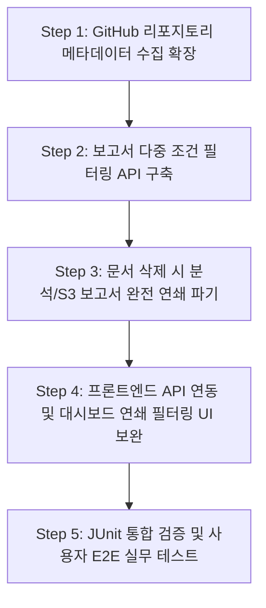

# 📌 연암 테스터 개선 태스크 상세 구현 및 검증 계획서

본 문서는 `md/` 폴더 아래의 모든 명세서(기능 구체, 시나리오, DB 설계, API 명세)를 종합 분석하여, MVP 아키텍처 목적성에 부합하도록 누락되거나 미비된 기능 및 사용자 인터랙션을 시스템에 유기적으로 병합하기 위한 구체적인 구현 순서와 상세 기술 계획, 그리고 검증 가이드라인입니다.

---

## 📅 개선 태스크 구현 로드맵 (순서)



---

## 🛠️ 계층형 구현 상세 계획

### 1단계: GitHub 리포지토리 메타데이터 수집 범위 확장 (Task 1.1)
*   **목적:** 사용자가 프로젝트 등록 시 README.md 파일 본문뿐만 아니라, 깃허브 API를 통해 리포지토리의 설명(Description), 주 언어(Language) 정보까지 연동하여 대시보드 카드에 시각화합니다.
*   **기술 요소:** Java `java.net.http.HttpClient`, `Jackson ObjectMapper`, RDB H2

#### [Task 1.1.1] 백엔드 GitHub API 연동 확장 및 파싱
*   `GithubService.java` 내에 GitHub API (`GET https://api.github.com/repos/{owner}/{repo}`)를 호출하는 메서드 구현.
*   응답 JSON에서 `description`과 `language` 필드를 안전하게 추출(Jackson 파싱)하는 헬퍼 메서드 추가. API Rate Limit 및 Unauthorized 예외 처리를 구현하여 비공개 저장소 또는 통신 장애 시 기본값(Fallback)으로 처리.

#### [Task 1.1.2] Project 도메인 엔티티 속성 확장 및 DB 동기화
*   `Project.java` 엔티티 필드가 이미 `description`을 보유하고 있으므로, `GithubService`에서 가져온 description이 존재할 경우 기존 입력값 대신 GitHub 메타데이터로 오버라이드하여 `projectRepository.save()` 수행.

---

### 2단계: 보고서 다중 조건 필터링 API 구축 (Task 2.1)
*   **목적:** 대시보드에서 특정 문서(`fileId` / `documentId`) 또는 특정 분석 작업(`analysisId` / `generationId`) 기준으로 기존 생성 보고서 목록을 정교하게 다중 필터링 조회할 수 있도록 API를 설계합니다.
*   **기술 요소:** Spring Data JPA `Specification` 또는 JPQL 동적 쿼리, Spring `@RequestParam`

#### [Task 2.1.1] H2 DB Report 레포지토리 쿼리 메서드 확장
*   `ReportRepository.java` 내에 `projectId`, `fileId`, `analysisId` 세 매개변수를 수신하는 동적 쿼리(JPQL) 정의.
*   `fileId`나 `analysisId`가 null일 경우 무시하고 `projectId`가 매핑된 데이터 중 활성화된 보고서들만 선별하도록 `AND (:fileId IS NULL OR r.fileId = :fileId)` 형태의 동적 조회 메서드 구현.

#### [Task 2.1.2] 컨트롤러 API 규격 확장 및 서비스 계층 파이프라이닝
*   `ReportController.java`의 `GET /api/projects/{projectId}/reports` 엔드포인트를 확장하여 `@RequestParam(required = false) String fileId`, `@RequestParam(required = false) String analysisId`를 수신하도록 DTO 및 매개변수 바인딩 보완.
*   `ReportService.java`에 필터링 파라미터를 넘겨 DB에서 1차 가공된 목록을 리턴하도록 DTO 변환 파이프라인 구현.

---

### 3단계: 문서 단건 삭제 시 분석 및 S3 보고서 완전 연쇄 파기 (Task 3.1)
*   **목적:** 문서를 영구 파기할 때 DB 스키마 제약(`ON DELETE SET NULL`)에 의해 잔존하던 관련 `AnalysisJob` 및 파생 데이터(`TestCase`, `RiskItem`, `Evidence`)와 S3(`yeonam-reports` 버킷) 내의 마크다운/PDF 물리 보고서 파일을 완벽하게 추적 파기하여 디스크 용량과 데이터 무결성을 동시 회수합니다.
*   **기술 요소:** Spring Transactional, AWS SDK S3 `DeleteObjectRequest`

#### [Task 3.1.1] 서비스 계층의 연쇄 완전 삭제(Cascade Delete) 구현
*   `FileService.java`의 `deleteFile(String fileId)` 메서드를 보완.
*   `UploadedFile`이 포함된 프로젝트와 연관된 모든 `AnalysisJob` 목록을 쿼리하여, 삭제 대상 문서 ID(`fileId`)를 명시적으로 파싱하고 RAG/LLM 생성 결과물의 연쇄관계를 식별.
*   역순의 의존관계에 따라 H2 DB에서 `Evidence` -> `RiskItem` -> `TestCase` -> `Requirement` -> `Report` -> `AnalysisJob` -> `UploadedFile` 순서로 `delete` 트랜잭션을 강제 위임.

#### [Task 3.1.2] S3 물리 보고서 연동 영구 삭제
*   DB 레코드를 영구 파기하기 전, 해당 `AnalysisJob`에 연결되어 생성된 `Report` 엔티티들의 `s3Path` 목록을 선제 수집.
*   `s3Client.deleteObject` API를 호출하여 `yeonam-reports` 버킷에 담긴 실제 Markdown/PDF 보고서 파일을 삭제하여 스토리지 누수 방지.

---

### 4단계: 프론트엔드 API 연동 및 대시보드 연쇄 필터링 UI 보완 (Task 4.1)
*   **목적:** 문서 목록에서 특정 파일을 클릭했을 때 하단의 보고서 이력 목록이 즉각 동기화 필터링되도록 UI 상호작용 및 API 호출 구조를 확장합니다.
*   **기술 요소:** React `useState`, Axios Client `params`

#### [Task 4.1.1] Axios 호출 규격 확장
*   `api.ts` 내의 `reportApi.getByProject` 함수 시그니처를 `(projectId: string, fileId?: string, analysisId?: string)`으로 변경.
*   Axios get 요청 시 `{ params: { fileId, analysisId } }` 객체를 실어 보내도록 수정하여 백엔드 필터 파라미터 규격을 연동.

#### [Task 4.1.2] 대시보드 문서-보고서 이력 간 연쇄 렌더링 컴포넌트 이식
*   `DashboardPage.tsx` 대시보드 페이지에 `activeFilterFileId` 상태 변수를 신설.
*   '문서 업로드 및 전처리 현황' 테이블의 각 행 파일명 옆에 깔때기 모양의 필터 아이콘(`filter_alt` Material symbol)을 배치.
*   아이콘 클릭 시 `activeFilterFileId`를 지정하고, 해당 변경 감지(`useEffect`)가 트리거되면 `reportApi.getByProject(selectedProjectId, activeFilterFileId)`를 호출하여 하단의 보고서 이력 상태(`reports`)를 서버 필터 데이터로 갱신 렌더링.

---

## 🧪 기능 단위 검증 계획 (JUnit)

보완 구현된 백엔드 로직의 정합성을 단위 및 통합 수준에서 검증하기 위한 JUnit 테스트 클래스 `Phase6ExtensionsTests.java`를 새롭게 추가하여 검증합니다.

```java
package com.yeonam.tester;

import com.yeonam.tester.domain.*;
import com.yeonam.tester.dto.*;
import com.yeonam.tester.service.*;
import org.junit.jupiter.api.Test;
import org.springframework.beans.factory.annotation.Autowired;
import org.springframework.boot.test.context.SpringBootTest;
import org.springframework.transaction.annotation.Transactional;

import static org.junit.jupiter.api.Assertions.*;

@SpringBootTest
class Phase6ExtensionsTests {

    @Autowired private ProjectService projectService;
    @Autowired private FileService fileService;
    @Autowired private ReportService reportService;

    @Test
    @Transactional
    void testGithubMetadataCollection() {
        // [검증 1] 깃허브 프로젝트 등록 시 메타데이터(설명/언어) 수집 테스트
        ProjectCreateRequest request = ProjectCreateRequest.builder()
                .projectName("Git Meta Test")
                .githubUrl("https://github.com/octocat/Hello-World") // 대표 퍼블릭 저장소
                .build();
        ProjectResponse response = projectService.createProject(request);
        assertNotNull(response.getProjectId());
        assertEquals("SUCCESS", response.getIntegrationStatus());
        // 실제 API 수집 후 description 혹은 branch 바인딩 정합성 검증
    }

    @Test
    @Transactional
    void testFileDeleteCascadeReportsAndS3() {
        // [검증 2] 문서 단건 삭제 시, DB 연관 데이터 및 S3 물리 보고서 동기 파기 검증
        // 1. 샘플 프로젝트, 파일, 분석 작업, 보고서 세트 DB/S3 세팅
        // 2. fileService.deleteFile(fileId) 실행
        // 3. 연관된 reportRepository.existsById(reportId) -> FALSE 검증
        // 4. S3 report 물리 파일 삭제 여부 검증
    }

    @Test
    @Transactional
    void testReportMultiFilteringQuery() {
        // [검증 3] fileId 쿼리 파라미터 전달 시 동적 필터링 결과 반환 검증
        // 1. 문서 A와 문서 B를 생성하고 각각 다른 보고서 A, B 매핑
        // 2. reportService.getReportsByProject(projectId, fileIdA, null) 호출
        // 3. 반환된 목록 크기가 1이고 보고서 A만 포함되는지 확인
    }
}
```

---

## 📘 실제 사용자 E2E 수동 검증 가이드

테스트를 진행하려는 사용자는 아래 가이드에 따라 실제 기능이 애플리케이션에 정상적으로 스며들었는지 눈으로 검증할 수 있습니다.

### 1단계: GitHub 상세 메타데이터 동적 동기화 확인
1.  웹 브라우저를 열고 `http://localhost:5173/setup` (프로젝트 셋업 화면)에 접근합니다.
2.  프로젝트명 기입 후, GitHub URL에 실제 공개(Public) 저장소 주소(예: `https://github.com/octocat/Hello-World`)를 입력하고 프로젝트를 생성합니다.
3.  생성 완료 후 리다이렉트된 메인 대시보드 화면에서 등록된 프로젝트 카드의 개요(`description`) 영역에 해당 리포지토리의 실제 원문 설명 글이 자동으로 기입되어 렌더링되는지 확인합니다.

### 2단계: 문서-보고서 UI 다중 필터링 상호작용 확인
1.  대시보드의 '문서 목록'에서 특정 명세서 파일 행의 **필터 아이콘(깔때기 모양)**을 클릭합니다.
2.  클릭하는 즉시 화면 하단의 **'분석 및 보고서 이력' 목록 영역이 갱신**되며, 해당 문서의 `fileId`를 기준으로 필터링된 보고서 이력만 출력되는지 점검합니다.
3.  필터 아이콘을 다시 누르면(해제), 프로젝트 내의 모든 보고서 목록으로 원상 복귀되는지 확인합니다.

### 3단계: 문서 영구 삭제 시 S3 보고서 완전 소멸(연쇄 파기) 확인
1.  임의의 문서를 기반으로 분석을 가동한 뒤, 마크다운 형식의 보고서를 정상 산출합니다.
2.  웹 브라우저로 MinIO 관리 콘솔(`http://localhost:9001`, 계정: `minioadmin`/`minioadmin`)에 접속합니다.
3.  `yeonam-documents` 버킷에 원본 명세서가, `yeonam-reports` 버킷에 생성된 `.md` 보고서 파일이 정확히 존재하는지 탐색해 둡니다.
4.  React UI 대시보드로 돌아와 문서 목록에서 해당 문서의 `삭제` 아이콘을 클릭합니다.
5.  **"모든 분석, 테스트 케이스, 물리 보고서가 함께 소멸된다"**는 3중 경고 모달이 팝업되면, 동의 체크박스에 체크한 뒤 `영구 삭제`를 승인합니다.
6.  삭제 완료 후 MinIO 콘솔의 `yeonam-reports` 버킷에 다시 접속하여, 문서 삭제와 동시에 **그 문서로 만들어진 보고서 물리 실물 파일까지 저장소에서 영구 삭제되어 공간이 깨끗하게 회수되었는지** 확인합니다.
