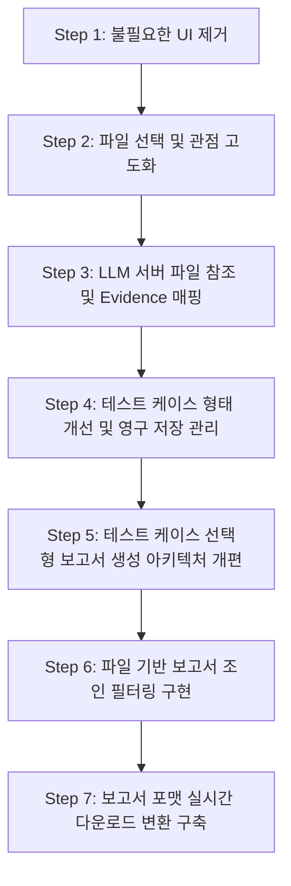

# 📌 연암 테스터 애플리케이션 추가 개선 계획서 (개선 테스크 2)

본 계획서는 연암 테스터의 코드 완성도를 한층 더 높이기 위해 제안된 10가지 개선 사항을 실제 시스템에 정교하게 병합하기 위한 구체적인 구현 로드맵이자 상세 기술 설계서입니다. 모든 구현 계획은 프로젝트 명세서(기능 구체, 시나리오, DB 설계, API 명세, 페이지 요구사항)를 엄격히 기반으로 하여 소프트웨어의 본질적인 목적성을 해치지 않도록 설계되었습니다.

---

## 📅 구현 순서 및 로드맵

---

## 🛠️ 계층형 구현 및 검증 상세 계획

### [Step 1] 불필요한 UI 요소 제거 (Task 1.1)
* **목적:** 데모/MVP 수준에서 무의미하게 작동하거나 기획서 명세에 존재하지 않는 장식용 UI 요소를 제거하여 오직 핵심 검증 시나리오에 몰입할 수 있도록 화면을 정돈합니다.
* **대상 파일:** [App.tsx](file:///c:/capd/yeonam_tester/frontend/src/App.tsx)

#### 1.1.1. 상세 구현 계획
* **우측 상단 헤더 UI 제거:** `App.tsx` 내 `NavigationWrapper` 컴포넌트의 `<header>` 영역에서 알림 버튼(bell 아이콘), 설정 버튼(cog 아이콘), 사용자 프로필 아바타 이미지 컨테이너 블록을 영구히 삭제합니다.
* **좌측 사이드바 UI 제거:** `App.tsx` 내 `<aside>` 태그 영역에서 `QA TERMINAL` 타이틀 텍스트, `v2.4.0-stable` 정보 라벨, `Reports` 네비게이션 링크, `Upgrade Plan` 버튼, `Support` 및 `Logout` 링크가 렌더링되지 않도록 코드를 영구 삭제합니다.

#### 1.1.2. 기능 단위 검증 및 테스트 방법
* **컴파일 검증:** 프론트엔드 폴더(`frontend/`)에서 `npm run build`를 실행하여 컴포넌트 제거로 인한 깨진 태그나 참조 오류가 없는지 검증합니다.
* **수동 E2E 테스트 가이드:**
  1. 프론트엔드 React 서버(`npm run dev`)를 가동합니다.
  2. 브라우저에서 `http://localhost:5173` 대시보드 화면에 접속합니다.
  3. 좌측 내비게이션 바에 오직 **`Projects`**와 **`Documentation`** 2개의 활성 탭만 남아있고, 우측 상단 헤더에 새 프로젝트 생성 버튼만 심플하게 잔존하는지 시각적으로 검증합니다.

---

### [Step 2] 분석 대상 파일 선택 기능 및 QA 관점 고도화 (Task 2.1)
* **목적:** 분석 실행 시 전체 문서가 아닌 사용자가 원하는 문서만 지정해 분석을 가동하도록 제어하고, QA 관점별로 LLM에 동적 템플릿 프롬프트를 전송해 검증 성숙도를 끌어올립니다.
* **대상 파일:** [DocumentUploadPage.tsx](file:///c:/capd/yeonam_tester/frontend/src/pages/DocumentUploadPage.tsx), [AnalysisService.java](file:///c:/capd/yeonam_tester/backend/src/main/java/com/yeonam/tester/service/AnalysisService.java)

#### 2.1.1. 상세 구현 계획
* **문서 다중 선택 UI:** `DocumentUploadPage.tsx` 또는 RAG 분석 실행 단계 진입 시, 업로드 완료된(`status = DONE`) 파일 목록에 다중 선택 체크박스 컴포넌트를 이식합니다. 선택된 `documentId`들을 React 상태 배열인 `selectedDocIds`에 담습니다.
* **API 호출 규격 연동:** Axios 분석 실행 호출 시 `AnalysisCreateRequest.targetDocumentIds` 파라미터에 `selectedDocIds` 배열을 실어 `POST /api/projects/{projectId}/analysis` 엔드포인트를 호출합니다.
* **QA 관점 상세 템플릿 연동:** `AnalysisService.java`에서 분석 트리거 시, 활성화된 QA 관점(SECURITY, PERFORMANCE, FUNCTIONAL 등) 목록을 식별하고, 각 관점에 매핑된 **상세 전문 검증 가이드 프롬프트**를 수집하여 `customPrompt` 앞부분에 동적으로 병합하여 외부 LLM 서버에 전송하도록 구현합니다.
  - (예: SECURITY -> "인증, 인가, 데이터 오용, 입력값 유효성 검증을 위한 침투형 시나리오 수립에 집중하라.")

#### 2.1.2. 기능 단위 검증 및 테스트 방법
* **백엔드 단위 테스트:** JUnit을 통해 `AnalysisService.startAnalysis` 호출 시 `targetDocumentIds`가 알맞게 필터링되고, 관점 프롬프트가 동적으로 조립되어 trigger JSON에 탑재되는지 mocking 서버 테스트를 수행합니다.
* **수동 E2E 테스트 가이드:**
  1. 문서를 3개 업로드하고 전처리 완료 상태를 확인합니다.
  2. 분석 실행 화면에서 기획 문서 중 1개만 체크박스로 선택하고, '보안성' 관점을 활성화한 후 분석을 가동합니다.
  3. 백엔드 콘솔의 trigger 요청 바디 로깅 혹은 LLM 서버 수신 로그에서 전달된 `s3Paths` 배열의 길이가 1개이며, 프롬프트 내에 보안 관점 특화 템플릿이 병합되어 전달되었는지 눈으로 직접 검토합니다.

---

### [Step 3] LLM Server의 파일 참조 및 근거(Evidence) 데이터 매핑 (Task 3.1)
* **목적:** RAG/LLM 분석 시 선택된 기획서들의 텍스트를 인가받아 실제로 분석 컨텍스트로 활용하고, 파싱되어 회신된 테스트 케이스별 출처와 근거 메타데이터를 백엔드 DB에 영구 기록하도록 연동을 보장합니다.
* **대상 파일:** `llm_server/main.py`, `llm_server/result_formatter.py`, [CallbackService.java](file:///c:/capd/yeonam_tester/backend/src/main/java/com/yeonam/tester/service/CallbackService.java)

#### 3.1.1. 상세 구현 계획
* **LLM 서버의 파일 파싱 및 참조:** `llm_server`는 수신한 `s3Paths`를 S3 클라이언트를 통해 메모리로 읽어들인 후 `document_parser.py`를 활용해 텍스트를 추출합니다. 추출된 텍스트들을 기획서 파일명별 블록으로 나누어 LLM 시스템 프롬프트(Context)로 참조시킵니다.
* **결과 포맷 근거(Evidence) 요구 강화:** `result_formatter.py` 및 LLM 지시 프롬프트에 규격을 강제하여, 도출되는 모든 테스트 케이스마다 `evidences` 배열을 지니게 하고 그 안에 `sourceName`(파일명), `sourceSection`(장/절), `evidenceText`(인용한 문서 조각 원문)를 담아 콜백하도록 처리합니다.
* **백엔드 Webhook 콜백 저장 처리:** [CallbackService.java](file:///c:/capd/yeonam_tester/backend/src/main/java/com/yeonam/tester/service/CallbackService.java)의 `processCallback` 로직에서 콜백 데이터의 `evidences` 리스트를 파싱하여, RDB H2의 `evidence` 테이블에 외래키 무결성에 맞춰 순차적으로 저장(`evidenceRepository.save()`)합니다.

#### 3.1.2. 기능 단위 검증 및 테스트 방법
* **Mock 콜백 JUnit 테스트:** `Phase6ExtensionsTests`에 `testWebhookCallbackEvidencePersistence` 테스트 케이스를 수립하여, `AnalysisCallbackRequest`에 `evidences` JSON 정보를 담아 `callbackService.processCallback`을 직접 호출한 후 `evidenceRepository`를 통해 DB에 근거 레코드들이 정확히 insert되었는지 검증합니다.
* **수동 E2E 테스트 가이드:**
  1. 프로젝트 분석을 정상 수행합니다.
  2. 분석이 완료(`COMPLETED`)된 후, H2 DB 콘솔(`http://localhost:8080/h2-console`)에 접속합니다.
  3. `SELECT * FROM EVIDENCE;` 쿼리를 실행하여, 각 테스트 케이스에 연계된 원본 기획서 파일명(`SOURCE_NAME`)과 인용문(`EVIDENCE_TEXT`)이 정교하게 분리 매핑되어 들어와 있는지 직접 쿼리 결과로 검증합니다.

---

### [Step 4] 테스트 케이스 형태 개선 및 영구 저장 관리 UI 이식 (Task 4.1)
* **목적:** 산출된 테스트 케이스 카드의 레이아웃을 정형화하고, 사용자가 기획서 출처(Evidence)를 우아하게 확인하며, 각각의 케이스를 인라인 또는 리스트 형태로 영구 편집/삭제 관리할 수 있는 편의 기능을 확보합니다.
* **대상 파일:** [AnalysisResultPage.tsx](file:///c:/capd/yeonam_tester/frontend/src/pages/AnalysisResultPage.tsx), [DashboardPage.tsx](file:///c:/capd/yeonam_tester/frontend/src/pages/DashboardPage.tsx), `TestCaseController.java`, `TestCaseService.java`

#### 4.1.1. 상세 구현 계획
* **출처(Evidence) 배지 UI 구현:** `AnalysisResultPage.tsx`에서 테스트 케이스 카드 하단에 '출처: [파일명] ([장/절])'을 표시하는 라벨을 렌더링하고, 마우스 오버(Tooltip) 또는 아코디언 버튼 클릭 시 `evidenceText` 원문이 부드러운 애니메이션과 함께 노출되도록 디자인을 다듬습니다.
* **백엔드 관리 API 수립:** 
    * `GET /api/projects/{projectId}/testcases`: 프로젝트의 누적 저장된 전체 테스트 케이스 리스트 조회 API를 개발합니다.
    * `PUT /api/testcases/{testCaseId}`: 개별 테스트 케이스 필드(명칭, 사전조건, 기대결과 등) 수정 API를 개발합니다.
    * `DELETE /api/testcases/{testCaseId}`: 개별 테스트 케이스 완전 영구 삭제 API를 개발합니다.
* **프론트엔드 관리 UI 보드 이식:**
    * 대시보드 페이지에 **'테스트 케이스 관리 보드'** 탭을 추가하고 누적된 테스트 케이스들을 조회합니다.
    * 리스트의 각 테스트 케이스 행에 '수정' 및 '삭제' 액션 아이콘을 제공하여, 수정 버튼 클릭 시 인라인 입력 창이나 모달 창을 띄워 변경값을 백엔드 수정 API로 갱신 전송하도록 처리합니다.

#### 4.1.2. 기능 단위 검증 및 테스트 방법
* **API 동작성 JUnit 테스트:** `Phase6ExtensionsTests`에 `testTestCaseCRUD`를 수립하고, 테스트 케이스의 수정 및 삭제 API를 가동하여 DB 데이터가 업데이트 및 삭제되는지 검증합니다.
* **수동 E2E 테스트 가이드:**
  1. 웹 브라우저 대시보드 화면 하단의 '테스트 케이스 관리 보드' 탭으로 이동합니다.
  2. 기존에 생성된 테스트 케이스 중 하나의 '수정' 아이콘을 클릭하여 시나리오 및 사전조건 텍스트를 고친 후 '저장' 버튼을 누릅니다.
  3. 페이지를 새로고침하여 수정한 텍스트가 정상적으로 영구 렌더링되는지 확인하고, '삭제' 버튼을 눌러 목록에서 깔끔하게 즉각 지워지는지 검증합니다.

---

### [Step 5] 테스트 케이스 선택형 보고서 생성 아키텍처 개편 (Task 5.1)
* **목적:** 분석 작업 통째로 보고서를 생성하던 기존의 비유연한 구조를 변경하여, 사용자가 원하는 고품질 테스트 케이스들만 체크하여 원하는 시점에 맞춤형 보고서를 직접 생성할 수 있도록 개편합니다.
* **대상 파일:** [Report.java](file:///c:/capd/yeonam_tester/backend/src/main/java/com/yeonam/tester/domain/Report.java), [ReportService.java](file:///c:/capd/yeonam_tester/backend/src/main/java/com/yeonam/tester/service/ReportService.java), [ReportController.java](file:///c:/capd/yeonam_tester/backend/src/main/java/com/yeonam/tester/controller/ReportController.java), [AnalysisResultPage.tsx](file:///c:/capd/yeonam_tester/frontend/src/pages/AnalysisResultPage.tsx)

#### 5.1.1. 상세 구현 계획
* **DB 매핑 테이블 신설:** `Report`와 `TestCase` 간의 N:M 매핑을 관계형 데이터베이스로 추적할 수 있도록 중간 다대다 매핑 테이블인 `report_test_case` 테이블을 스키마에 추가하고, 연계 엔티티인 `ReportTestCase`를 신설합니다.
* **API 바디 DTO 개편:** `ReportCreateRequest` DTO 클래스에 `List<String> testCaseIds` 필드를 추가하고, `ReportController.java`에서 이 DTO를 수신하도록 엔드포인트를 정비합니다.
* **서비스 조립 로직 변경:** `ReportService.java` 및 `ReportAssemblyService.java`에서 S3에 저장할 보고서 마크다운을 빌드할 때, 전체 `AnalysisJob`의 테스트 케이스가 아닌, 요청된 `testCaseIds`에 대응되는 테스트 케이스 레코드들만 DB에서 선별 조회하여 마크다운 본문을 조립하도록 템플릿 렌더링 코드를 전면 개편합니다.
* **프론트엔드 체크박스 보고서 생성 연동:** `AnalysisResultPage.tsx`에서 테스트 케이스 목록의 각 항목 맨 앞에 체크박스를 배치하고, 상단에 '선택된 테스트 케이스로 보고서 생성' 버튼을 배치합니다. 사용자가 선택한 케이스 ID 배열을 DTO 바디에 실어 보고서 생성 API를 호출하도록 교체합니다.

#### 5.1.2. 기능 단위 검증 및 테스트 방법
* **선택형 보고서 JUnit 통합 테스트:** `Phase6ExtensionsTests` 내에 `testGenerateReportWithSelectedTestCases`를 구성합니다. 테스트 케이스 2개 중 1개만 ID 목록으로 요청했을 때, 정상적으로 보고서가 생성 및 S3에 적재되고, DB `report_test_case` 조인 테이블에 1건만 기록되는지 검증합니다.
* **수동 E2E 테스트 가이드:**
  1. 웹 화면에서 분석 결과 페이지로 진입하여 나열된 테스트 케이스들 중 2개만 선별하여 체크박스를 선택합니다.
  2. '보고서 생성' 버튼을 누릅니다.
  3. 생성된 보고서 미리보기 혹은 다운로드 파일에서 내가 선택한 2개의 테스트 케이스 세부 내용만 깔끔하게 보고서 본문에 수록되어 있는지 눈으로 확인합니다.

---

### [Step 6] 파일을 통한 보고서 필터링 (조인 쿼리 구현) (Task 6.1)
* **목적:** 보고서가 담고 있는 테스트 케이스들이 실제로 참조하는 기획서 파일 경로를 정밀 조인 추적하여, 특정 문서를 깔때기로 필터링했을 때 수록된 내용과 완벽히 부합하는 보고서들만 선별되도록 구현합니다.
* **대상 파일:** [ReportRepository.java](file:///c:/capd/yeonam_tester/backend/src/main/java/com/yeonam/tester/repository/ReportRepository.java)

#### 6.1.1. 상세 구현 계획
* **JPQL 조인 쿼리 수정:** `ReportRepository.java`에 이전에 구현한 `findByProjectWithFilters` 동적 쿼리를 수정하여, `Report r`에서 시작해 다대다 조인 엔티티 `ReportTestCase rtc`, `TestCase tc`, `Evidence e`, `UploadedFile uf` 순서로 inner join을 수행하는 JPQL을 구성합니다.
  - (예: `SELECT DISTINCT r FROM Report r JOIN r.reportTestCases rtc JOIN rtc.testCase tc JOIN tc.evidences e JOIN e.testCase.uploadedFile uf ...`)
* **동적 조건 보정:** `fileId` 파라미터가 유효하게 전달되었을 때, 위의 조인 체인을 타고 들어간 `uf.fileId`가 매칭되는 보고서만 선별하도록 `AND (:fileId IS NULL OR uf.fileId = :fileId)` 동적 조건을 적용합니다.

#### 6.1.2. 기능 단위 검증 및 테스트 방법
* **필터링 정합성 JUnit 테스트:** `Phase6ExtensionsTests`의 `testReportMultiFilteringQuery` 메서드를 고쳐서, 보고서 A는 파일 A의 테스트 케이스를 가리키고 보고서 B는 파일 B의 테스트 케이스를 가리키도록 설정한 후, 파일 A의 ID로 필터링 요청 시 정확히 보고서 A만 걸러지는지 검증합니다.
* **수동 E2E 테스트 가이드:**
  1. 문서 A와 문서 B를 업로드하고 각각 개별 분석을 수행해 보고서 A, B를 각각 생성합니다.
  2. 대시보드 문서 목록에서 문서 A의 깔때기 필터 아이콘을 클릭합니다.
  3. 하단 이력에 문서 A를 근거로 제작된 보고서 A만 노출되고 보고서 B는 완벽히 화면에서 제외되는지 수동으로 최종 점검합니다.

---

### [Step 7] 보고서 반출 포맷 실시간 변환(On-the-fly) 아키텍처 구축 (Task 7.1)
* **목적:** S3에 포맷별로 파일을 이중 생성하던 낭비적 로직을 없애고 S3에는 단일 마크다운 리소스만 보관하며, 클라이언트가 다운로드를 요청할 때 실시간으로 원하는 포맷(PDF/MD)으로 컴파일해 반출하도록 최적화합니다.
* **대상 파일:** [ReportService.java](file:///c:/capd/yeonam_tester/backend/src/main/java/com/yeonam/tester/service/ReportService.java), [ReportController.java](file:///c:/capd/yeonam_tester/backend/src/main/java/com/yeonam/tester/controller/ReportController.java), [DashboardPage.tsx](file:///c:/capd/yeonam_tester/frontend/src/pages/DashboardPage.tsx)

#### 7.1.1. 상세 구현 계획
* **S3 원본 캐시 단일화:** `ReportService.generateReport` 시 더이상 format 구분을 두어 생성하지 않고, 포맷에 관계없이 S3에 항상 표준 마크다운(`.md`) 파일 원본 하나만 업로드하도록 단일화합니다.
* **실시간 변환 다운로드 엔드포인트 개편:** [ReportController.java](file:///c:/capd/yeonam_tester/backend/src/main/java/com/yeonam/tester/controller/ReportController.java)의 `GET /api/reports/{reportId}/download` API에 `@RequestParam String format`을 바인딩받습니다.
* **실시간 다운로드 컴파일러 연동:** 서비스단에서 S3의 원본 마크다운 파일을 fetch하여 메모리에 얹은 뒤, `format = PDF` 요청 시 즉석에서 `renderEngine.renderPdf(markdown)`를 호출해 PDF 바이너리 바이트 배열을 컴파일 추출하여 HTTP 응답 스트림에 Content-Type `application/pdf`로 실어 즉시 반환하도록 아키텍처를 전면 개편합니다.
* **프론트엔드 포맷 선택 다운로드 연동:** `DashboardPage.tsx` 또는 보고서 미리보기 페이지에서 다운로드 아이콘 클릭 시 'Markdown 다운로드'와 'PDF 다운로드' 두 선택지를 가진 드롭다운 메뉴를 배치하고, 선택된 포맷 파라미터가 실린 쿼리 스트링으로 URI를 생성해 다운로드를 실행하도록 연동합니다.

#### 7.1.2. 기능 단위 검증 및 테스트 방법
* **On-the-fly JUnit 테스트:** `Phase6ExtensionsTests`에 `testDownloadOnTheFlyPdf` 테스트 케이스를 구현하고, S3에는 오직 마크다운으로 등록된 보고서 리소스를 타겟으로 하여 다운로드 API를 가동했을 때, 정상적으로 PDF 바이트 배열이 에러 없이 무중단 렌더링 변환되어 회신되는지 JUnit 단에서 검증합니다.
* **수동 E2E 테스트 가이드:**
  1. 대시보드 보고서 이력에서 다운로드 아이콘을 눌러 'PDF 다운로드'를 선택합니다.
  2. 로컬 기기에 `.pdf` 확장자 파일로 보고서 파일이 다운로드 완료되는지 확인합니다.
  3. 다운로드된 PDF 파일을 실행하여 폰트나 레이아웃이 깨지지 않고, 마크다운 원본 내용이 아름답게 PDF 포맷 문서 형태로 실시간 렌더링되어 완성되었는지 최종 확인합니다.
