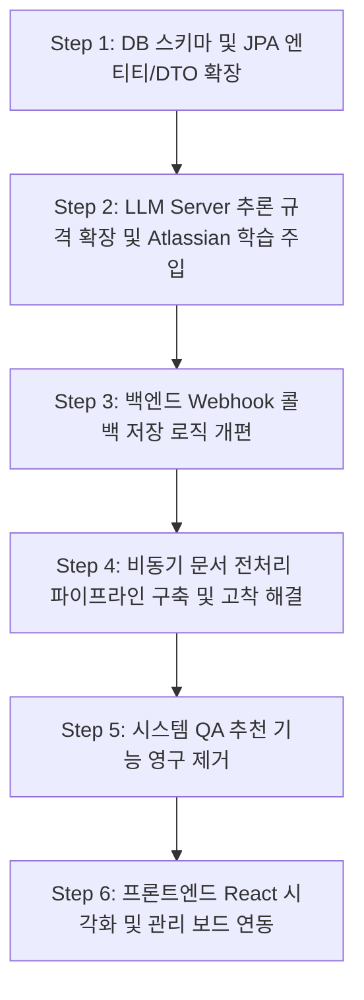

# 📌 연암 테스터 애플리케이션 추가 개선 계획서 (개선 테스크 3)

본 계획서는 연암 테스터 애플리케이션의 완성도를 높이고, 기능상의 병목과 무한 대기 오류를 근본적으로 해결하기 위해 수립된 정교한 개선 구현 계획서입니다. 명세서(기능 구체, 시나리오, DB 설계, API 명세, 페이지 요구사항)를 엄격히 준수하여 프로젝트의 본질적 목적을 충족하고 원활한 통합을 이룰 수 있도록 계층적이고 직관적인 기술 구현 설계를 제공합니다.

---

## 📅 구현 순서 및 로드맵 (의존성 기준)

데이터 스키마와 데이터 흐름의 뼈대를 먼저 구축한 후, 추론 엔진(AI) 및 비동기 처리 파이프라인(전처리), 마지막으로 UI 렌더링 및 정리 순서로 계층적 구현을 전개합니다.



---

## 🛠️ 계층형 구현 및 검증 상세 계획

### [Step 1] DB 스키마 및 JPA 엔티티/DTO 확장 (Task 1.1)
* **목적:** 도출되는 고품질 테스트 케이스의 Atlassian 기반 특성(테스트 카테고리, 설계 기법, TDD 힌트, 부정 시나리오)을 저장할 데이터베이스 스키마와 백엔드 통신용 객체(DTO)를 확장합니다.
* **대상 파일:**
  * [schema.sql](file:///c:/capd/yeonam_tester/backend/src/main/resources/schema.sql)
  * [TestCase.java](file:///c:/capd/yeonam_tester/backend/src/main/java/com/yeonam/tester/domain/TestCase.java)
  * `AnalysisCallbackRequest.java` (백엔드 DTO)
  * `AnalysisResultResponse.java` (백엔드 DTO)

#### 1.1.1. 상세 구현 계획
1. **DB DDL 수정 ([schema.sql](file:///c:/capd/yeonam_tester/backend/src/main/resources/schema.sql))**:
   - `test_case` 테이블 생성 쿼리에 다음 4개 신규 컬럼 명세를 추가합니다.
     - `category VARCHAR(100)`: 테스트 성격 분류 (`test_level`, `test_technique`, `non_functional`, `qa_concept`)
     - `technique VARCHAR(255)`: 적용된 Atlassian 설계 기법 및 원칙 명칭
     - `tdd_hint CLOB`: TDD 구현 시 참고할 상세 설계 흐름 및 단언(Assert) 힌트
     - `negative_scenario TEXT`: Happy Path를 넘어서는 부정/예외 시나리오의 구체적 서술
2. **JPA 엔티티 수정 ([TestCase.java](file:///c:/capd/yeonam_tester/backend/src/main/java/com/yeonam/tester/domain/TestCase.java))**:
   - 멤버 필드로 `private String category;`, `private String technique;`, `private String tddHint;`, `private String negativeScenario;`를 추가합니다.
   - `tddHint`와 `negativeScenario` 필드 상단에 대용량 문자열을 수용할 수 있도록 `@Lob` 및 `@Column(name = "...", columnDefinition = "CLOB")` 어노테이션을 선언합니다.
   - 생성자 파라미터, Getter/Setter 메소드, Builder inner 클래스에 4개 필드 정의를 추가하여 객체 생성을 지원합니다.
3. **백엔드 DTO 확장**:
   - **`AnalysisCallbackRequest.TestCaseDto`** 및 **`AnalysisResultResponse.TestCaseDto`** 스태틱 빌더 내에 `category`, `technique`, `tddHint`, `negativeScenario` 멤버 필드를 추가하고 빌더 및 Getter/Setter를 구현합니다.

#### 1.1.2. 기능 단위 검증 및 테스트 방법
* **자동화 테스트 (JUnit)**:
  - `Phase6ExtensionsTests` 클래스에 `testTestCaseEntityExtension` 테스트 케이스를 생성합니다.
  - 임의의 `TestCase` 객체를 빌드할 때 신규 필드를 지정하고 `testCaseRepository.save(testCase)`를 실행한 후, 다시 엔티티를 조회하여 4개 필드가 유실 없이 정확하게 H2 DB에서 읽혀오는지 `assertEquals` 단언문으로 확인합니다.
* **사용자 수동 검증 가이드**:
  1. H2 DB 콘솔(`http://localhost:8080/h2-console`)에 접속합니다.
  2. `TEST_CASE` 테이블 구조 조회를 실행하여 `CATEGORY`, `TECHNIQUE`, `TDD_HINT`, `NEGATIVE_SCENARIO` 컬럼이 에러 없이 물리적으로 추가되어 있는지 확인합니다.

---

### [Step 2] LLM Server 추론 규격 확장 및 Atlassian 학습 주입 (Task 2.1)
* **목적:** AI 분석 엔진에 `atlassian_knowledge_cards_refined.json`에 정리된 12대 QA 원칙을 학습시키고, 도출 시 개선된 4대 구조적 필드를 채워 반환하도록 지시 및 유효성 검증을 보강합니다.
* **대상 파일:**
  * `llm_server/llm_client.py`
  * `llm_server/result_formatter.py`

#### 2.1.1. 상세 구현 계획
1. **Atlassian QA 원칙 주입 (`llm_server/llm_client.py`)**:
   - Python `json` 라이브러리를 통해 AI 서버 초기 기동 시 `md/atlassian_knowledge_cards_refined.json` 지식 카드를 파싱하여 메모리에 적재합니다.
   - `system_prompt` 문자열에 로드된 12개 원칙 지식을 컨텍스트 형태로 주입하여 LLM이 설계 지식을 인용할 수 있게 설계합니다.
   - LLM이 결과로 제출해야 할 JSON 스키마 명세를 다음과 같이 시스템 프롬프트에 추가 및 강제합니다:
     ```json
     {
       "testCases": [{
         "testCaseId": "TC-xxx",
         "requirementId": "REQ-xxx",
         "testCaseName": "명칭",
         "testScenario": "시나리오",
         "precondition": "사전조건",
         "testSteps": ["단계1", "단계2"],
         "expectedResult": "기대결과",
         "priority": "HIGH",
         "confidenceLevel": "HIGH",
         "riskTags": ["#태그"],
         "category": "test_level | test_technique | non_functional | qa_concept",
         "technique": "적용한 Atlassian 설계 기법 명칭",
         "tddHint": "TDD 설계 흐름 및 assert 비교 팁",
         "negativeScenario": "Happy Path 너머의 의도적 파괴/예외 검증 시나리오"
       }]
     }
     ```
   - `MOCK_RESPONSE` 내 테스트 케이스 예제 데이터에도 위 4대 속성이 구체적으로 채워진 고품질 Mock 데이터를 업데이트합니다.
2. **결과 포맷 방어 및 Fallback (`llm_server/result_formatter.py`)**:
   - `format_and_validate_result` 함수 내 테스트 케이스 루프 처리에 신규 4대 필드 검증을 이식합니다.
   - LLM이 특정 필드(`category`, `technique`, `tddHint`, `negativeScenario`)를 누락했을 경우, 예외가 나지 않도록 `"qa_concept"`, `"Atlassian QA Standard Principle"`, `"추가 검토 필요"`, `"추가 검토 필요"` 등의 디폴트 값을 안전하게 주입하는 Fallback 로직을 작성합니다.

#### 2.1.2. 기능 단위 검증 및 테스트 방법
* **자동화 테스트 (FastAPI Pytest)**:
  - `result_formatter.py`에 유효하지 않거나 신규 필드가 누락된 JSON 문자열을 전달했을 때, `format_and_validate_result`가 가로채서 에러 없이 기본값을 정상 병합하는지 단위 유닛 테스트를 구동합니다.
* **사용자 수동 검증 가이드**:
  1. AI 서버 환경 변수를 `MOCK_LLM=true`로 설정하고 실행합니다.
  2. cURL 명령어로 `/api/analysis/trigger` 또는 `/analyze` 엔드포인트에 Mock 요청을 보냅니다.
  3. LLM Server의 표준 출력 로그에 표시되는 분석 반환 데이터에 `category`, `technique`, `tddHint`, `negativeScenario` 필드가 명확한 데이터 규격을 갖춘 JSON으로 출력되는지 직접 터미널 상에서 파싱된 결과를 확인합니다.

---

### [Step 3] 백엔드 Webhook 콜백 저장 로직 개편 (Task 3.1)
* **목적:** LLM Server로부터 Webhook을 수신할 때 백엔드 H2 DB에 4대 추가 필드 데이터를 관계형 데이터의 무결성에 맞춰 안정적으로 가동 및 저장합니다.
* **대상 파일:**
  * [CallbackService.java](file:///c:/capd/yeonam_tester/backend/src/main/java/com/yeonam/tester/service/CallbackService.java)

#### 3.1.1. 상세 구현 계획
1. **`CallbackService.processCallback` 매핑 보강**:
   - API 콜백 요청 바디 내의 `TestCaseDto` 루프 영역에서 `tcDto.getCategory()`, `tcDto.getTechnique()`, `tcDto.getTddHint()`, `tcDto.getNegativeScenario()` 값을 추출합니다.
   - JPA 엔티티 `TestCase testCase`를 `.builder()` 패턴으로 신규 조립하여 빌드할 때 해당 속성들을 바인딩하여 맵핑합니다.
   - `testCaseRepository.save(testCase)`를 수행함으로써 데이터가 정상 적재되도록 연동합니다.

#### 3.1.2. 기능 단위 검증 및 테스트 방법
* **자동화 테스트 (JUnit Integration Test)**:
  - `Phase6ExtensionsTests` 클래스 내에 `testWebhookCallbackWithAtlassianFields` 통합 테스트를 구성합니다.
  - 신규 4대 필드 정보가 포함된 Mock `AnalysisCallbackRequest` 페이로드를 생성하고 `callbackService.processCallback`을 강제 호출합니다.
  - 결과적으로 `testCaseRepository`에서 해당 저장 레코드를 조회하여 저장 시와 완벽하게 대칭되는 문장 및 분류가 DB에 최종 복구되는지 검증합니다.
* **사용자 수동 검증 가이드**:
  1. 로컬 백엔드 서버를 구동합니다.
  2. Postman 또는 API 도구를 통해 백엔드 내부 콜백 주소(`POST http://localhost:8080/api/internal/analysis/{analysisId}/callback`)로 4대 필드가 채워진 테스트 데이터를 전송합니다.
  3. 백엔드 시스템 로그에 `200 OK` 또는 에러 없는 무결한 트랜잭션 종료 로그가 발생하는지 식별합니다.

---

### [Step 4] 비동기 문서 전처리 파이프라인 구축 및 고착 해결 (Task 4.1)
* **목적:** 사용자가 요구사항 문서를 업로드했을 때, RAG/LLM 연동 특성상 청킹/임베딩 단계가 부재하여 상태 전이가 일어나지 않던 문제를 백엔드 비동기 서비스 및 FastAPI 검증 API 연계를 통해 해결합니다.
* **대상 파일:**
  * 백엔드: [FileService.java](file:///c:/capd/yeonam_tester/backend/src/main/java/com/yeonam/tester/service/FileService.java), [FileController.java](file:///c:/capd/yeonam_tester/backend/src/main/java/com/yeonam/tester/controller/FileController.java)
  * 백엔드 신규: `FilePreprocessingService.java` [NEW]
  * FastAPI 신규: `/api/files/preprocess` 라우터 추가

#### 4.1.1. 상세 구현 계획
1. **백엔드 비동기 처리 환경 셋업**:
   - Spring Boot의 비동기 실행 스레드 풀을 가동하기 위해 메인 애플리케이션 클래스에 `@EnableAsync` 어노테이션을 부여합니다.
2. **`FilePreprocessingService.java` 비동기 컴포넌트 신설 [NEW]**:
   - `@Service` 클래스를 생성하고 비동기로 수행될 `public void preprocessFile(String fileId)` 메서드를 구현합니다. 이 메서드 위에는 반드시 `@Async` 어노테이션을 부착하여 호출 스레드와 즉각 격리합니다.
   - **비동기 내부 처리 흐름**:
     1. DB에서 업로드된 파일 정보(`UploadedFile`)를 획득한 후 상태(`status`)를 즉시 `"PROCESSING"`으로 업데이트합니다.
     2. Java 11 표준 `java.net.http.HttpClient`를 활용하여 FastAPI 서버에 전처리 검증 요청(`POST {aiServerUrl}/api/files/preprocess`)을 전달합니다. (바디 파라미터: `fileId`, `s3Path`).
     3. 만약 FastAPI 응답이 정상이면 파일 상태를 `"DONE"`으로 변경 저장하고 트랜잭션을 마칩니다.
     4. **샌드박스 및 오프라인 폴백 처리:** 만약 FastAPI 서버가 꺼져있거나 네트워크 장애 또는 실패(HTTP 500 등)가 발생하면, 로컬 파일 검증 로직으로 폴백을 시도합니다. 백엔드에서 직접 S3에 업로드된 파일을 읽어 텍스트 데이터가 유효한지 간이 파싱 검증을 수행하고, 성공 시 `"DONE"`, 텍스트 추출 불가 시 `"FAILED"`로 상태를 확정 갱신합니다.
3. **업로드 연동 ([FileService.java](file:///c:/capd/yeonam_tester/backend/src/main/java/com/yeonam/tester/service/FileService.java))**:
   - `uploadFile` 및 `uploadRawTextFile` 메서드에서 데이터베이스 레코드 저장(`fileRepository.save()`)이 정상 완료된 직후, `filePreprocessingService.preprocessFile(uploadedFile.getFileId())`를 호출하여 비동기 스레드를 가동하고, 호출 프로세스는 즉시 브라우저에 `201 Created` 응답을 회신하도록 개선합니다.

#### 4.1.2. 기능 단위 검증 및 테스트 방법
* **자동화 테스트 (JUnit Async Test)**:
  - `Phase6ExtensionsTests`에서 파일 업로드 API 호출 후 즉시 반환된 응답 상태가 `UPLOADED` 혹은 `PROCESSING`임을 단언하고, `CountDownLatch` 또는 `Thread.sleep`을 활용해 비동기 스레드 실행 시간을 대기한 뒤 최종 DB 내 파일 상태가 `DONE`으로 깔끔하게 업데이트되는지 비동기 갱신 무결성을 테스트합니다.
* **사용자 수동 검증 가이드**:
  1. 기획서 파일 하나를 업로드합니다.
  2. 데이터베이스 콘솔 또는 파일 조회 API(`GET /api/projects/{projectId}/files`)를 반복 조회하여, 1~2초 내에 파일 레코드의 `status` 컬럼이 `"UPLOADED"`에서 `"PROCESSING"`을 거쳐 `"DONE"`으로 자동 변환되는지 눈으로 확인합니다.

---

### [Step 5] 시스템 QA 추천 기능 영구 제거 (Task 5.1)
* **목적:** 기획서 내용을 바탕으로 시스템에서 맞춤형 QA 해시태그를 추천하던 불필요한 기능(추천 칩셋 뷰, 추천 API)을 완벽하게 삭제하여 애플리케이션 명세 영역을 최적화합니다.
* **대상 파일:**
  * 백엔드: [AnalysisService.java](file:///c:/capd/yeonam_tester/backend/src/main/java/com/yeonam/tester/service/AnalysisService.java), [AnalysisController.java](file:///c:/capd/yeonam_tester/backend/src/main/java/com/yeonam/tester/controller/AnalysisController.java)
  * 프론트엔드: [DocumentUploadPage.tsx](file:///c:/capd/yeonam_tester/frontend/src/pages/DocumentUploadPage.tsx)

#### 5.1.1. 상세 구현 계획
1. **백엔드 기능 및 API 파기**:
   - [AnalysisService.java](file:///c:/capd/yeonam_tester/backend/src/main/java/com/yeonam/tester/service/AnalysisService.java)에서 `public QaRecommendationResponse getQaRecommendations(String projectId)` 메서드와 내부 구문을 영구 제거합니다.
   - [AnalysisController.java](file:///c:/capd/yeonam_tester/backend/src/main/java/com/yeonam/tester/controller/AnalysisController.java)에서 `GET /api/analysis/recommendations` 엔드포인트를 담당하던 `getQaRecommendations` API 메서드 선언을 통째로 파기합니다.
2. **프론트엔드 UI/UX 제거 ([DocumentUploadPage.tsx](file:///c:/capd/yeonam_tester/frontend/src/pages/DocumentUploadPage.tsx))**:
   - `DocumentUploadPage.tsx` 코드 내부에서 "시스템 추천 맞춤형 QA 관점" UI 렌더링에 관여하던 JSX 요소 전체(기존 518~539라인)를 제거합니다.
   - 파일 내 `recommendedHashtags`, `selectedHashtags` 상태 선언과 이와 연결된 토글 핸들러인 `handleHashtagToggle` 코드를 영구 삭제합니다.
   - `fetchRecommendations` 호출부와 이를 유발하던 `useEffect` 내 훅 트리거들을 제거합니다.
   - '기본 QA 관점' 체크박스 렌더링 리스트 중, 추천되었을 때 렌더링되던 별표/반짝이 이모지(`✨`)를 표시하는 조건부 구문을 삭제하여 순수한 기본 관점 리스트만 노출합니다.

#### 5.1.2. 기능 단위 검증 및 테스트 방법
* **컴파일 검증**:
  - 백엔드 빌드(`./mvnw clean compile`) 및 프론트엔드 빌드(`npm run build`)를 가동하여 삭제된 기능이나 변수 참조 오류로 인한 빌드 파괴가 일어나지 않는지 완벽히 확인합니다.
* **사용자 수동 검증 가이드**:
  1. 브라우저에서 문서 업로드 화면으로 접속합니다.
  2. 우측 QA 분석 관점 설정 화면에 존재하던 '시스템 추천 맞춤형 QA 관점' 타이틀과 해시태그 칩셋들이 완전히 영구 삭제되어 빈 공간 없이 깔끔하게 기본 QA 관점들만 렌더링되고 있는지 시각적으로 확인합니다.

---

### [Step 6] 프론트엔드 React 시각화 및 관리 보드 연동 (Task 6.1)
* **목적:** AI 분석이 완료되었을 때, 신규 추가된 4대 Atlassian QA 필드(TDD 힌트, 부정 시나리오 등)가 카드 뷰와 관리 테이블 내에서 아름답고 정돈된 형태로 렌더링 및 편집이 가능하게 이식합니다.
* **대상 파일:**
  * 프론트엔드: `src/services/api.ts` (API 인터페이스)
  * 프론트엔드: [AnalysisResultPage.tsx](file:///c:/capd/yeonam_tester/frontend/src/pages/AnalysisResultPage.tsx) (결과 카드 뷰)
  * 프론트엔드: [DashboardPage.tsx](file:///c:/capd/yeonam_tester/frontend/src/pages/DashboardPage.tsx) (테스트 케이스 관리 보드)

#### 6.1.1. 상세 구현 계획
1. **API 타입 선언 확장 (`src/services/api.ts`)**:
   - `TestCase` 및 `TestCaseDto` 인터페이스 타입에 `category?: string;`, `technique?: string;`, `tddHint?: string;`, `negativeScenario?: string;` 필드를 선언합니다.
2. **분석 결과 시각화 고도화 ([AnalysisResultPage.tsx](file:///c:/capd/yeonam_tester/frontend/src/pages/AnalysisResultPage.tsx))**:
   - 각 테스트 케이스 카드 좌측 헤더에 `category` 및 `technique`를 기반으로 색상이 지정된 스타일 배지를 부착합니다. (예: `test_technique` -> 에메랄드색, `Negative Testing` -> 연보라색 배지).
   - 카드 하단부에 접이식(Accordion) 컴포넌트 2개를 신설합니다:
     - **`[💡 TDD 개발 구현 가이드]`**: 클릭 시, API 응답의 `tddHint` 텍스트를 고대비 등폭 폰트(Monospace) 스타일 박스 안에 렌더링합니다.
     - **`[⚠️ Happy Path 너머 예외 검증 시나리오]`**: 클릭 시, API 응답의 `negativeScenario` 텍스트가 붉은 경고 팁 아이콘과 함께 노출됩니다.
   - 클릭 시 부드럽게 높이가 변하며 노출되도록 CSS Transition 애니메이션 효과를 이식합니다.
3. **대시보드 관리 보드 및 인라인 편집 보완 ([DashboardPage.tsx](file:///c:/capd/yeonam_tester/frontend/src/pages/DashboardPage.tsx))**:
   - 대시보드의 '테스트 케이스 관리 보드' 테이블 열에 '테스트 설계 기법' 및 '카테고리' 열을 추가합니다.
   - 테스트 케이스 수정 모달창(또는 수정 모드 폼) 내에 TDD 힌트와 부정 시나리오를 편집할 수 있도록 `<textarea>` 입력 폼을 신설하고, 변경 저장 시 `PUT /api/testcases/{testCaseId}` API를 통해 DB에 영구 갱신되도록 바인딩합니다.

#### 6.1.2. 기능 단위 검증 및 테스트 방법
* **프론트엔드 빌드 및 브라우저 검증**:
  - `npm run build`를 완수하여 컴포넌트 태그 오류 여부를 판단합니다.
* **사용자 수동 검증 가이드**:
  1. 기획서를 업로드하여 분석 시작을 눌러 완료될 때까지 기다리거나, `MOCK_LLM=true` 환경에서 시뮬레이션 분석을 가동합니다.
  2. 도출된 테스트 케이스 카드의 좌측 상단에 카테고리 뱃지(예: `test_technique`)가 올바른 색상으로 부착되어 있는지 확인합니다.
  3. 'TDD 개발 구현 가이드' 접이식 버튼을 클릭하여 슬라이드가 부드럽게 열리며 개발자용 단언문 힌트 텍스트가 렌더링되는지 확인합니다.
  4. 대시보드 내 관리 보드 탭으로 이동하여 해당 테스트 케이스의 수정 버튼을 누르고, TDD 힌트를 수정한 뒤 저장했을 때 리스트에 변경사항이 영구 반영되는지 최종 확인합니다.
