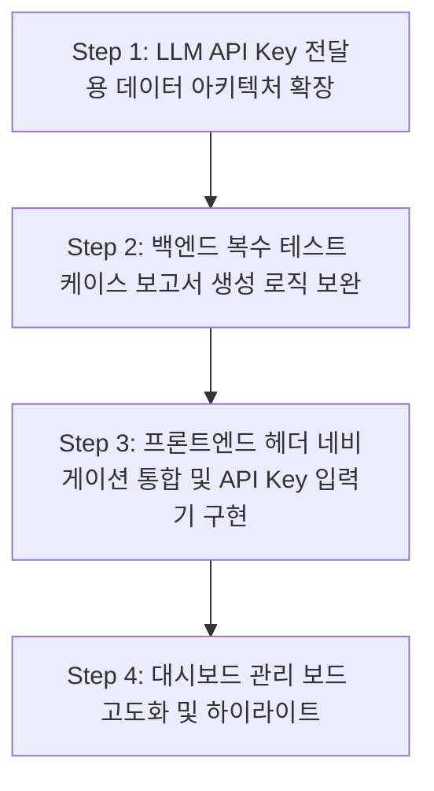

# 📌 연암 테스터 애플리케이션 개선 계획서 (개선 테스크 4)

본 계획서는 연암 테스터 애플리케이션의 사용 편의성을 극대화하고, 테스트 케이스 관리 보드의 기능적 완성도를 대폭 향상시키며, 개별 사용자 LLM API Key를 브라우저 단에서 안전하게 주입 및 연동할 수 있도록 구체적인 아키텍처 및 UI 확장 계획을 정의합니다. 명세서를 엄격하게 준수하여 기존 기능과의 유기적 연결성을 유지합니다.

---

## 📅 구현 순서 및 로드맵 (의존성 기준)

데이터 흐름의 안전성과 하위 컴포넌트 간의 바인딩 무결성을 보장하기 위해 데이터 아키텍처 및 백엔드 파이프라인을 먼저 구성한 후, 프론트엔드 UI 통합 및 관리 보드 확장을 전개합니다.



---

## 🛠️ 계층형 구현 및 검증 상세 계획

### [Step 1] LLM API Key 전달용 데이터 아키텍처 확장
* **목적:** 프론트엔드에서 입력된 OpenAI API Key가 백엔드를 거쳐 AI 서버(FastAPI) 및 litellm까지 보안 위협 없이 동적으로 유통되는 데이터 파이프라인을 확장합니다.

#### 1.1. 상세 구현 계획 (기능 단위 쪼개기)
1. **[Task 1.1.1] 백엔드 DTO 확장 (`AnalysisCreateRequest.java`)**:
   - `c:/capd/yeonam_tester/backend/src/main/java/com/yeonam/tester/dto/AnalysisCreateRequest.java` 파일에 `private String llmApiKey;` 필드를 선언하고 Getter, Setter 및 Builder를 생성합니다.
2. **[Task 1.1.2] 백엔드 분석 서비스 수정 ([AnalysisService.java](file:///c:/capd/yeonam_tester/backend/src/main/java/com/yeonam/tester/service/AnalysisService.java))**:
   - `triggerExternalAiServer` 메서드 내에서 FastAPI `/api/analysis/trigger` API로 송신하는 JSON payload 문자열 빌더 구문을 수정합니다.
   - DTO에 실려온 `llmApiKey`가 null이거나 비어있지 않은 경우, JSON 문자열 내에 `\"llmApiKey\":\"{key}\"`를 결합하도록 보강합니다.
3. **[Task 1.1.3] FastAPI DTO 및 작업 큐 확장 (`llm_server/main.py`)**:
   - `TriggerRequest` Pydantic 모델에 `llmApiKey: Optional[str] = None` 필드를 추가합니다.
   - 수신된 API Key가 `queue_manager`에 들어갈 `job_data` 사전에 `"llmApiKey"` 키로 들어가 백그라운드 워커 스레드로 넘어가도록 가동합니다.
4. **[Task 1.1.4] litellm 추론 엔진 동적 API Key 바인딩 (`llm_server/llm_client.py`)**:
   - `call_llm` 함수의 매개변수 시그니처에 `llm_api_key: str = None`을 추가하고, `main.py`의 백그라운드 프로세서가 호출할 때 `job_data.get("llmApiKey")` 값을 파라미터로 넘겨주도록 수정합니다.
   - `litellm.acompletion` 비동기 함수 호출 시, `llm_api_key` 값이 있다면 이를 `api_key` 인자에 명시적으로 전달(예: `api_key=llm_api_key`)하고, 없을 경우에만 환경 변수(`os.getenv("OPENAI_API_KEY")`)를 참조하도록 동적 분기를 이식합니다.

#### 1.2. 기능 단위 검증 및 테스트 방법
* **자동화 테스트 (JUnit)**:
  - `Phase6ExtensionsTests`에 `testAnalysisTriggerWithCustomApiKey` 테스트 케이스를 생성합니다.
  - 가상의 API Key(`sk-test-key-12345`)를 채운 `AnalysisCreateRequest` DTO를 빌드하여 `analysisService.startAnalysis`를 트리거합니다.
  - Mock화된 AI 서버 연동 에러 핸들링 혹은 로그 출력을 통해 FastAPI 호출 payload에 `llmApiKey` 필드가 안전하게 조립되는지 String 검사로 assert 검증합니다.
* **사용자 수동 검증 가이드**:
  1. FastAPI 서버 환경 변수를 `MOCK_LLM=false`로 설정한 뒤 OpenAI 실호출 상태로 실행해 두거나 mock 서버를 켭니다.
  2. cURL 명령어로 `/api/analysis/trigger`에 `llmApiKey`를 실어 POST 요청을 수행합니다:
     ```powershell
     curl -X POST "http://localhost:8000/api/analysis/trigger" -H "Content-Type: application/json" -d "{\"analysisId\":\"ANL-KEY-1\",\"projectId\":\"PRJ-KEY-1\",\"s3Paths\":[],\"llmApiKey\":\"sk-custom-user-key-value\"}"
     ```
  3. AI 서버 터미널 로그에 `llmApiKey`가 수신되었음이 로그로 정상 출력되는지 식별합니다.

---

### [Step 2] 백엔드 복수 테스트 케이스 보고서 생성 로직 보완
* **목적:** 대시보드 관리 보드에서 복수 선택된 테스트 케이스들을 취합하여 보고서를 산출할 때, 여러 개의 분석 작업(AnalysisJob) 출신 테스트 케이스라도 예외 없이 하나의 보고서로 통합 매핑될 수 있도록 처리합니다.

#### 2.1. 상세 구현 계획 (기능 단위 쪼개기)
1. **[Task 2.1.1] `ReportService.java` 내의 다중 AnalysisJob 호환성 이식**:
   - [ReportService.java](file:///c:/capd/yeonam_tester/backend/src/main/java/com/yeonam/tester/service/ReportService.java)의 `generateReport` 메서드 내에서, 전달된 `testCaseIds` 목록을 기반으로 `testCaseRepository.findAllById(testCaseIds)`를 실행하여 TestCase 엔티티 목록을 획득합니다.
   - 단일 `AnalysisJob`을 참조하던 기존의 `analysisJobRepository.findById(analysisId)` 로직은 유지하되, 선택된 각 TestCase의 고유 분석 ID가 다른 혼재 상태인 경우에도 외래키 무결성이 깨지지 않도록 보고서와 테스트 케이스 간의 매핑 엔티티인 `ReportTestCase` 객체들을 루프를 돌며 안전하게 생성 및 벌크 저장(`reportTestCaseRepository.saveAll`)하도록 구현을 보완합니다.

#### 2.2. 기능 단위 검증 및 테스트 방법
* **자동화 테스트 (JUnit)**:
  - `Phase6ExtensionsTests`에 `testGenerateReportWithMultiJobTestCases` 테스트 케이스를 생성합니다.
  - 서로 다른 `AnalysisJob`을 부모로 두는 가상의 테스트 케이스 레코드 2개(`TC-JOB1-001`, `TC-JOB2-002`)를 생성 및 DB에 저장합니다.
  - 대표 `analysisId`와 이 두 개의 서로 다른 TestCase ID 리스트를 담아 `reportService.generateReport`를 기동시킵니다.
  - **검증 기준**: 예외(Exception) 없이 정상 종료되고 생성된 보고서 매핑 테이블(`ReportTestCase`)을 조회하여 두 테스트 케이스가 무결하게 결합해 있는지 `assertEquals(2, mappings.size())`로 assert 검증합니다.
* **사용자 수동 검증 가이드**:
  1. H2 콘솔(`http://localhost:8080/h2-console`)을 실행합니다.
  2. API 도구(Postman 등)로 서로 다른 분석에 속한 테스트 케이스 목록을 바디에 실어 `POST /api/analysis/{representativeAnalysisId}/reports` API를 수동 호출합니다.
  3. HTTP 응답 상태가 `200 OK` 혹은 `201 Created`인지 확인한 후, RDB 상의 `REPORT_TEST_CASE` 테이블을 SQL로 조회하여 정상 적재를 체크합니다:
     ```sql
     SELECT REPORT_ID, TEST_CASE_ID FROM REPORT_TEST_CASE;
     ```

---

### [Step 3] 프론트엔드 헤더 네비게이션 통합 및 API Key 입력기 구현
* **목적:** 좌측 사이드바 구조를 상단 헤더로 통합 정돈하고 불필요한 Support 메뉴를 제거하며, 사용자 로컬 LLM API Key를 입력받아 반영하도록 기능을 이식합니다.

#### 3.1. 상세 구현 계획 (기능 단위 쪼개기)
1. **[Task 3.1.1] 헤더 레이아웃 및 탭 메뉴 통합 (`src/App.tsx`)**:
   - `c:/capd/yeonam_tester/frontend/src/App.tsx` 파일 내 좌측 사이드바 JSX 블록을 통째로 걷어내고 메인 컨텐츠 영역의 너비를 좌측 여백 없이 전체 화면(w-full)으로 재조정합니다.
   - 상단 공통 헤더 바 영역에 수평 네비게이션 메뉴(`Link` 혹은 `NavLink`) 리스트를 이식하여 "프로젝트 생성", "대시보드", "문서 업로드" 페이지로 사용자가 즉각 탭 이동을 수행할 수 있게 구성합니다.
2. **[Task 3.1.2] Support 삭제 및 API Key 설정 모달 창 구현 (`src/App.tsx` 내 Modal)**:
   - 헤더의 'Support' 앵커 태그를 영구 삭제합니다.
   - 우측 사용자 도구 영역에 'API Key 설정 (🔑)' 버튼을 만들고, 활성화 시 노출될 `ApiKeyModal` React 서브 컴포넌트를 설계합니다.
   - 입력값 마스킹 처리(비밀번호 필드 형식 `<input type="password" />`)와 클립보드 복사 방지 속성을 지원하고, 저장 클릭 시 `localStorage.setItem('yeonam_llm_api_key', key)`를 호출하여 브라우저 로컬 스토리지에 영구 캐싱하게 유도합니다.
3. **[Task 3.1.3] 업로드 분석 시작 페이지 API Key 자동 수집 연동 (`src/pages/DocumentUploadPage.tsx`)**:
   - `DocumentUploadPage.tsx`에서 '분석 시작' 클릭 핸들러인 `handleStartAnalysis`의 바디 내부 DTO 파라미터 빌드 영역에 `llmApiKey: localStorage.getItem('yeonam_llm_api_key') || ''` 속성을 바인딩하여 백엔드로 자동 연동 송출하도록 마칩니다.

#### 3.2. 기능 단위 검증 및 테스트 방법
* **사용자 수동 검증 가이드**:
  1. 웹 브라우저로 애플리케이션 프론트엔드에 접속합니다.
  2. 기존의 좌측 사이드바가 완전히 제거되었고, 상단 헤더에 네비게이션 탭 메뉴들이 미려한 스타일로 수평 배치되었는지 육안으로 점검합니다.
  3. 헤더 우측의 'API Key 설정' 버튼을 누른 후 가상의 Key(`sk-fake-user-key-abcde12345`)를 입력하고 저장합니다.
  4. 크롬 개발자 도구(F12) -> Application -> Local Storage에서 `yeonam_llm_api_key`에 해당 값이 정상 등재되어 있는지 직접 확인합니다.

---

### [Step 4] 대시보드 관리 보드 고도화 및 하이라이트
* **목적:** 대시보드 내 관리 보드 테이블에서 개별 테스트 케이스의 모든 필드를 한눈에 확인할 수 있는 상세 뷰를 제공하고, 체크박스를 통한 복수 선택 보고서 생성을 지원하며, 선택된 프로젝트를 시각적으로 눈에 띄게 하이라이트합니다.

#### 4.1. 상세 구현 계획 (기능 단위 쪼개기)
1. **[Task 4.1.1] 활성 프로젝트 카드 발광 하이라이트 이식 (`src/pages/DashboardPage.tsx`)**:
   - 프로젝트 카드들의 루프 렌더링 블록 내에서 `project.projectId === selectedProjectId` 분기문인 경우, CSS 클래스에 `ring-2 ring-primary/80 bg-primary/5 shadow-[0_0_25px_rgba(99,102,241,0.25)] border-primary/40` 등을 가미하여 한눈에 어떤 프로젝트가 활성화되어 있는지 사용자가 직관적으로 감상할 수 있도록 합니다.
2. **[Task 4.1.2] 테스트 케이스 상세 확인 전용 모달 창 구현 (`src/pages/DashboardPage.tsx` 내 Modal)**:
   - 테스트 케이스 테이블 열에 '상세(👁️)' 동작 버튼을 배치하고, 클릭 시 `activeTestCaseDetail` 상태에 해당 TestCase 객체를 할당하며 상세 모달인 `TestCaseDetailModal`을 렌더링합니다.
   - 모달 내부에는 카테고리, 설계 기법, 사전 조건, 절차 리스트, 기대 결과, TDD 힌트(등폭 폰트 Monospace), 부정 시나리오 전체를 일목요연하고 미려한 디자인 테마에 맞춰 레이아웃으로 표현합니다.
3. **[Task 4.1.3] 복수 체크박스 및 통합 보고서 생성 플로팅 뷰 구현 (`src/pages/DashboardPage.tsx`)**:
   - 테이블 가장 좌측에 `Checkbox` 컬럼을 생성하고, 선택된 TestCase ID들을 관리할 `selectedTcIds: string[]` 상태 배열을 선언합니다.
   - 선택된 ID 개수(`selectedTcIds.length > 0`)가 1개 이상일 경우 화면 하단 혹은 테이블 상단에 **'선택된 테스트 케이스로 통합 보고서 생성 ({count}개)'** 이라는 Indigo/Purple 그라데이션 플로팅 액션 버튼을 띄웁니다.
   - 버튼 클릭 시 보고서 포맷(PDF/Markdown) 선택 서브 다이얼로그를 경유하여 `reportApi.generate(representativeAnalysisId, format, selectedTcIds)`를 호출하고, 성공 완료 시 `/report-demo?reportId={id}`로 정상 라우팅 전개합니다.

#### 4.2. 기능 단위 검증 및 테스트 방법
* **사용자 수동 검증 가이드**:
  1. 대시보드로 접속하여 상단 리스트 중 임의의 프로젝트 카드를 클릭하고, 해당 카드가 멋지게 네온 하이라이트 발광 효과를 내는지 눈으로 봅니다.
  2. '테스트 케이스 관리 보드' 탭을 누른 후, 임의의 행에 있는 상세(👁️) 아이콘을 눌러 해당 케이스의 모든 Atlassian 속성이 상세하게 적힌 모달창이 미려하게 올라오는지 봅니다.
  3. 체크박스로 테스트 케이스 3개를 중복 선택한 뒤, 플로팅된 '보고서 생성' 버튼을 클릭하여 PDF 포맷으로 실행합니다.
  4. 생성된 프리뷰 화면에 수록된 시나리오가 내가 체크박스로 다중 선택했던 3개의 시나리오와 완벽하게 일치하여 출력되는지 최종 확인합니다.
